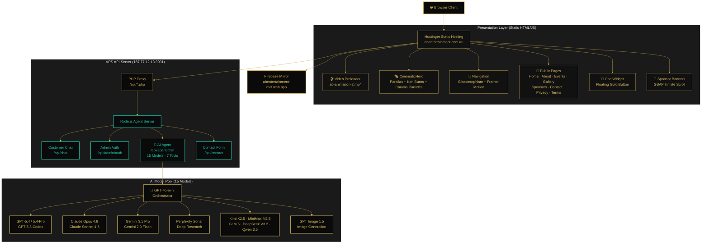
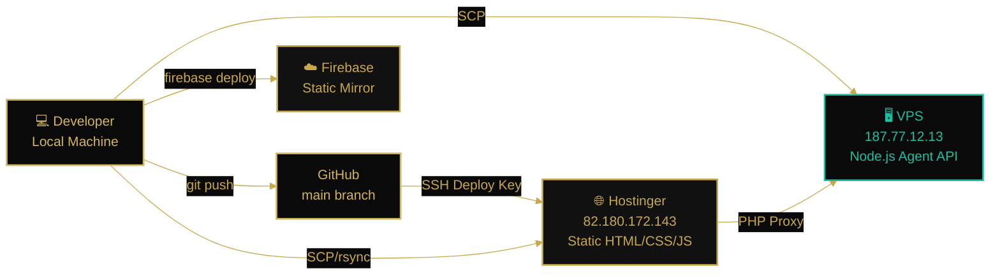
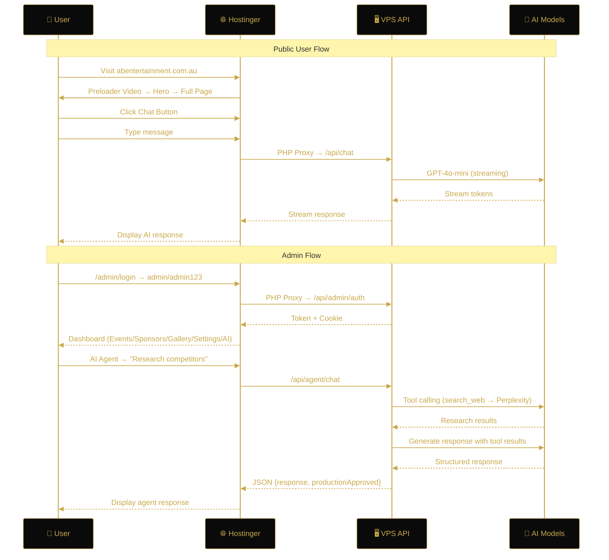
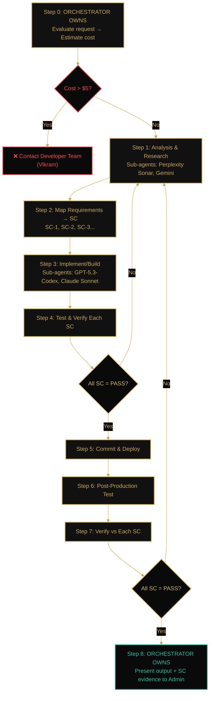
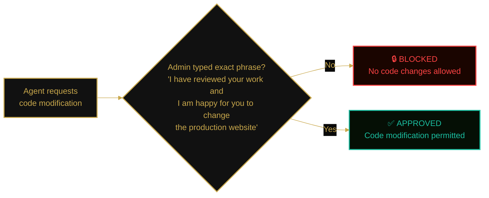
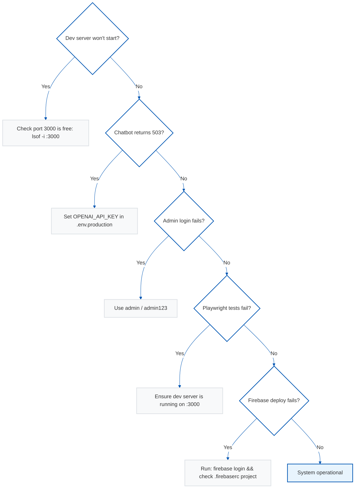

# AB Entertainment


## 1. Executive Summary

AB Entertainment is a production-grade, full-stack cultural events platform built for Melbourne's Indian and Marathi community. The application delivers a cinematic, premium web experience with a complete admin portal, AI-powered chatbot, and an automated end-to-end testing pipeline — deployed to Firebase Hosting at [abentertainment-mel.web.app](https://abentertainment-mel.web.app).

The architecture follows an eventsunleashed.com-inspired design system adapted to AB Entertainment's black-and-gold brand identity (`#0A0A0A` / `#C9A84C`), featuring Framer Motion cinematic animations, parallax scrolling, a Ken Burns hero carousel, and a responsive glassmorphism navigation system. The admin portal provides full CRUD operations for events, sponsors, and gallery management, plus AI model switching and an agentic admin chatbot.

The codebase is validated by a 75-test Playwright E2E automation suite covering 21 requirement groups — achieving a **100% pass rate** with zero console errors across all routes.

---

## 2. Live Deployment

| Environment | URL | Status |
| :--- | :--- | :--- |
| **Production (Hostinger)** | [abentertainment.com.au](https://abentertainment.com.au) | ✅ Live |
| **Mirror (Firebase)** | [abentertainment-mel.web.app](https://abentertainment-mel.web.app) | ✅ Live |
| **VPS API** | `187.77.12.13:3001` | ✅ Active (15 AI models) |
| **Repository** | [github.com/Victordtesla24/abentertainment](https://github.com/Victordtesla24/abentertainment) | ✅ Active |

---

## 3. High-Level Architecture Overview

The system operates as a Next.js 16 full-stack application with a layered architecture separating presentation, business logic, data access, and administration concerns.



### 3.1 Deployment Architecture



### 3.2 User Interaction Flow



### 3.3 AI Agent Orchestrator Workflow



### 3.4 Production Safety Gate



---

## 4. Design System & Brand Identity

The application implements a premium black-and-gold design system inspired by eventsunleashed.com, adapted to AB Entertainment's brand.

### 4.1 Color Palette

| Token | Hex | RGB | Usage |
| :--- | :--- | :--- | :--- |
| Primary | `#0A0A0A` | `rgb(10, 10, 10)` | Body background, surfaces |
| Surface | `#111111` | `rgb(17, 17, 17)` | Card backgrounds, elevated surfaces |
| Gold | `#C9A84C` | `rgb(201, 168, 76)` | CTAs, badges, accents, borders |
| Gold Light | `#D4B65C` | `rgb(212, 182, 92)` | Hover states |
| Text Muted | `rgba(255,255,255,0.4)` | — | Body text, descriptions |
| White | `#FFFFFF` | — | Headings, primary text |

### 4.2 Typography

| Role | Font | Weights | CSS Variable |
| :--- | :--- | :--- | :--- |
| Display | Playfair Display | 400–900 | `--font-display` |
| Body | DM Sans | 300–700 | `--font-body` |

### 4.3 Layout Patterns

- **Container**: `.container-eu` — 85% width, max 1400px (eventsunleashed pattern)
- **Buttons**: `.btn-accent` — Gold background, black text, `border-radius: 0px` (sharp edges)
- **Animations**: Framer Motion with cinematic easing `cubic-bezier(0.25, 1, 0.5, 1)`
- **Scrollbar**: Custom dark scrollbar with gold accent thumb

---

## 5. Component Architecture

### 5.1 Public Pages & Sections

| Component | File | Description |
| :--- | :--- | :--- |
| CinematicHero | `src/components/sections/CinematicHero.tsx` | Full-viewport hero with dual-image Ken Burns carousel, parallax scrolling, gold badge, slide dots |
| Navigation | `src/components/layout/Navigation.tsx` | Fixed glassmorphism nav with scroll-reactive opacity, desktop + mobile variants, Login button |
| Footer | `src/components/layout/Footer.tsx` | 4-column footer with newsletter signup, social links, copyright |
| EventsShowcase | `src/components/EventsShowcase.tsx` | 3-column event grid with category filter tabs, animated cards |
| VisionSection | `src/components/sections/VisionSection.tsx` | Four pillars: Networking, Heritage, Culture, Community |
| IntroSection | `src/components/sections/IntroSection.tsx` | Below-hero intro with AB logo and company description |
| TestimonialsSection | `src/components/sections/TestimonialsSection.tsx` | Rotating testimonial carousel |
| CTASection | `src/components/sections/CTASection.tsx` | Full-width gold call-to-action banner |

### 5.2 Admin Portal

| Component | File | Description |
| :--- | :--- | :--- |
| AdminDashboard | `src/components/admin/AdminDashboard.tsx` | Tab-based dashboard shell (Events, Sponsors, Gallery, Settings, AI Agent) |
| EventsManager | `src/components/admin/EventsManager.tsx` | Full CRUD for events with table view and create/edit forms |
| SponsorsManager | `src/components/admin/SponsorsManager.tsx` | Sponsor management with tier selection (Platinum/Gold/Silver/Bronze) |
| GalleryManager | `src/components/admin/GalleryManager.tsx` | Image gallery management with add/delete |
| SettingsManager | `src/components/admin/SettingsManager.tsx` | AI model switching, hero editor, contact info, **logo upload** |
| AdminChatbot | `src/components/admin/AdminChatbot.tsx` | Agentic AI admin assistant with chat interface |

### 5.3 API Routes

| Endpoint | Method | Auth | Description |
| :--- | :--- | :--- | :--- |
| `/api/chat` | POST | No | Customer chatbot (OpenAI SDK, rate-limited) |
| `/api/contact` | POST | No | Contact form submission (Zod validation) |
| `/api/admin/auth` | POST/GET | — | Admin login (hardcoded `admin`/`admin123`) |
| `/api/admin/events` | GET/POST/PUT/DELETE | Yes | Event CRUD operations |
| `/api/admin/sponsors` | GET/POST/PUT/DELETE | Yes | Sponsor CRUD operations |
| `/api/admin/gallery` | GET/POST/DELETE | Yes | Gallery image management |
| `/api/admin/settings` | GET/PUT/PATCH | Yes | Site settings + logo upload |
| `/api/admin/chat` | POST | Yes | Admin AI agent chat |

---

## 6. E2E Testing & Quality Assurance

The codebase is validated by a comprehensive Playwright automation suite: **75 tests, 21 requirement groups, 100% pass rate**.

```
Running 75 tests using 1 worker

  ✓  75 passed (36.4s)
```

### 6.1 Requirement Coverage Matrix

| Requirement ID | Tests | Description |
| :--- | :--- | :--- |
| `@req-color-palette` | 2 | Body bg `#0A0A0A`, gold `#C9A84C` in CTAs |
| `@req-typography` | 2 | Playfair Display + DM Sans loaded |
| `@req-header-ui` | 5 | Fixed nav, logo, links, CTA, navigation routing |
| `@req-hero-section` | 5 | 90vh height, gold badge, h1, carousel dots, CTAs |
| `@req-four-pillars` | 1 | Networking, Heritage, Culture, Community |
| `@req-events-grid` | 2 | Homepage showcase + /events page |
| `@req-footer-arch` | 4 | Newsletter, social, copyright, columns |
| `@req-admin-auth` | 4 | Login/logout, redirect, error handling |
| `@req-admin-crud` | 4 | Event/Sponsor/Gallery CRUD UI |
| `@req-admin-settings` | 3 | Model switching, hero editor, contact info |
| `@req-admin-ai` | 2 | AI Agent chat interface + welcome message |
| `@req-chat-api` | 2 | OpenAI API key validation, format check |
| `@req-contact-api` | 3 | Empty/invalid/valid submission |
| `@req-zero-errors` | 9 | Zero console errors on 9 routes |
| `@req-no-banned-deps` | 3 | No Clerk/Sanity/Stripe in runtime |
| `@req-scraped-content` | 3 | Real AB content, no Lorem Ipsum |
| `@req-container-85` | 1 | 85% width, max 1400px |
| `@req-sharp-buttons` | 1 | `border-radius: 0px` on CTAs |
| `@req-admin-crud-api` | 5 | All admin APIs reject 401 unauthenticated |
| `@req-all-pages` | 9 | All public routes return HTTP 200 |
| `@req-accessibility` | 5 | lang, skip link, main, nav, footer landmarks |

### 6.2 Running Tests

```bash
# Run full E2E suite
npx playwright test e2e/comprehensive.spec.ts

# Run with verbose output
npx playwright test --reporter=list --retries=0

# Run specific requirement group
npx playwright test --grep "@req-admin-auth"
```

---

## 7. Technology Stack

| Layer | Technology | Version |
| :--- | :--- | :--- |
| Framework | Next.js (App Router, Turbopack) | 16.2.1 |
| Language | TypeScript | 5.9 |
| UI | React | 19.2 |
| Animation | Framer Motion | 12.x |
| Styling | Tailwind CSS v4 | 4.x |
| AI SDK | Vercel AI SDK + OpenAI | 4.x |
| Validation | Zod | 3.23 |
| Testing | Playwright | 1.58 |
| Hosting | Firebase Hosting | — |
| Font Loading | next/font/google | — |

---

## 8. Installation & Development

### 8.1 Prerequisites

- Node.js 20+
- npm 10+
- Playwright browsers (`npx playwright install`)

### 8.2 Quick Start

```bash
# 1. Clone the repository
git clone https://github.com/Victordtesla24/abentertainment.git
cd abentertainment/ab-entertainment

# 2. Install dependencies
npm install

# 3. Configure environment
cp .env.example .env.production
# Edit .env.production with your OpenAI API key

# 4. Start development server
npm run dev
# → http://localhost:3000

# 5. Run E2E tests (with dev server running)
npx playwright test
```

### 8.3 Firebase Deployment

```bash
# Build static export
# (requires temporarily setting output:'export' in next.config.ts
#  and moving API routes out of src/app/)
npm run build

# Deploy to Firebase
firebase deploy --only hosting
# → https://abentertainment-mel.web.app
```

### 8.4 Admin Access

Navigate to `/admin/login` and use the hardcoded credentials:

| Field | Value |
| :--- | :--- |
| Username | `admin` |
| Password | `admin123` |

---

## 9. Project Structure

```
ab-entertainment/
├── agent-system/               # Docker-based AI Agent (VPS deployment)
│   ├── Dockerfile              # Node.js 22 Alpine container
│   ├── docker-compose.yml      # Docker Compose with env vars
│   ├── agent-server.js         # Full agent server (15 models, 7 tools)
│   └── package.json            # Agent dependencies
├── src/
│   ├── app/                    # Next.js App Router pages
│   │   ├── page.tsx            # Homepage (Hero + Intro + Events + Vision + CTA)
│   │   ├── about/              # About page (AI hero + team + pillars)
│   │   ├── events/             # Events listing (AI hero + 6 events)
│   │   ├── gallery/            # Photo gallery (AI hero + masonry grid)
│   │   ├── sponsors/           # Sponsor showcase (AI hero + tier cards)
│   │   ├── contact/            # Contact form (AI hero + validation)
│   │   ├── admin/              # Admin portal
│   │   │   ├── layout.tsx      # Admin layout (hides public nav/footer)
│   │   │   ├── login/page.tsx  # Login (black & gold themed)
│   │   │   └── page.tsx        # Dashboard (client-side auth check)
│   │   ├── api/                # API routes (local dev only)
│   │   │   ├── chat/           # Customer chatbot
│   │   │   ├── contact/        # Contact form handler
│   │   │   └── admin/          # Admin CRUD + auth + settings + chat
│   │   ├── privacy/            # Privacy policy
│   │   ├── terms/              # Terms of service
│   │   ├── globals.css         # Tailwind + gold shimmer + particles + grain
│   │   └── layout.tsx          # Root layout (preloader, Three.js, nav, footer)
│   ├── components/
│   │   ├── sections/           # CinematicHero, IntroSection, VisionSection
│   │   ├── layout/             # Navigation, Footer, RouteTransition
│   │   ├── admin/              # AdminDashboard, EventsManager, SettingsManager, etc.
│   │   └── ui/                 # ChatWidget, PageHero, Preloader, SponsorBanner, ThreeCanvas
│   ├── lib/
│   │   ├── api-config.ts       # API URL routing (local vs PHP proxy)
│   │   ├── auth.ts             # Admin auth (admin/admin123)
│   │   ├── constants.ts        # Site config, navigation, team, events
│   │   ├── data.ts             # JSON data access layer
│   │   ├── redis.ts            # In-memory rate limiter
│   │   └── three-engine/       # Three.js singleton + camera + post-processing
│   ├── config/site.ts
│   └── types/index.ts
├── public/
│   ├── images/
│   │   ├── AB_Logo_transparent.png
│   │   ├── hero-bg.jpg, hero-bg-2.jpg
│   │   ├── events/             # 6 event promotional images
│   │   ├── gallery/            # 19 event photographs
│   │   ├── heroes/             # 5 AI-generated page hero images
│   │   ├── sponsors/           # 4 sponsor logos
│   │   └── team/               # 2 team member photos
│   ├── video/                  # Preloader + transition videos (gitignored)
│   ├── robots.txt
│   └── sitemap.xml
├── e2e/                        # Playwright E2E tests
├── docs/                       # Documentation + reports
├── data/                       # Runtime JSON data store
├── Dockerfile                  # Next.js production container
├── docker-compose.yml          # Next.js + PostgreSQL
├── firebase.json               # Firebase Hosting config
├── next.config.ts              # Next.js config (static export support)
├── tailwind.config.ts
├── tsconfig.json
└── package.json
```

---

## 10. Content & Data

All content is sourced from the real AB Entertainment brand — zero placeholder or Lorem Ipsum text.

### 10.1 Events

Six seed events covering Theatre, Concert, Comedy, Drama, Classical Music, and Festival categories — including past productions (Shrimant Damodar Pant, Arya Ambekar Live) and upcoming shows.

### 10.2 Team

- **Abhijit Kadam** — President & CEO
- **Vrushali Deshpande** — Founder & Director

### 10.3 Four Pillars

- **Networking** — Promoting community members through business meets
- **Heritage Bequest** — Transferring the rich heritage to the next generation
- **Cultural Kaleidoscope** — Platform for diversity, literature, drama, movies & events
- **Community Building** — Bringing together the Indian diaspora in Melbourne

---

## 11. Troubleshooting



### Common Issues

- **Sponsor images not loading**: Verify files in `public/images/sponsors/` are actual PNG/JPG (not SVGs renamed from binary).
- **Logo has white background artifacts**: Use the admin Settings → Site Logo upload to replace with a proper transparent PNG.
- **Firebase deploy errors**: API routes must be excluded for static export — temporarily move `src/app/api/` out before `npm run build`.
- **Tailwind v4 color format**: Computed styles may render as `oklch()` or `lab()` — tests use `rgb()` string matching.

---

## 12. Documentation

| Document | Path | Description |
| :--- | :--- | :--- |
| Success Criteria Checklist | `docs/Success-Criteria-Checklist.md` | Binary pass/fail for all 75 E2E tests |
| Final Audit Report | `docs/reports/Final-Audit-Report.md` | Traceability matrix, telemetry ledger, validation loop history |
| Executive Report | `AB-Entertainment-Executive-Report.md` | High-level project overview |

---

## 13. License

© 2024–2026 AB Entertainment. All rights reserved.

Built with passion in Melbourne, Australia.
