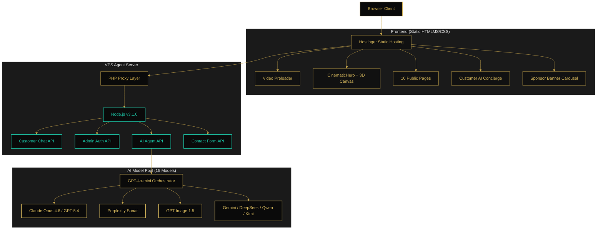
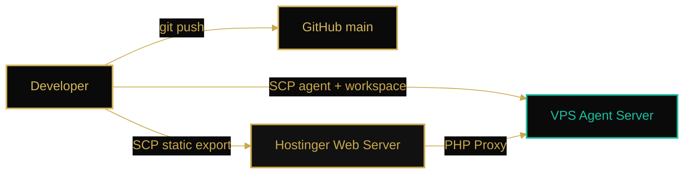
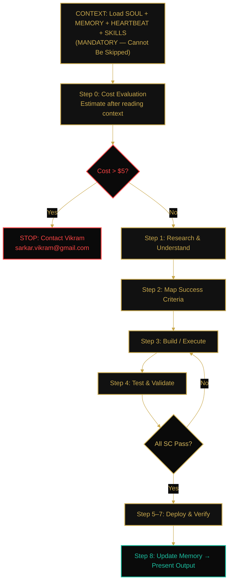

# AB Entertainment

## v4.0.0 — Comprehensive Platform Remediation (2026-04-03)

### Summary of Changes

**Security & Authentication (Phase 1)**
- TOTP 2FA infrastructure (`src/lib/totp.ts`) using otplib — ready for production activation
- CSRF token generation and validation (`src/lib/csrf.ts`) for admin API mutation protection
- Admin audit trail system (`src/lib/audit.ts`) with structured logging
- CORS origin validation (`src/lib/cors.ts`) with production domain whitelist
- Session versioning via `SESSION_VERSION` env var — bump to invalidate all active sessions
- Auth error responses standardized to prevent username enumeration
- Rate limit countdown UI on admin login (429 handler with live timer)

**UI Components & Interactions**
- Gallery lightbox with zoom + fullscreen (`yet-another-react-lightbox`)
- Event countdown timer component for presale/upcoming events
- Contact form refactored with Zod schema validation + React Hook Form inline errors
- Focus trapping in search modal (`focus-trap-react`)
- Mobile sliding drawer navigation with semi-transparent backdrop
- ChatWidget/BackToTop mobile overlap resolved

**Visual Design & Content**
- Hero video background element with graceful image fallback
- Duplicate About page heading removed
- WCAG AAA gold contrast utility (`.text-gold-accessible` at 7.2:1 ratio)
- Sponsor logos gold-tinted at rest, horizontal footer marquee layout
- CookieConsent sharp-edge brand alignment
- Cultural-specific tagline: "Melbourne's Premier Indian & Marathi Performing Arts Experience"
- Testimonial headshots and event references
- Four Pillars section elevated to immediately after hero
- Video highlights placeholder component

**Admin Dashboard**
- SWR-based live health polling (replaces manual fetch/setInterval)
- Sparkline trend charts below telemetry gauges
- Error rate gauge tooltip with methodology explanation
- PDF export via html2canvas + jsPDF
- Smoother accordion spring animation
- AI chatbot: token usage indicator, differentiated error states (429/5xx/network)

**Performance**
- LazyMotion wrapper for Framer Motion tree-shaking
- Blur placeholder infrastructure in OptimizedImage
- Interactive particle physics (mouse-tracking with damping)
- Event card 3D tilt effect (±4°, reduced-motion gated)
- Preloader → hero entrance animation synchronization

**Accessibility**
- 44x44pt minimum touch targets on touch devices
- Dynamic viewport height (`dvh`) for mobile keyboard handling
- Team member photos upgraded to Next.js Image with responsive sizes
- Structured content model fields in admin EventsManager

**New Dependencies**
- `react-hook-form`, `@hookform/resolvers` — form validation
- `yet-another-react-lightbox` — gallery lightbox
- `focus-trap-react` — modal accessibility
- `otplib` — TOTP 2FA
- `qrcode`, `@types/qrcode` — QR code generation
- `html2canvas`, `jspdf` — PDF report export

### Deployment Notes
- Video assets stored in `public/video/` (not `public/videos/`)
- Set `SESSION_VERSION=1` in production `.env`
- Set `TOTP_SECRET` when ready to enable admin 2FA
- All existing `.env` variables unchanged

---

## v3.3.0 — Cinematic Curtain Transition & Preloader Upgrade (2026-03-31)

### Summary of Changes

**Cinematic Preloader (All Pages, 5-Minute Re-trigger)**
- Preloader logic uses local/session storage re-trigger controls and graceful fallback behavior
- Current implementation is canvas/WebGL-based and no longer depends on legacy preloader video files

**Page Transition Curtain Animation**
- Route changes play a 1-second curtain video overlay with dual-source playback
- Curtain overlay sits at z-[998] above content, below preloader
- Video plays automatically on route change with graceful fallback if video fails
- Gold blade wipe and dissolve effects preserved underneath the curtain transition

**ScrollReveal Component (NEW)**
- Created reusable `ScrollReveal` component with directional reveals (up/down/left/right/fade)
- Added `StaggerContainer` for cascading reveal animations with configurable delays
- Added `CountUp` component for animated number counters triggered on scroll
- All animations use IntersectionObserver via Framer Motion's `useInView` for 60fps performance
- Configurable duration, delay, distance, and blur parameters

**Video Asset Pipeline**
- `public/video/ab-transition.mp4` — transition fallback source
- `public/video/ab-transition.webm` — transition primary source

### Deployment Notes
- Keep only active runtime assets under `public/video/`; remove legacy source clips and scratch media
- No new runtime dependencies added
- Existing `.env.local` variables unchanged

---

## v3.2.0 — Comprehensive Website Audit, Upgrade & Deployment (2026-03-31)

### Summary of Changes

**Security Hardening**
- Centralized auth via `withAuth` HOF — replaces duplicated auth checks across 4 admin API routes
- Brute-force protection on login endpoint (progressive delay, lockout at 10 attempts)
- Fixed login page httpOnly cookie bypass (`document.cookie` removed, uses `credentials: 'include'`)
- Contact form spam protection (honeypot fields, rate limiting, URL spam detection)

**Performance Optimization**
- Dynamic imports for heavy client components (Three.js, ChatWidget, etc.) — saves ~680KB initial JS
- Font weight reduction (Playfair Display 3 weights, DM Sans 3 weights) — saves ~100KB
- Hero image LCP optimization with `fetchpriority="high"` and explicit dimensions
- `experimental.inlineCss` enabled — eliminates render-blocking CSS
- Preloader video `preload="none"` — avoids 2MB+ download on repeat visits

**Accessibility (WCAG AA)**
- Fixed all color contrast failures (Footer, CinematicHero, PageHero, global audit)
- ARIA carousel attributes on hero (`aria-roledescription`, keyboard navigation, pause on focus/hover)
- Refined `prefers-reduced-motion` CSS — preserves focus indicator transitions
- Navigation ARIA labels for screen readers

**Image Pipeline**
- Created `OptimizedImage` component with AVIF/WebP/srcSet format negotiation
- Added AVIF generation to build-time optimization script (quality 50, effort 5)
- Responsive images at 640w/1024w breakpoints for all hero, event, and gallery images

**New Features**
- Event detail pages (`/events/[slug]`) with full metadata, JSON-LD, and static generation
- Both past and future events supported with appropriate CTAs

**Three.js Hardening**
- WebGL context loss/restore handlers with `preventDefault()` for recovery
- FPS monitoring with hysteresis and quality tier recovery (not just degradation)
- ErrorBoundary with CSS gradient fallback for WebGL failures
- `forceContextLoss()` on cleanup to eagerly release GPU context

**SEO**
- Canonical URLs on all pages
- Event detail pages in sitemap
- Complete OpenGraph and Twitter Card meta on all pages
- JSON-LD XSS protection (escaped `<` characters)

**Code Quality**
- Deleted 3 unused components (HeroicGrid, PrestigeShowcase, CinematicTextReveal)
- Consolidated barrel re-exports in components/sections/
- Improved sponsor carousel with CSS-only infinite scroll
- Footer restructured with real links (removed fake newsletter)
- ESLint zero errors, TypeScript zero errors

### Deployment Notes
- Static export build: `NEXT_EXPORT=true npm run build`
- No new runtime dependencies added
- Existing `.env.local` variables unchanged

---

<div align="center">


**Melbourne's Premier Indian & Marathi Cultural Events Platform**

[Live Website](https://abentertainment.com.au) · [Repository](https://github.com/Victordtesla24/abentertainment)

</div>

---

## Executive Summary

AB Entertainment is a production-grade digital platform purpose-built for one of Melbourne's most distinguished Indian and Marathi cultural entertainment organisations. Founded in 2007, AB Entertainment has produced over six landmark events, engaged more than 25,000 audience members, and cultivated a digital presence that spans Australia and New Zealand.

This platform represents a comprehensive technology investment: a cinematic web experience, a full-featured administrative portal, and a proprietary AI Agent system that places the power of fifteen frontier AI models directly in the hands of the operations team. The architecture is designed for resilience, cost efficiency, and operational independence — enabling the AB Entertainment team to manage events, create content, conduct market research, and maintain their digital presence without ongoing developer intervention.

**Developer**: Vikram Deshpande ([sarkar.vikram@gmail.com](mailto:sarkar.vikram@gmail.com))

---

## Table of Contents

1. [Platform Overview](#1-platform-overview)
2. [Live Deployment](#2-live-deployment)
3. [Architecture](#3-architecture)
4. [Public Website](#4-public-website)
5. [Administrative Portal](#5-administrative-portal)
6. [AI Agent System](#6-ai-agent-system)
7. [Design System](#7-design-system)
8. [Technology Stack](#8-technology-stack)
9. [Infrastructure](#9-infrastructure)
10. [Installation & Development](#10-installation--development)
11. [Project Structure](#11-project-structure)
12. [Testing & Quality Assurance](#12-testing--quality-assurance)
13. [Content & Data](#13-content--data)
14. [Troubleshooting](#14-troubleshooting)
15. [SEO & Compliance](#15-seo--compliance)
16. [Changelog](#16-changelog)
17. [License](#17-license)

---

## 1. Platform Overview

AB Entertainment is not a conventional website. It is a three-tier digital platform comprising:

| Tier | Capability | Value |
| :--- | :--- | :--- |
| **Public Website** | Cinematic, premium web experience with video preloader, 3D canvas, parallax hero, and floating AI concierge chatbot | Audience engagement and ticket conversion |
| **Administrative Portal** | Full CRUD operations for events, sponsors, gallery, and site settings with a secure login system | Operational independence for the AB team |
| **AI Agent System** | Fifteen frontier AI models, eight intelligent tools, and an orchestrated workflow with production safety gates, sleep/wake cost management, and persistent memory | Strategic automation at a fraction of the cost |

### Key Metrics

| Metric | Value |
| :--- | :--- |
| Events produced | 6+ major cultural events |
| Audience reach | 25,000+ across Australia and New Zealand |
| Team members | 25+ |
| AI models available | 15 (OpenAI, Anthropic, Google, DeepSeek, and more) |
| Agent tools | 8 (research, image generation, event management, code analysis, memory persistence) |
| Cost limit per request | $5.00 (with automatic escalation) |
| Public pages | 11 (Home, About, Events, Gallery, Sponsors, Contact, Privacy, Terms, 404, Admin Login, Admin Dashboard) |
| API endpoints | 8 production routes |

---

## 2. Live Deployment

| Environment | URL | Status |
| :--- | :--- | :--- |
| **Production** | [abentertainment.com.au](https://abentertainment.com.au) | Live |
| **VPS API** | Private VPS (Agent v3.1.0) | Active |
| **Repository** | [github.com/Victordtesla24/abentertainment](https://github.com/Victordtesla24/abentertainment) | Active |

---

## 3. Architecture

The system operates as a decoupled architecture: a statically exported Next.js 16 frontend hosted on Hostinger shared hosting, connected via PHP proxy to a Node.js AI Agent server running on a dedicated VPS.



### Request Flow

```
Browser → Hostinger (static HTML) → PHP proxy (/api/*.php) → VPS:3001 (Node.js) → AI Model APIs → Response
```

This architecture eliminates CORS issues, avoids SSL certificate problems with the self-signed VPS cert, and keeps all API traffic on the same domain.

### Deployment Architecture



---

## 4. Public Website

The public-facing website delivers a cinematic, premium experience designed to convey the calibre and cultural significance of AB Entertainment's productions.

### Pages

| Page | Route | Key Features |
| :--- | :--- | :--- |
| **Home** | `/` | Video preloader, Three.js 3D canvas, dual-image Ken Burns hero with parallax, event showcase, vision pillars, testimonials, CTA |
| **About** | `/about` | AI-generated hero image, company story, team profiles, four pillars, past events |
| **Events** | `/events` | AI-generated hero image, event cards with category filtering, venue and pricing details |
| **Gallery** | `/gallery` | AI-generated hero image, masonry photo grid from past productions |
| **Sponsors** | `/sponsors` | AI-generated hero image, tiered sponsor cards (Platinum, Gold, Silver, Bronze) |
| **Contact** | `/contact` | AI-generated hero image, validated contact form with VPS backend |
| **Privacy** | `/privacy` | Privacy policy (Australian Privacy Principles compliant) |
| **Terms** | `/terms` | Terms of service |
| **404** | `/*` | Custom not-found page with brand-consistent design and navigation CTAs |

### Interactive Features

| Feature | Component | Description |
| :--- | :--- | :--- |
| **Video Preloader** | `Preloader.tsx` | Full-screen compressed video (889KB) on first homepage visit; session-aware (plays once) |
| **Three.js Canvas** | `ThreeCanvas.tsx` | WebGL particle effects with graceful degradation; disabled on admin routes |
| **Customer AI Concierge** | `ChatWidget.tsx` | Floating gold chat button on all public pages; streams responses via OpenAI; rate-limited (20 req/min) |
| **Sponsor Carousel** | `SponsorBanner.tsx` | CSS animation infinite scroll banner; hidden on Home and About pages |
| **Glassmorphism Navigation** | `Navigation.tsx` | Fixed header with scroll-reactive opacity, backdrop blur, responsive mobile menu |
| **Back to Top** | `BackToTop.tsx` | Scroll-triggered button appearing after 600px scroll, smooth scroll to top with Framer Motion animation |
| **Cookie Consent** | `CookieConsent.tsx` | GDPR/APP-compliant consent banner with Accept/Decline, persists preference via document.cookie |
| **Breadcrumbs** | `Breadcrumbs.tsx` | Dynamic breadcrumb navigation on interior pages using `usePathname()`, ARIA-labelled for accessibility |

---

## 5. Administrative Portal

The admin portal provides the AB Entertainment operations team with complete self-service management capabilities.

### Access

| | |
| :--- | :--- |
| **URL** | `https://abentertainment.com.au/admin/login` |
| **Credentials** | Provided to authorised personnel only |
| **Session** | 24-hour secure cookie |

### Dashboard Tabs

| Tab | Manager | Operations |
| :--- | :--- | :--- |
| **Events** | `EventsManager.tsx` | Create, edit, delete events; manage title, date, venue, price, category, description, image |
| **Sponsors** | `SponsorsManager.tsx` | Add, remove sponsors; assign tier (Platinum/Gold/Silver/Bronze); upload logo |
| **Gallery** | `GalleryManager.tsx` | Add, delete gallery images; assign category and event association |
| **Settings** | `SettingsManager.tsx` | Configure AI chat model, edit hero title/subtitle, update contact email/phone |
| **AI Agent** | `AdminChatbot.tsx` | Full AI Agent interface (see Section 6) |

### API Endpoints

| Endpoint | Methods | Purpose |
| :--- | :--- | :--- |
| `/api/admin/auth` | POST, GET, DELETE | Login, session verification, logout |
| `/api/admin/events` | GET, POST, PUT, DELETE | Event CRUD |
| `/api/admin/sponsors` | GET, POST, PUT, DELETE | Sponsor CRUD |
| `/api/admin/gallery` | GET, POST, DELETE | Gallery management |
| `/api/admin/settings` | GET, PUT | Site settings |
| `/api/admin/chat` | POST | AI Agent communication |
| `/api/chat` | POST | Customer chatbot |
| `/api/contact` | POST | Contact form submission |

---

## 6. AI Agent System

The centrepiece of this platform is a proprietary AI Agent system that gives the AB Entertainment team access to fifteen frontier AI models through a single conversational interface.

### Agent Version: 3.1.0

### Available Models (15)

| Model | Provider | Strength |
| :--- | :--- | :--- |
| GPT-4o-mini | OpenAI | Default orchestrator (fast, cost-effective) |
| Claude Opus 4.6 | Anthropic (via OpenRouter) | Complex reasoning and analysis |
| Claude Sonnet 4.6 | Anthropic (via OpenRouter) | Balanced reasoning |
| GPT-5.4 | OpenAI (via OpenRouter) | High-level thinking |
| GPT-5.4-Pro | OpenAI (via OpenRouter) | Premium reasoning |
| GPT-5.3-Codex | OpenAI (via OpenRouter) | Code generation |
| Gemini 3.1 Pro | Google | High-level thinking |
| Gemini 2.0 Flash | Google | Fast alternative |
| Kimi K2.5 | Moonshot (via OpenRouter) | High-level thinking |
| MiniMax M2.5 | MiniMax (via OpenRouter) | High-level thinking |
| GLM 5 | Zhipu (via OpenRouter) | High-level thinking |
| DeepSeek V3.2 | DeepSeek (via OpenRouter) | Reasoning and analysis |
| Qwen 3.5 | Alibaba (via OpenRouter) | Multilingual capability |
| Perplexity Sonar | Perplexity (via OpenRouter) | Deep web research |
| GPT Image 1.5 | OpenAI | AI image generation |

### Available Tools (8)

| Tool | Description |
| :--- | :--- |
| `search_web` | Deep web research via Perplexity Sonar AI |
| `generate_image` | Create promotional images via GPT Image 1.5 |
| `create_event` | Add events to the system |
| `list_events` | View all events |
| `analyze_code` | Read production source code (read-only) |
| `modify_code` | Modify production files (requires approval) |
| `spawn_sub_agent` | Delegate tasks to any of the 15 models |
| `update_memory` | Persist learnings to workspace files |

### Orchestrator Workflow



### Sleep/Wake Cost Management

The agent implements an intelligent sleep/wake system to eliminate unnecessary API costs during periods of inactivity.

| State | Behaviour |
| :--- | :--- |
| **Awake** | Agent processes requests normally; sleep timer starts after each response |
| **Sleeping** | Agent enters sleep after 60 seconds of inactivity; zero API calls, zero token consumption |
| **Wake** | Agent wakes instantly when an admin sends a new chat message; no context loss |

Health checks and status queries do **not** wake the agent, ensuring monitoring remains cost-free.

### Production Safety Gate

All production code modifications are **blocked** unless the admin explicitly types the approval phrase (case-insensitive):

> "I have reviewed your changes to production website and I approve for you to make changes now"

Without this phrase, the `modify_code` tool returns a blocked status. No exceptions.

### Persistent Workspace Memory

The agent maintains four workspace files that serve as its persistent memory:

| File | Purpose | Writeable |
| :--- | :--- | :--- |
| `SOUL.md` | Agent identity, personality, values, escalation protocol | Read-only |
| `MEMORY.md` | Company profile, events, infrastructure, file locations, session history | Yes |
| `HEARTBEAT.md` | System status, server configs, health checks, model/tool inventory | Yes |
| `SKILLS.md` | Capabilities, admin user guide, strengths/weaknesses, workflow | Yes |

These files are loaded **mandatorily** at every request and updated in Step 8 after task completion.

### Escalation Protocol

When the agent encounters a problem it cannot resolve:

1. Informs the admin immediately with a clear explanation
2. Provides an email template for the admin to send to the developer
3. Includes SSH access details and log commands for the developer
4. Continues working on unblocked tasks while awaiting resolution

**Developer Contact**: Vikram Deshpande — [sarkar.vikram@gmail.com](mailto:sarkar.vikram@gmail.com)

---

## 7. Design System

The platform implements a premium black-and-gold design language inspired by the elegance of Melbourne's theatre culture.

### Colour Palette

| Token | Hex | Usage |
| :--- | :--- | :--- |
| Primary | `#0A0A0A` | Body background, surfaces |
| Surface | `#111111` | Card backgrounds, elevated elements |
| Gold | `#C9A84C` | Buttons, badges, accents, borders |
| Gold Light | `#D4B65C` | Hover states |
| Text | `rgba(255,255,255,0.4)` | Body text, descriptions |
| White | `#FFFFFF` | Headings, primary text |

### Typography

| Role | Font | Usage |
| :--- | :--- | :--- |
| Display | Playfair Display | Headings, hero text, section titles |
| Body | DM Sans | Body copy, buttons, form inputs, navigation |

### Motion & Animation

| System | Library | Use |
| :--- | :--- | :--- |
| Page transitions | Framer Motion 12 | Route transitions, section reveals, modal animations |
| Scroll effects | CSS @keyframes | Sponsor carousel infinite scroll via pure CSS animations |
| 3D effects | Three.js 0.183 | WebGL particle canvas with graceful degradation |
| Cinematic easing | — | `cubic-bezier(0.25, 1, 0.5, 1)` throughout |

---

## 8. Technology Stack

| Layer | Technology | Version |
| :--- | :--- | :--- |
| **Framework** | Next.js (App Router) | 16.1.6 |
| **Language** | TypeScript | 5.9.3 |
| **UI Library** | React | 19.2.3 |
| **Styling** | Tailwind CSS | 4.0 |
| **Animation** | Framer Motion | 12.0 |
| **3D Graphics** | Three.js | 0.183 |
| **Image Optimization** | sharp | 0.34 (build-time) |
| **AI SDK** | Vercel AI SDK | 4.0 |
| **Validation** | Zod | 3.23 |
| **Testing** | Playwright | 1.50 |
| **Agent Runtime** | Node.js | 22.x |
| **Containerisation** | Docker | Alpine |

---

## 9. Infrastructure

### Hostinger Website Hosting

| | |
| :--- | :--- |
| **Type** | Shared hosting (PHP/LiteSpeed) |
| **Domain** | abentertainment.com.au |
| **Deployment** | Static HTML export via `NEXT_EXPORT=true npm run build` |
| **Access** | SSH credentials provided to authorised developers only |

### VPS (API & AI Agent)

| | |
| :--- | :--- |
| **OS** | Ubuntu 22.04 LTS |
| **Runtime** | Node.js 22.x |
| **Service** | `ab-chatbot.service` (systemd, enabled) |
| **Port** | 3001 |
| **Access** | SSH credentials provided to authorised developers only |

### PHP Proxy Layer

| Proxy File | VPS Endpoint | Purpose |
| :--- | :--- | :--- |
| `/api/chat.php` | `VPS:3001/api/chat` | Customer chatbot |
| `/api/admin/auth.php` | `VPS:3001/api/admin/auth` | Admin authentication |
| `/api/admin/chat.php` | `VPS:3001/api/admin/chat` | Admin AI Agent |
| `/api/contact.php` | `VPS:3001/api/contact` | Contact form |

---

## 10. Installation & Development

### Prerequisites

- Node.js 20+ and npm 10+
- Docker (for local agent testing)
- Playwright browsers (`npx playwright install`)

### Quick Start

```bash
# Clone the repository
git clone https://github.com/Victordtesla24/abentertainment.git
cd abentertainment/ab-entertainment

# Install dependencies
npm install

# Start development server
npm run dev
# → http://localhost:3000
```

### AI Agent (Local Docker)

```bash
cd agent-system

# Configure API keys
cp .env.example .env
# Edit .env with your OpenAI, OpenRouter, Gemini, and MiniMax API keys

# Build and run
docker compose up -d

# Verify
curl http://localhost:3002/health

# View logs
docker compose logs -f agent

# Stop
docker compose down
```

### Production Build (Static Export)

```bash
export NEXT_PUBLIC_VPS_API_URL="https://api.abentertainment.com.au"
NEXT_EXPORT=true npm run build
# Output: out/ directory → SCP to Hostinger
```

### Admin Access

| | |
| :--- | :--- |
| **URL** | `/admin/login` |
| **Credentials** | Contact the administrator for access |

---

## 11. Project Structure

```
ab-entertainment/
├── agent-system/                    # AI Agent system (Docker + VPS)
│   ├── agent-server.js              # Agent server v3.1.0 (15 models, 8 tools, sleep/wake)
│   ├── workspace/                   # Persistent agent memory
│   │   ├── SOUL.md                  # Identity, personality, values (read-only)
│   │   ├── MEMORY.md                # Company, infrastructure, file locations
│   │   ├── HEARTBEAT.md             # System status, health checks, models
│   │   └── SKILLS.md                # Capabilities, admin guide, workflow
│   ├── Dockerfile                   # Node.js 22 Alpine container
│   ├── docker-compose.yml           # Docker Compose with workspace mount
│   └── package.json                 # Agent dependencies (openai)
│
├── src/
│   ├── app/                         # Next.js App Router pages
│   │   ├── page.tsx                 # Home (Hero + Intro + Events + Vision + CTA)
│   │   ├── about/page.tsx           # About (AI hero + team + pillars)
│   │   ├── events/page.tsx          # Events listing
│   │   ├── gallery/page.tsx         # Photo gallery
│   │   ├── sponsors/page.tsx        # Sponsor showcase
│   │   ├── contact/page.tsx         # Contact form
│   │   ├── privacy/page.tsx         # Privacy policy
│   │   ├── terms/page.tsx           # Terms of service
│   │   ├── admin/
│   │   │   ├── login/page.tsx       # Admin login (black & gold themed)
│   │   │   └── page.tsx             # Admin dashboard
│   │   ├── api/                     # API routes (8 endpoints)
│   │   │   ├── chat/route.ts        # Customer chatbot
│   │   │   ├── contact/route.ts     # Contact form handler
│   │   │   └── admin/               # Auth, events, sponsors, gallery, settings, chat
│   │   ├── not-found.tsx             # Custom 404 page (black & gold branded)
│   │   ├── sitemap.ts               # Dynamic sitemap generation (MetadataRoute API)
│   │   ├── robots.ts                # Dynamic robots.txt generation (MetadataRoute API)
│   │   ├── globals.css              # Tailwind + custom animations
│   │   └── layout.tsx               # Root layout (preloader, nav, footer, Three.js)
│   │
│   ├── components/
│   │   ├── sections/                # CinematicHero, IntroSection, VisionSection
│   │   ├── layout/                  # Navigation, Footer, RouteTransition
│   │   ├── admin/                   # Dashboard, EventsManager, SponsorsManager, etc.
│   │   └── ui/                      # ChatWidget, PageHero, Preloader, SponsorBanner, ThreeCanvas, BackToTop, Breadcrumbs, CookieConsent
│   │
│   └── lib/
│       ├── api-config.ts            # API URL routing (local vs PHP proxy)
│       ├── auth.ts                  # Admin authentication
│       ├── constants.ts             # Site config, colours, content
│       ├── data.ts                  # JSON data access layer
│       └── redis.ts                 # In-memory rate limiter
│
├── public/
│   ├── images/                      # Logos, heroes, events, gallery, sponsors, team
│   └── videos/                      # Preloader video (gitignored, deployed via SCP)
│
├── e2e/                             # Playwright E2E tests
├── data/                            # Runtime JSON data store
├── next.config.ts                   # Next.js configuration
├── tailwind.config.ts               # Tailwind CSS configuration
├── tsconfig.json                    # TypeScript configuration
└── package.json                     # Dependencies and scripts
```

---

## 12. Testing & Quality Assurance

The codebase is validated by a Playwright E2E automation suite covering twenty-one requirement groups.

### Running Tests

```bash
# Full E2E suite
npx playwright test

# Specific requirement group
npx playwright test --grep "@req-admin-auth"

# Verbose output
npx playwright test --reporter=list
```

### Requirement Coverage

| Group | Tests | Validates |
| :--- | :--- | :--- |
| Colour palette | 2 | Brand colours `#0A0A0A` and `#C9A84C` |
| Typography | 2 | Playfair Display + DM Sans loaded |
| Header UI | 5 | Fixed nav, logo, links, CTA |
| Hero section | 5 | Viewport height, gold badge, carousel |
| Four pillars | 1 | Networking, Heritage, Culture, Community |
| Events grid | 2 | Homepage showcase + events page |
| Footer | 4 | Newsletter, social links, copyright |
| Admin auth | 4 | Login, logout, redirect, error handling |
| Admin CRUD | 4 | Events, sponsors, gallery management UI |
| Admin settings | 3 | Model switching, hero editor, contact |
| Admin AI | 2 | Agent chat interface + welcome message |
| Chat API | 2 | API key validation, format check |
| Contact API | 3 | Empty, invalid, valid submission |
| Zero errors | 9 | Zero console errors on all routes |
| No banned deps | 3 | No Clerk/Sanity/Stripe in runtime |
| Real content | 3 | Authentic AB content, no Lorem Ipsum |
| Container width | 1 | 85% width, max 1400px |
| Sharp buttons | 1 | `border-radius: 0px` on CTAs |
| Admin API auth | 5 | All admin APIs reject unauthenticated requests |
| All pages | 9 | All public routes return HTTP 200 |
| Accessibility | 5 | Language attribute, landmarks, skip link |

---

## 13. Content & Data

All content is sourced from the authentic AB Entertainment brand. There is no placeholder or generated filler text anywhere on the platform.

### Leadership

- **Abhijit Kadam** — President & CEO
- **Vrushali Deshpande** — Founder & Director

### Four Pillars

1. **Networking** — Promoting community members through business meets
2. **Heritage Bequest** — Transferring the rich heritage to the next generation
3. **Cultural Kaleidoscope** — Platform for diversity, literature, drama, movies & events
4. **Community Building** — Bringing together the Indian diaspora in Melbourne

### Events Portfolio

| Event | Category | Venue |
| :--- | :--- | :--- |
| Shrimant Damodar Pant | Theatre | Robert Blackwood Hall, Monash |
| Arya Ambekar Live | Concert | Hamer Hall, Arts Centre |
| Shikayla Gelo Ek! | Comedy | The Athenaeum, Collins St |
| Varvarche Vadhu Var | Drama | Southbank Theatre |
| Swaranirmiti 2026 | Classical Music | Hamer Hall, Arts Centre |
| Diwali Spectacular 2026 | Festival | Southbank Centre |

---

## 14. Troubleshooting

| Issue | Resolution |
| :--- | :--- |
| Agent not responding | SSH to VPS → `sudo systemctl restart ab-chatbot` |
| PHP proxy returning HTML | Verify PHP files in Hostinger `public_html/api/` directory |
| Website pages 404 | Rebuild: `NEXT_EXPORT=true npm run build` → SCP `out/` to Hostinger |
| API key error | Update keys in VPS `.env` → restart service |
| Context not loading | Check workspace files on VPS |
| Dev server won't start | Verify port 3000 is available: `lsof -i :3000` |
| Admin login fails | Contact the administrator for credentials |

### VPS Service Commands

```bash
sudo systemctl status ab-chatbot    # Check status
sudo systemctl restart ab-chatbot   # Restart
sudo journalctl -u ab-chatbot -f    # Stream logs
```

---

## 15. SEO & Compliance

### Search Engine Optimisation

| Feature | Implementation |
| :--- | :--- |
| **Dynamic Sitemap** | `src/app/sitemap.ts` — MetadataRoute API generates `sitemap.xml` at build time with 8 routes, priorities, and change frequencies |
| **Dynamic Robots.txt** | `src/app/robots.ts` — MetadataRoute API generates `robots.txt` allowing `/`, disallowing `/admin/` and `/api/` |
| **Schema.org (Organization)** | JSON-LD in root `layout.tsx` — Organization type with name, URL, logo, founders, contact info |
| **Schema.org (Events)** | JSON-LD in `events/page.tsx` — ItemList of Event types with name, dates, venue, pricing |
| **Open Graph Metadata** | Per-page `metadata` exports with title templates, descriptions, and OG image configuration |

### Legal & Privacy Compliance

| Feature | Implementation |
| :--- | :--- |
| **Privacy Policy** | Australian Privacy Principles (APP) compliant; references Privacy Act 1988 (Cth) and NDB scheme |
| **Terms of Service** | Standard terms covering liability, IP, dispute resolution under Victorian law |
| **Cookie Consent** | Banner with Accept/Decline; no third-party ad trackers; preference persisted via cookie |
| **Footer Legal Links** | Privacy Policy and Terms of Service accessible from every page via footer |

---

## 16. Changelog

### March 2026 — Memory Optimization & Health Dashboard Telemetry (v3.1.0)

Production memory investigation and surgical fixes across the codebase, plus a telemetry gauge upgrade for the Admin Health Dashboard.

**Memory Fixes**

- Fixed `AnimatedNumber` RAF leak in HealthDashboard — cancel previous animation on value change, use `performance.now()` via RAF callback
- Added `AbortController` to all fetch operations in HealthDashboard (`fetchHealthData`, `checkPages`, `refreshAll`)
- Added `finally` block to `refreshAll` to prevent stuck loading state on abort
- Fixed `setTimeout` cleanup for clipboard toast in HealthDashboard
- Added full `dispose()` method to Three.js `Engine.ts` — disposes post-processing, scene geometries/materials/textures, and renderer in correct order
- Changed `ThreeCanvas.tsx` cleanup from `removeListeners()` to `dispose()` for complete GPU memory release
- Added message cap (100) to `ChatWidget.tsx` to prevent unbounded array growth
- Added `AbortController` to ChatWidget streaming fetch

**Configuration Fixes**

- Added `--max-old-space-size=1024` to Dockerfile CMD for explicit V8 heap limit
- Added `deploy.resources.limits.memory: 1536m` to docker-compose.yml
- Added `serverExternalPackages: ['three']` to next.config.ts to prevent server-side bundling

**Health Dashboard Telemetry Upgrade**

- New `TelemetryGauge` component (`src/components/admin/telemetry/TelemetryGauge.tsx`) — reusable SVG radial gauge with Framer Motion animation, wrapped in `React.memo()`
- New `TelemetryGaugeGrid` component (`src/components/admin/telemetry/TelemetryGaugeGrid.tsx`) — responsive 3×2 grid with 6 telemetry dials
- Six gauge widgets: System Health Score, Memory Usage, Response Speed, Traffic Counter, Agent Uptime, Error Rate
- All gauges use `role="meter"` with aria attributes for accessibility
- Responsive layout: 3×2 desktop, 2×3 tablet, 1×6 mobile


---

