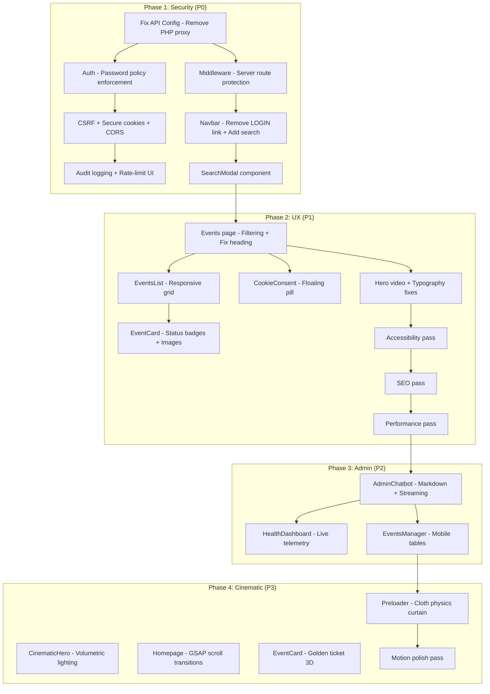

# feat: Implement AB Entertainment Critical Analysis Remediation (Phases 1-4)

## Overview

Systematic remediation of 75 issues across 12 dimensions identified in the comprehensive UX/UI critical analysis of the AB Entertainment platform (abentertainment.com.au). Work is organized into 4 sequential phases: P0 Critical Security, P1 Core UX, P2 Admin/AI Enhancements, P3 Cinematic Uplift. Each phase must pass a build + smoke test validation loop before the next begins.

## Problem Frame

The AB Entertainment platform — a Next.js 16 entertainment site for Melbourne's Indian/Marathi performing arts community — has critical security vulnerabilities (broken auth proxy, weak credentials, missing CSRF), severe UX gaps (no search, no filtering, no responsive grid), and lacks the cinematic polish the brand demands. The admin console auth is broken in production due to a PHP proxy dependency. Competitive benchmarking against Live Nation, AEG, Eventbrite, Frontier Touring, and TEG Dainty reveals significant feature gaps.

## Requirements Trace

- R1. Fix admin authentication to work without PHP proxy in both dev and static-export production
- R2. Server-side route protection for all /admin/* routes via Next.js middleware
- R3. Enforce strong password policy (12+ chars, mixed case, digits, symbols)
- R4. Remove public admin link from Navbar
- R5. Implement global Fuse.js search modal
- R6. CSRF token protection on all mutating admin endpoints
- R7. Secure cookie flags (Secure, HttpOnly, SameSite=Strict)
- R8. Audit logging for admin mutations
- R9. CORS/origin validation on admin API routes
- R9b. Secrets hygiene (.env files in .gitignore)
- R10. Event filtering (category, date-range, location)
- R11. Responsive event grid (1/2/3 col)
- R12. Fix duplicate heading on events page
- R13. Dynamic status badges on event cards
- R14. Cookie consent floating pill redesign
- R15. Hero video background
- R16. WCAG AAA contrast compliance
- R17. Accessibility (ARIA labels, focus trapping, skip link, aria-live)
- R18. SEO (generateMetadata, JSON-LD, sitemap, OG images, SEO slugs)
- R19. Performance (lazy Three.js, next/font, LazyMotion, image placeholders)
- R20. Admin AI chatbot enhancements (markdown, streaming, error states)
- R21. Live telemetry dashboard
- R22. Cinematic preloader with cloth physics
- R23. Volumetric hero lighting with 3D typography
- R24. GSAP scroll-triggered theatrical transitions
- R25. 3D golden ticket interactions
- R26. Lighthouse Performance score >= 80

## Scope Boundaries

- Only modify files explicitly referenced in the critical analysis
- No refactoring or restructuring of unlisted files
- No placeholder code, TODOs, or mock data
- No @ts-ignore, eslint-disable, or `any` type assertions
- All new UI must meet WCAG 2.1 AA
- Existing working features must remain functional after each phase

## Context & Research

### Relevant Code and Patterns

- **Auth system**: `src/lib/auth.ts` — HMAC-SHA256 signed session tokens (cookie: `ab-admin-session-v3`), bcrypt w/ work factor 12, constant-time comparison. Session secret currently weak ("admin123")
- **API routing**: `src/lib/api-config.ts` — dual-layer routing (admin -> VPS, public -> VPS), `getApiUrl(path)` resolves endpoints based on hostname and path
- **Middleware**: `src/middleware.ts` — already exists with basic token validation for /admin/* routes
- **Layout**: `src/app/layout.tsx` — Google Fonts (Playfair Display + DM Sans), JSON-LD org schema, preloader cooldown, skip-to-content link
- **Navigation**: `src/components/layout/Navigation.tsx` (may also be referenced as `src/components/Navbar.tsx` in the analysis — verify actual file path at implementation time)
- **Design tokens**: Tailwind config with charcoal (#1a1a2e), gold (#c9a84c), burgundy (#722f37), cream (#f5f0e8)
- **Deployment**: Static export to Hostinger `public_html/` via rsync over SSH (port 65002)
- **VPS**: PostgreSQL at 187.77.12.13:5432, API at api.abentertainment.com.au

### Key Dependencies

- Next.js 16.1.6, React 19.2.3, TypeScript 5.9.3
- Tailwind CSS 4.0.0, Framer Motion 12.0.0, GSAP 3.14.2
- Three.js 0.183.2, @react-three/fiber 9.1.2, @react-three/drei
- SWR, Zod, Fuse.js, bcryptjs 3.0.3
- AI SDKs: ai@4.0.0, OpenAI, Anthropic, OpenRouter, MiniMax, Gemini
- Playwright 1.50.0 for testing

## Key Technical Decisions

- **Remove PHP proxy entirely**: The PHP proxy (auth.php) on Hostinger returns HTML instead of forwarding POST requests. Since the site is statically exported, all API calls route directly to the VPS. The proxy layer adds no value and breaks auth. Remove it completely from api-config.ts.
- **Fuse.js over Algolia for search**: The analysis suggests Algolia but Fuse.js is already a dependency and sufficient for client-side fuzzy search of a small event catalog. No external service dependency needed.
- **Static export compatibility**: All server-side features (middleware, API routes) work in `next dev` but not in static export. For production, auth validation happens at the VPS API layer. Middleware provides dev-mode protection and SSR protection if the deployment mode changes.
- **Cookie security in static export**: In static export mode, cookies are set by the VPS API responses. The frontend reads cookies for display state; the VPS validates them for API access.
- **cannon-es for cloth physics**: Use cannon-es (maintained fork of cannon.js) for the Phase 4 curtain preloader physics simulation.

## Open Questions

### Resolved During Planning

- **Q: How does auth work in static export?** — In static export, there are no Next.js API routes at runtime. The frontend sends credentials directly to the VPS API (`api.abentertainment.com.au/api/admin/auth`), which validates and sets the session cookie. Client-side code reads the cookie for UI state. All admin API calls go directly to the VPS.
- **Q: Where do CSRF tokens come from in static export?** — The VPS API generates CSRF tokens on session creation and returns them. The frontend stores the token and includes it in headers for mutating requests.
- **Q: Should we add new npm dependencies?** — Yes, where specified: `react-markdown`, `remark-gfm`, `yet-another-react-lightbox`, `focus-trap-react`, `react-parallax-tilt`, `react-hook-form`, `html2canvas`, `jspdf`, `cannon-es`. All others (Fuse.js, SWR, Zod, GSAP, Three.js, Framer Motion) are already present.

### Deferred to Implementation

- Exact VPS API endpoint structure for CSRF token exchange — depends on current VPS code
- Whether `audit_log` table already exists in PostgreSQL — check at implementation time
- Exact video asset URLs for hero background — may need placeholder assets initially
- Performance impact of cloth physics preloader on low-end devices — test during Phase 4 validation
- **Issue 66 (2FA/MFA)**: TOTP-based two-factor auth is in the critical analysis but deferred — requires `otplib` dependency and significant VPS-side changes. Implement as a follow-up after Phase 1 security hardening is validated.
- **Issue 69 (Verbose Error Messages)**: Standardize auth error responses to prevent user enumeration — implement during Unit 1.6 alongside CSRF/cookies work
- **Issue 70 (Session Invalidation)**: Session versioning/blacklist system — requires database schema changes on VPS. Implement alongside audit logging if VPS changes are in scope

## High-Level Technical Design

> *This illustrates the intended approach and is directional guidance for review, not implementation specification. The implementing agent should treat it as context, not code to reproduce.*

## Implementation Units

### Phase 1 — P0: Critical Security & Architecture

- [ ] **Unit 1.1: Fix Admin Auth Proxy (Issue 64)**

  **Goal:** Eliminate PHP proxy dependency; route auth directly to VPS API

  **Requirements:** R1

  **Dependencies:** None

  **Files:**
  - Modify: `src/lib/api-config.ts`

  **Approach:**
  - Remove any references to PHP proxy endpoints or auth.php
  - Ensure `getApiUrl()` routes all admin API calls directly to the VPS (api.abentertainment.com.au) in production
  - For development, route to localhost or configurable dev API URL
  - Verify login, session validation, and logout paths all resolve to VPS endpoints
  - Read actual VPS URL from `.env.production` NEXT_PUBLIC_VPS_API_URL

  **Patterns to follow:**
  - Existing `getApiUrl()` pattern in api-config.ts
  - Environment variable resolution pattern already in the file

  **Test scenarios:**
  - Happy path: `getApiUrl('/api/admin/auth')` returns VPS URL in production environment
  - Happy path: `getApiUrl('/api/admin/auth')` returns localhost URL in development
  - Edge case: Missing NEXT_PUBLIC_VPS_API_URL falls back to hardcoded VPS URL with console warning
  - Integration: Login request from frontend reaches VPS without PHP proxy intermediary

  **Verification:**
  - `npm run build` succeeds
  - Login flow works against VPS in both dev and production configs
  - No references to PHP proxy remain in api-config.ts

---

- [ ] **Unit 1.2: Server-Side Route Protection (Issue 67)**

  **Goal:** Middleware intercepts /admin/* requests, validates session, redirects unauthenticated users

  **Requirements:** R2

  **Dependencies:** Unit 1.1 (auth endpoints must be correct)

  **Files:**
  - Modify: `src/middleware.ts`

  **Approach:**
  - Verify existing middleware validates session cookie (`ab-admin-session-v3`) for all /admin/* paths except /admin/login
  - Ensure invalid/expired tokens trigger cookie deletion + redirect to /admin/login
  - Add `from` query parameter to redirect URL for post-login return
  - Lightweight validation: check token structure, expiration, signature format

  **Patterns to follow:**
  - Existing HMAC token validation in auth.ts (`verifySessionToken`)
  - Next.js middleware matcher config pattern

  **Test scenarios:**
  - Happy path: Valid session cookie allows /admin/dashboard access
  - Happy path: /admin/login is accessible without session cookie
  - Error path: Missing cookie redirects to /admin/login
  - Error path: Expired token clears cookie and redirects
  - Error path: Malformed token clears cookie and redirects
  - Edge case: /admin/login with valid session does not redirect (avoids loop)

  **Verification:**
  - Unauthenticated request to /admin/dashboard returns 307 redirect to /admin/login
  - Authenticated request passes through to page render

---

- [ ] **Unit 1.3: Password Policy Enforcement (Issue 65)**

  **Goal:** Remove weak default credentials, enforce 12+ char passwords with complexity

  **Requirements:** R3

  **Dependencies:** None (parallel with 1.1)

  **Files:**
  - Modify: `src/lib/auth.ts`

  **Approach:**
  - Remove any acceptance of "admin123" as valid password
  - Add `validatePasswordStrength()` function: min 12 chars, at least 1 uppercase, 1 lowercase, 1 digit, 1 special char
  - Add `isLegacyWeakHash()` check that compares current password hash against known weak hash
  - When legacy hash detected on login, return a `requirePasswordChange: true` flag
  - Ensure SESSION_SECRET is not "admin123" — log warning if it is

  **Patterns to follow:**
  - Existing bcrypt validation pattern in auth.ts
  - Constant-time comparison pattern already used

  **Test scenarios:**
  - Happy path: 12+ char password with all character types passes validation
  - Error path: "admin123" is rejected regardless of context
  - Error path: Password under 12 chars is rejected
  - Error path: Password missing uppercase/lowercase/digit/special is rejected
  - Edge case: Legacy hash detection triggers password change requirement
  - Integration: Login with weak password returns specific error instructing password change

  **Verification:**
  - `validatePasswordStrength("admin123")` returns false
  - `validatePasswordStrength("Str0ng!Pass#2026")` returns true
  - Build succeeds with no type errors

---

- [ ] **Unit 1.4: Remove Public Admin Link + Nav Legibility (Issues 13, 3)**

  **Goal:** Remove LOGIN from public nav; improve nav legibility with tracking-wider and hover states

  **Requirements:** R4

  **Dependencies:** None (parallel)

  **Files:**
  - Modify: `src/components/Navbar.tsx`

  **Approach:**
  - Remove the "LOGIN" link from the navigation items array
  - Admin access only via direct /admin/login URL
  - Apply `tracking-wider` to nav link text
  - Add gold underline slide-in hover animation on nav links
  - Preserve existing mobile menu behavior

  **Patterns to follow:**
  - Existing nav link styling in Navbar.tsx
  - Tailwind transition utilities

  **Test scenarios:**
  - Happy path: Navbar renders without LOGIN link on all public pages
  - Happy path: Nav links have tracking-wider applied
  - Happy path: Hover shows gold underline animation
  - Edge case: Mobile nav also excludes LOGIN link
  - Integration: /admin/login is still accessible via direct URL

  **Verification:**
  - Visual inspection confirms no LOGIN link in navbar
  - Dev tools confirm tracking-wider class on nav links

---

- [ ] **Unit 1.5: Global Search Modal (Issue 8)**

  **Goal:** Search icon in Navbar opens a Fuse.js-powered fuzzy search modal with keyboard navigation

  **Requirements:** R5

  **Dependencies:** Unit 1.4 (Navbar modifications)

  **Files:**
  - Modify: `src/components/Navbar.tsx`
  - Create: `src/components/SearchModal.tsx`

  **Approach:**
  - Add search icon button to Navbar (magnifying glass icon)
  - SearchModal: overlay with input field, loads event data, creates Fuse.js index
  - Fuse.js keys: title, description, date, venue/location
  - Results display in scrollable dropdown with keyboard navigation (arrow keys + Enter)
  - Cmd/Ctrl+K keyboard shortcut to open
  - ESC to close, click-outside to close
  - Focus trap within modal when open
  - ARIA: role="dialog", aria-label, aria-live for results count

  **Patterns to follow:**
  - Existing modal patterns in the codebase
  - Fuse.js import already available as dependency
  - Framer Motion for modal enter/exit animation

  **Test scenarios:**
  - Happy path: Click search icon opens modal with focused input
  - Happy path: Typing query returns fuzzy-matched events
  - Happy path: Arrow keys navigate results, Enter selects
  - Happy path: Cmd+K opens modal from anywhere on page
  - Edge case: Empty query shows no results
  - Edge case: No matching results shows "No events found" message
  - Error path: Missing event data gracefully shows empty state
  - Integration: Selecting a result navigates to the event detail page

  **Verification:**
  - Search modal opens, accepts input, returns filtered results
  - Keyboard navigation works end-to-end
  - Modal is accessible (screen reader announces dialog)

---

- [ ] **Unit 1.6: CSRF Tokens + Secure Cookies + CORS (Issues 68, 72, 74)**

  **Goal:** Generate CSRF tokens on session creation; enforce secure cookie flags; restrict API origins

  **Requirements:** R6, R7, R9

  **Dependencies:** Unit 1.1 (auth proxy fix)

  **Files:**
  - Modify: `src/app/api/admin/auth/route.ts`
  - Modify: `src/app/api/admin/[...slug]/route.ts` (if exists, or equivalent admin API routes)

  **Approach:**
  - On successful login, generate CSRF token (crypto.randomUUID or similar), return in response body
  - Frontend stores CSRF token in memory (not cookie) and sends as X-CSRF-Token header
  - All mutating admin endpoints (POST, PUT, DELETE) validate X-CSRF-Token header
  - Session cookie: set `Secure: true`, `HttpOnly: true`, `SameSite: 'Strict'` in all environments
  - CORS: validate Origin header against allowlist (`abentertainment.com.au`, `localhost`, `127.0.0.1`)
  - Return 403 for invalid origin on admin routes

  **Patterns to follow:**
  - Existing cookie-setting pattern in auth route
  - Next.js headers() and cookies() API

  **Test scenarios:**
  - Happy path: Login response includes CSRF token and secure session cookie
  - Happy path: Mutating request with valid CSRF token succeeds
  - Error path: Mutating request without CSRF token returns 403
  - Error path: Mutating request with wrong CSRF token returns 403
  - Error path: Request from disallowed origin returns 403
  - Edge case: GET requests do not require CSRF token
  - Integration: Full login -> CSRF token -> create event flow works

  **Verification:**
  - Cookie inspector shows Secure, HttpOnly, SameSite=Strict flags
  - curl with wrong origin returns 403

---

- [ ] **Unit 1.7: Rate-Limit UI Feedback (Issue 71)**

  **Goal:** Display countdown when login endpoint returns 429

  **Requirements:** R1 (auth UX)

  **Dependencies:** Unit 1.1

  **Files:**
  - Modify: `src/app/admin/login/page.tsx`

  **Approach:**
  - Catch HTTP 429 response from login endpoint
  - Parse Retry-After header (seconds) from response
  - Display "Too Many Attempts — retry in X seconds" with live countdown
  - Disable submit button during countdown
  - Use useEffect interval to decrement countdown

  **Patterns to follow:**
  - Existing error handling in login page
  - Framer Motion for countdown animation

  **Test scenarios:**
  - Happy path: Normal login attempt works without countdown
  - Happy path: 429 response shows countdown timer
  - Happy path: Countdown reaches 0, re-enables submit button
  - Edge case: Missing Retry-After header defaults to 30 seconds

  **Verification:**
  - After triggering rate limit, UI shows countdown
  - Submit button disabled during countdown period

---

- [ ] **Unit 1.8: Audit Logging (Issue 73)**

  **Goal:** Log admin mutations with user ID, action, timestamp, IP

  **Requirements:** R8

  **Dependencies:** Unit 1.6 (admin API routes modified)

  **Files:**
  - Modify: `src/app/api/admin/events/route.ts`
  - Modify: `src/app/api/admin/auth/route.ts`

  **Approach:**
  - Create `logAuditEvent()` utility: accepts { userId, action, details, ip, timestamp }
  - On login/logout: log auth events
  - On event CRUD: log mutation events
  - Extract IP from request headers (x-forwarded-for or remoteAddress)
  - Write to PostgreSQL `audit_log` table (create if not exists)
  - Graceful fallback: if DB write fails, log to console.error (don't block the operation)

  **Patterns to follow:**
  - Existing database connection pattern in the codebase
  - PostgreSQL connection string from .env.production

  **Test scenarios:**
  - Happy path: Login creates audit log entry with user, action, timestamp, IP
  - Happy path: Event creation creates audit log entry
  - Error path: DB write failure doesn't block the primary operation
  - Edge case: IP extraction handles x-forwarded-for with multiple IPs

  **Verification:**
  - After admin login, audit_log table contains entry
  - After event CRUD, audit_log table contains entry

---

- [ ] **Unit 1.9: Secrets Hygiene (Issue 75)**

  **Goal:** Confirm .env files are in .gitignore

  **Requirements:** R9b

  **Dependencies:** None

  **Files:**
  - Modify: `.gitignore` (if needed)

  **Approach:**
  - Verify `.env.local`, `.env.production`, `.env`, `.env*.local` are all in .gitignore
  - Add any missing patterns
  - Verify no .env files are tracked in git history (warn if found)

  **Test expectation:** none — pure config verification, no behavioral change

  **Verification:**
  - `git check-ignore .env.production` confirms it is ignored

---

### Phase 2 — P1: Core UX & Functionality

- [ ] **Unit 2.1: Events Page — Filtering + Fix Duplicate Heading (Issues 12, 9, 11)**

  **Goal:** Add filter dropdowns, remove duplicate heading, relocate sponsor banners

  **Requirements:** R10, R12

  **Dependencies:** Phase 1 complete

  **Files:**
  - Modify: `src/app/events/page.tsx`

  **Approach:**
  - Remove duplicate "Upcoming & Past Events" heading (component duplication bug)
  - Add filter bar above events list: category dropdown, date-range picker, location dropdown
  - Filters apply client-side against loaded event data using Array.filter
  - Move vertical sponsor banners to horizontal footer marquee with CSS animation
  - Maintain existing event data loading pattern

  **Patterns to follow:**
  - Existing event data fetching pattern
  - Tailwind select/dropdown styling

  **Test scenarios:**
  - Happy path: Events page renders with single heading (no duplicate)
  - Happy path: Category filter narrows displayed events
  - Happy path: Date range filter shows events within range
  - Happy path: Location filter shows events at selected venue
  - Happy path: Multiple filters combine correctly (AND logic)
  - Edge case: No events match filters shows "No events found" message
  - Edge case: Clearing all filters restores full list
  - Integration: Sponsor logos appear in footer marquee, not as vertical banners

  **Verification:**
  - Single heading visible on events page
  - Filters interactively narrow event list
  - Sponsors in horizontal marquee at bottom

---

- [ ] **Unit 2.2: Responsive Event Grid (Issue 10)**

  **Goal:** 1 col mobile, 2 col tablet, 3 col desktop grid layout

  **Requirements:** R11

  **Dependencies:** None (parallel with 2.1)

  **Files:**
  - Modify: `src/components/EventsList.tsx`

  **Approach:**
  - Replace single-column layout with CSS grid
  - `grid grid-cols-1 md:grid-cols-2 lg:grid-cols-3 gap-6`
  - Add `aria-live="polite"` region wrapper for filter change announcements (Issue 53)
  - Ensure cards fill grid cells uniformly

  **Patterns to follow:**
  - Tailwind grid utilities
  - Existing EventCard component interface

  **Test scenarios:**
  - Happy path: Mobile (375px) shows 1 column
  - Happy path: Tablet (768px) shows 2 columns
  - Happy path: Desktop (1024px) shows 3 columns
  - Edge case: Single event renders centered in grid
  - Integration: aria-live region announces "Showing X events" on filter changes

  **Verification:**
  - Visual inspection at mobile/tablet/desktop breakpoints shows correct column count

---

- [ ] **Unit 2.3: Event Card Enhancements (Issues 16, 41, 47, 26)**

  **Goal:** Status badges, responsive images, blur placeholders, 3D tilt

  **Requirements:** R13, R19

  **Dependencies:** Unit 2.2

  **Files:**
  - Modify: `src/components/EventCard.tsx`

  **Approach:**
  - Add dynamic status badges: "Selling Fast" (<=20% tickets remaining), "Sold Out" (0 tickets), "New Date Added", "On Sale Now"
  - Badge logic based on event data fields (ticketsRemaining, totalTickets, isNewDate, onSaleDate)
  - Add `sizes` attribute to Image components for responsive loading
  - Add `placeholder="blur"` with `blurDataURL` (base64 tiny placeholder)
  - Integrate `react-parallax-tilt` for 3D tilt on hover
  - Preserve existing card structure and styling

  **Patterns to follow:**
  - Existing EventCard prop interface
  - Tailwind badge styling (small pill with color coding)

  **Test scenarios:**
  - Happy path: Event with 10% tickets shows "Selling Fast" badge
  - Happy path: Event with 0 tickets shows "Sold Out" badge
  - Happy path: Event with isNewDate flag shows "New Date Added" badge
  - Happy path: Images load with blur placeholder
  - Happy path: Card tilts on mouse hover
  - Edge case: Event without ticket data shows no badge
  - Edge case: Multiple badges stack correctly

  **Verification:**
  - Badges visible on event cards with correct logic
  - Images have blur-up loading effect
  - Tilt effect responds to mouse movement

---

- [ ] **Unit 2.4: Cookie Consent Redesign (Issue 14)**

  **Goal:** Floating pill bottom-right with Accept/Decline, Framer Motion animation

  **Requirements:** R14

  **Dependencies:** None (parallel)

  **Files:**
  - Modify: `src/components/CookieConsent.tsx`

  **Approach:**
  - Replace full-width banner with fixed bottom-right floating pill
  - Compact design: short text + Accept + Decline buttons
  - Framer Motion: slide up from bottom on mount, slide down on dismiss
  - Persist choice in localStorage
  - Don't show if already accepted/declined
  - z-index below modals but above page content

  **Patterns to follow:**
  - Existing CookieConsent localStorage pattern
  - Framer Motion AnimatePresence for enter/exit

  **Test scenarios:**
  - Happy path: First visit shows floating pill in bottom-right
  - Happy path: Accept dismisses pill and persists choice
  - Happy path: Decline dismisses pill and persists choice
  - Happy path: Pill animates in/out with Framer Motion
  - Edge case: Returning visitor with stored choice sees no pill
  - Edge case: Pill doesn't overlap with chat widget on mobile

  **Verification:**
  - Pill appears bottom-right on fresh visit
  - Accept/Decline persists to localStorage

---

- [ ] **Unit 2.5: Hero Video + Typography Fixes (Issues 1, 2, 59)**

  **Goal:** Video hero background, fix duplicate About heading, update hero tagline

  **Requirements:** R15

  **Dependencies:** None (parallel)

  **Files:**
  - Modify: `src/components/CinematicHero.tsx`
  - Modify: `src/app/about/page.tsx`
  - Modify: `src/lib/data.ts`

  **Approach:**
  - CinematicHero: Replace static image with `<video>` element — muted, autoplay, loop, playsInline
  - Include poster frame as fallback for slow connections
  - Video source: MP4 + WebM formats for browser compatibility
  - About page: Remove duplicate "About AB Entertainment" heading
  - data.ts: Update tagline to reference Melbourne's Indian/Marathi performing arts niche

  **Patterns to follow:**
  - HTML5 video element with poster attribute
  - Existing hero component structure

  **Test scenarios:**
  - Happy path: Hero video plays automatically on page load
  - Happy path: Video is muted and loops continuously
  - Happy path: About page shows single heading
  - Happy path: Hero tagline references Marathi/Indian performing arts
  - Edge case: Poster image shows while video loads
  - Edge case: prefers-reduced-motion pauses video

  **Verification:**
  - Video plays in hero section
  - About page has no duplicate heading
  - Hero copy is culturally specific

---

- [ ] **Unit 2.6: Visual Design Fixes (Issues 4, 5, 6, 7, 23, 40, 51)**

  **Goal:** Contrast fix, border-radius standardization, sponsor logos, form styling, hover easing, touch targets, focus indicators

  **Requirements:** R16

  **Dependencies:** None (parallel)

  **Files:**
  - Modify: `src/app/globals.css`
  - Modify: `tailwind.config.ts`
  - Modify: `src/components/SponsorsSection.tsx`
  - Modify: `src/app/contact/page.tsx`

  **Approach:**
  - globals.css: Change gold text color to `#D4AF37` for text below 18px (WCAG AAA)
  - globals.css: Add `transition-all duration-300 ease-in-out` to interactive elements
  - globals.css: Increase touch targets to min 44x44px for footer/utility elements
  - globals.css: Add custom `:focus-visible` ring styles (gold ring, 2px offset)
  - tailwind.config.ts: Define `--radius-card: 0.75rem` and apply globally
  - SponsorsSection: Apply `filter: brightness(0) invert(1)` to sponsor logos
  - contact/page.tsx: Increase border opacity to 40%, add `ring-2 ring-gold/30` on focus
  - contact/page.tsx: Use `dvh` units for viewport height (Issue 43)
  - contact/page.tsx: Add Zod + react-hook-form validation (Issue 19)

  **Patterns to follow:**
  - Existing Tailwind custom property patterns
  - Existing form input styles

  **Test scenarios:**
  - Happy path: Gold text on dark background passes WCAG AAA at small sizes
  - Happy path: All cards have consistent 0.75rem border-radius
  - Happy path: Sponsor logos render in monochromatic white
  - Happy path: Form inputs have visible borders and focus rings
  - Happy path: Interactive elements have smooth hover transitions
  - Happy path: Contact form shows inline validation errors
  - Edge case: Focus-visible only shows on keyboard navigation, not mouse click
  - Edge case: Touch targets meet 44px minimum on mobile

  **Verification:**
  - Contrast checker confirms AAA compliance for gold text
  - Visual inspection confirms consistent border-radius

---

- [ ] **Unit 2.7: Accessibility Pass (Issues 49, 50, 51, 52, 53)**

  **Goal:** ARIA labels, focus trapping, skip link, aria-live regions

  **Requirements:** R17

  **Dependencies:** Unit 2.2 (EventsList for aria-live)

  **Files:**
  - Modify: `src/components/Carousel.tsx`
  - Modify: `src/components/Modal.tsx`
  - Modify: `src/app/layout.tsx`
  - Modify: `src/components/EventsList.tsx`

  **Approach:**
  - Carousel: Add `aria-label` to all icon-only buttons (prev, next, dots)
  - Modal: Integrate `focus-trap-react` for proper focus containment
  - layout.tsx: Verify skip-to-content link exists (research shows it does), ensure it's properly styled (visually hidden, visible on focus)
  - layout.tsx: Wrap app in Framer Motion `LazyMotion` with `domAnimation` (Issue 46)
  - layout.tsx: Switch to `next/font` for Playfair Display and DM Sans (Issue 45)
  - EventsList: Add `aria-live="polite"` region for filter result announcements

  **Patterns to follow:**
  - HTML semantic elements
  - focus-trap-react usage pattern

  **Test scenarios:**
  - Happy path: Screen reader announces carousel button purposes
  - Happy path: Tab key cycles within modal when open
  - Happy path: Skip link visible on Tab from page top, jumps to main content
  - Happy path: Filter changes announce "Showing X events" to screen readers
  - Edge case: Focus trap releases when modal closes
  - Integration: Keyboard-only user can navigate entire site

  **Verification:**
  - All interactive elements have aria-labels or visible text
  - Focus stays trapped in open modals
  - Skip link works with keyboard

---

- [ ] **Unit 2.8: SEO Pass (Issues 54-58)**

  **Goal:** Dynamic metadata, JSON-LD, SEO slugs, OG images, dynamic sitemap

  **Requirements:** R18

  **Dependencies:** None (parallel)

  **Files:**
  - Modify: `src/app/events/[slug]/page.tsx`
  - Create: `src/components/EventSchema.tsx`
  - Create: `src/app/events/[slug]/opengraph-image.tsx`
  - Create: `src/app/sitemap.ts`

  **Approach:**
  - events/[slug]/page.tsx: Implement `generateMetadata()` with event-specific title, description
  - events/[slug]/page.tsx: Update routing to use descriptive slugs (e.g., "shrimant-damodar-pant")
  - EventSchema.tsx: Schema.org Event JSON-LD component with name, date, location, description, offers
  - opengraph-image.tsx: Dynamic OG image generation with event artwork
  - sitemap.ts: Auto-generate sitemap from event data, include all static pages

  **Patterns to follow:**
  - Next.js generateMetadata API
  - Schema.org Event type specification
  - Next.js dynamic OG image generation pattern

  **Test scenarios:**
  - Happy path: Event page has unique meta title and description
  - Happy path: Event page includes JSON-LD script tag with Event schema
  - Happy path: Event URL uses descriptive slug instead of numeric ID
  - Happy path: Social sharing shows event-specific OG image
  - Happy path: /sitemap.xml includes all events and static pages
  - Edge case: Event without image uses fallback OG image
  - Edge case: Sitemap updates when events are added

  **Verification:**
  - View source shows correct meta tags on event pages
  - Google Rich Results Test validates JSON-LD
  - /sitemap.xml returns valid XML with all pages

---

- [ ] **Unit 2.9: Remaining P1 Components (Issues 15, 17, 18, 20, 21, 39, 44, 60, 61, 62, 63)**

  **Goal:** Counter animation, countdown timers, lightbox, newsletter, chat widget fix, mobile menu, lazy Three.js, testimonials, event descriptions, four pillars, video content

  **Requirements:** R15, R17, R19

  **Dependencies:** Phase 2 units above

  **Files:**
  - Modify: `src/components/StatsSection.tsx`
  - Modify: `src/components/EventDetails.tsx`
  - Modify: `src/app/gallery/page.tsx`
  - Modify: `src/components/Footer.tsx`
  - Modify: `src/components/ChatWidget.tsx`
  - Modify: `src/components/MobileMenu.tsx`
  - Modify: `src/app/page.tsx`
  - Modify: `src/components/TestimonialsSection.tsx`
  - Modify: `src/components/admin/EventsManager.tsx`

  **Approach:**
  - StatsSection: Intersection Observer triggers count-up animation only in viewport
  - EventDetails: Countdown timer component for events with presaleDate
  - gallery/page.tsx: Integrate `yet-another-react-lightbox` with keyboard nav and zoom
  - Footer: Add email newsletter signup field with basic validation
  - ChatWidget: Fix z-index overlap with back-to-top on mobile
  - MobileMenu: Sliding drawer with backdrop blur animation
  - page.tsx: Load ThreeCanvas via `next/dynamic` with `ssr: false` (Issue 44)
  - page.tsx: Move Four Pillars section to immediately below hero (Issue 62)
  - page.tsx: Add performance highlights video reel section (Issue 63)
  - TestimonialsSection: Add headshots and event references
  - EventsManager: Enforce Hook/Details/Cast structure for event descriptions (Issue 61)

  **Patterns to follow:**
  - Intersection Observer API
  - next/dynamic with ssr: false
  - Framer Motion AnimatePresence for mobile menu

  **Test scenarios:**
  - Happy path: Stat counters animate from 0 to target when scrolled into view
  - Happy path: Countdown timer shows days:hours:minutes:seconds
  - Happy path: Gallery lightbox opens on image click with keyboard navigation
  - Happy path: Newsletter field validates email format
  - Happy path: Chat widget and back-to-top don't overlap on mobile
  - Happy path: Mobile menu slides in with backdrop blur
  - Happy path: Three.js loads lazily without blocking initial paint
  - Happy path: Four Pillars appear immediately below hero
  - Edge case: Countdown reaches zero shows "On Sale Now"
  - Edge case: Stats don't re-animate on scroll back up

  **Verification:**
  - All components render correctly
  - No console errors or hydration mismatches
  - Lighthouse Performance >= 80

---

### Phase 3 — P2: Admin & AI Enhancements

- [ ] **Unit 3.1: AdminChatbot Enhancements (Issues 34, 35, 36, 37, 38)**

  **Goal:** Markdown rendering, context token indicator, contextual prompts, stop generation, specific error states

  **Requirements:** R20

  **Dependencies:** Phase 2 complete

  **Files:**
  - Modify: `src/components/admin/AdminChatbot.tsx`

  **Approach:**
  - Integrate `react-markdown` with `remark-gfm` for table, code, list rendering
  - Add context token usage indicator (estimated tokens used / limit)
  - Generate dynamic suggested prompt chips based on active admin tab
  - Wire `AbortController` to "Stop" button during streaming responses
  - Distinguish error states: 429 (rate limit with retry timer), network failure (offline indicator), API error (specific error message)

  **Patterns to follow:**
  - Existing AdminChatbot message rendering
  - react-markdown + remark-gfm integration pattern

  **Test scenarios:**
  - Happy path: AI response with markdown table renders as HTML table
  - Happy path: Code blocks render with syntax highlighting
  - Happy path: Context token indicator shows usage percentage
  - Happy path: Prompt chips change based on active tab (Events -> event queries)
  - Happy path: Stop button halts streaming response
  - Error path: 429 response shows "Rate limited — retry in X seconds"
  - Error path: Network offline shows "Connection lost" state
  - Error path: API error shows specific error message
  - Edge case: Stop during token streaming cleanly aborts

  **Verification:**
  - Markdown tables render as formatted HTML in chat
  - Stop button successfully halts generation
  - Error states display correct UI for each error type

---

- [ ] **Unit 3.2: Health Dashboard Enhancements (Issues 28, 29, 32, 33)**

  **Goal:** Dynamic escalation contact, live SWR polling, accordion animation, PDF export

  **Requirements:** R21

  **Dependencies:** None (parallel with 3.1)

  **Files:**
  - Modify: `src/components/admin/HealthDashboard.tsx`

  **Approach:**
  - Pull escalation email from `ESCALATION_EMAIL` env var
  - Replace static mock data with SWR polling at 10-second interval against `/api/admin/health`
  - Refine AnimatePresence for smooth accordion expansion on issue cards
  - Add "Download PDF Report" button using `html2canvas` + `jsPDF`
  - PDF captures current dashboard state as visual report

  **Patterns to follow:**
  - SWR data fetching pattern
  - Existing AnimatePresence usage in the component
  - html2canvas + jsPDF for PDF generation

  **Test scenarios:**
  - Happy path: Dashboard shows live data updating every 10 seconds
  - Happy path: Escalation email reads from environment variable
  - Happy path: Issue accordion expands/collapses smoothly
  - Happy path: PDF download generates readable report
  - Error path: API failure shows stale data with "Last updated" timestamp
  - Edge case: Missing ESCALATION_EMAIL shows default contact
  - Edge case: PDF captures scrolled-out content

  **Verification:**
  - Dashboard data updates without full page refresh
  - PDF downloads successfully with current data

---

- [ ] **Unit 3.3: Telemetry Enhancements (Issues 30, 31)**

  **Goal:** Error metric tooltips, sparkline trends

  **Requirements:** R21

  **Dependencies:** Unit 3.2

  **Files:**
  - Modify: `src/components/admin/telemetry/TelemetryGauge.tsx`
  - Modify: `src/components/admin/telemetry/TelemetryGaugeGrid.tsx`

  **Approach:**
  - TelemetryGauge: Add hover tooltip explaining error rate calculation methodology
  - TelemetryGaugeGrid: Add 24-hour sparkline charts below each gauge
  - Sparklines use SVG path elements for lightweight rendering
  - Data sourced from health API history endpoint

  **Patterns to follow:**
  - Existing gauge component structure
  - SVG sparkline pattern (simple polyline)

  **Test scenarios:**
  - Happy path: Hovering error gauge shows tooltip with calculation explanation
  - Happy path: Sparkline shows 24-hour trend data below each gauge
  - Edge case: Insufficient historical data shows partial sparkline
  - Edge case: Tooltip positions correctly near viewport edges

  **Verification:**
  - Tooltips appear on gauge hover
  - Sparklines render below gauges with trend data

---

- [ ] **Unit 3.4: Mobile Admin Tables (Issue 42)**

  **Goal:** Responsive scroll containers for admin data tables

  **Requirements:** R20

  **Dependencies:** None (parallel)

  **Files:**
  - Modify: `src/components/admin/EventsManager.tsx`

  **Approach:**
  - Wrap all data tables in `overflow-x-auto` container
  - Add horizontal scroll indicator (gradient fade or scrollbar styling)
  - Enforce Hook/Details/Cast structure for event descriptions (Issue 61)
  - Ensure table headers remain visible during scroll

  **Patterns to follow:**
  - Tailwind overflow utilities
  - Existing table structure in EventsManager

  **Test scenarios:**
  - Happy path: Tables scroll horizontally on mobile without breaking viewport
  - Happy path: Scroll indicator visible when content overflows
  - Happy path: Event description editor enforces Hook/Details/Cast structure
  - Edge case: Table with few columns doesn't show scroll indicator

  **Verification:**
  - Admin tables don't cause horizontal page overflow on 375px viewport

---

### Phase 4 — P3: Cinematic "Game of Thrones" Uplift

- [ ] **Unit 4.1: Curtain-Raise Preloader (Issue 4.1, 27)**

  **Goal:** Three.js cloth physics velvet curtain that parts on 100% load

  **Requirements:** R22

  **Dependencies:** Phase 3 complete

  **Files:**
  - Modify: `src/components/Preloader.tsx`

  **Approach:**
  - Implement WebGL cloth simulation using react-three-fiber + cannon-es
  - Curtain mesh: deep red velvet material with PBR properties
  - During loading: curtain ripples subtly
  - On 100% load: curtain physically parts (left/right) revealing hero
  - Optional low-frequency audio rumble (respect `prefers-reduced-motion`)
  - Sync preloader completion with hero entrance animation (Issue 27)
  - Reduced motion: instant fade transition instead of physics simulation
  - Preloader cooldown: 5-minute localStorage check (existing pattern)

  **Patterns to follow:**
  - Existing Preloader.tsx structure and cooldown logic
  - react-three-fiber Canvas component pattern
  - cannon-es cloth body setup

  **Test scenarios:**
  - Happy path: Curtain renders as velvet mesh during load
  - Happy path: Curtain parts smoothly on load completion
  - Happy path: Hero entrance animation begins as curtain fully opens
  - Edge case: prefers-reduced-motion skips physics, uses fade
  - Edge case: Preloader cooldown skips animation on repeat visits within 5 min
  - Error path: WebGL not available falls back to simple fade preloader

  **Verification:**
  - Curtain animation plays on first load
  - Hero appears after curtain parts
  - No WebGL errors in console

---

- [ ] **Unit 4.2: Volumetric Hero Lighting (Issue 4.2)**

  **Goal:** 3D spotlight tracking mouse, dust particles, PBR gold typography

  **Requirements:** R23

  **Dependencies:** Unit 4.1 (preloader must be ready)

  **Files:**
  - Modify: `src/components/CinematicHero.tsx`

  **Approach:**
  - Add Three.js Canvas overlay in hero section
  - Implement SpotLight from @react-three/drei that tracks mouse position
  - Floating dust-mote particles using instanced mesh (performance)
  - 3D-extruded text with metallic gold PBR material using Text3D from drei
  - Dynamic shadows cast from text onto background plane
  - Respect prefers-reduced-motion: disable tracking, reduce particles

  **Patterns to follow:**
  - @react-three/drei SpotLight, Text3D components
  - Existing Three.js canvas usage in the project
  - Pointer event handling for mouse tracking

  **Test scenarios:**
  - Happy path: Spotlight follows mouse movement
  - Happy path: Dust particles visible and illuminated by spotlight
  - Happy path: Gold typography has realistic metallic reflection
  - Edge case: Mobile uses gyroscope for light direction (if available)
  - Edge case: prefers-reduced-motion disables mouse tracking and particle animation
  - Error path: WebGL unavailable shows static hero with 2D text

  **Verification:**
  - Spotlight tracks mouse in hero section
  - Typography has 3D metallic appearance

---

- [ ] **Unit 4.3: Scroll-Triggered Theatrical Transitions (Issue 4.3)**

  **Goal:** GSAP ScrollTrigger lighting shifts, dissolve shader on event cards

  **Requirements:** R24

  **Dependencies:** None (parallel with 4.2)

  **Files:**
  - Modify: `src/app/page.tsx`

  **Approach:**
  - Use GSAP ScrollTrigger to animate background color/lighting between sections
  - "House lights down, stage lights up" effect as user scrolls to Events section
  - Custom GLSL dissolve shader for event card reveal
  - Cards emerge from darkness as they enter viewport
  - Performance: Use will-change and GPU-accelerated properties
  - prefers-reduced-motion: simple fade-in instead of shader effects

  **Patterns to follow:**
  - GSAP ScrollTrigger registration and cleanup in React useEffect
  - Existing section structure in page.tsx

  **Test scenarios:**
  - Happy path: Background shifts dramatically when scrolling to Events section
  - Happy path: Event cards dissolve into view from shadow
  - Edge case: Scroll snapping doesn't conflict with ScrollTrigger
  - Edge case: prefers-reduced-motion uses simple crossfade
  - Error path: Shader compilation failure falls back to CSS transitions

  **Verification:**
  - Visible lighting transition when scrolling between sections
  - Event cards have dissolve entrance effect

---

- [ ] **Unit 4.4: 3D Golden Ticket Interaction (Issue 4.4)**

  **Goal:** Skeuomorphic 3D golden tickets replacing CTA buttons

  **Requirements:** R25

  **Dependencies:** Unit 2.3 (EventCard base)

  **Files:**
  - Modify: `src/components/EventCard.tsx`

  **Approach:**
  - Replace standard CTA buttons with golden ticket components
  - Hover: physical tilt using react-spring, foil-shimmer custom shader
  - Click: tear/stamp animation with SVG mask, then page transition
  - react-spring for smooth physics-based hover animations
  - Custom SVG masks for tear effect
  - mix-blend-mode for foil shimmer
  - Fallback for reduced motion: simple color change on hover, instant transition on click

  **Patterns to follow:**
  - react-spring animation pattern
  - SVG mask and clip-path techniques
  - Existing EventCard CTA button position

  **Test scenarios:**
  - Happy path: Ticket tilts on hover with foil shimmer
  - Happy path: Click triggers tear/stamp animation
  - Happy path: Animation completes then navigates to event page
  - Edge case: Keyboard activation (Enter/Space) triggers animation
  - Edge case: prefers-reduced-motion uses simple hover state change
  - Error path: Animation failure doesn't block navigation

  **Verification:**
  - Golden ticket visible on event cards
  - Tilt and shimmer respond to mouse hover
  - Click navigates after animation

---

- [ ] **Unit 4.5: Motion Polish Pass (Issues 22, 24, 25)**

  **Goal:** Route transitions, interactive particles, scroll reveal

  **Requirements:** R22

  **Dependencies:** Units 4.1-4.4

  **Files:**
  - Create: `src/app/template.tsx`
  - Modify: `src/components/ThreeCanvas.tsx`
  - Modify: `src/components/FadeIn.tsx`

  **Approach:**
  - template.tsx: Framer Motion layout animations for page transitions (fade + subtle slide)
  - ThreeCanvas: Particles react to scroll position (density shifts) and mouse movement (repulsion/attraction)
  - ThreeCanvas: Optimize to use InstancedMesh for particles (Issue 48)
  - FadeIn: Wrap component with Framer Motion `whileInView` for scroll-triggered fade-up animations
  - All animations respect prefers-reduced-motion

  **Patterns to follow:**
  - Next.js template.tsx for route transitions
  - Framer Motion whileInView props
  - Three.js InstancedMesh for performance

  **Test scenarios:**
  - Happy path: Page transitions animate smoothly between routes
  - Happy path: Particles react to scroll position
  - Happy path: Particles react to mouse movement
  - Happy path: Major sections fade in as they enter viewport
  - Edge case: prefers-reduced-motion disables all motion
  - Edge case: InstancedMesh handles 1000+ particles at 60fps

  **Verification:**
  - Route changes have visible transition animation
  - Particles respond to user interaction
  - Homepage sections animate on scroll

---

## System-Wide Impact

- **Interaction graph:** Auth changes (Units 1.1-1.3, 1.6-1.8) affect login page, middleware, all admin API routes, and session cookie lifecycle. Changes to Navbar (1.4, 1.5) affect all page layouts. EventCard changes (2.3, 4.4) affect events page and homepage. Layout changes (2.7) affect every page.
- **Error propagation:** Auth failures redirect to /admin/login. API errors surface in admin UI with specific error states (Unit 3.1). VPS unavailability affects all admin features.
- **State lifecycle risks:** Session cookie changes (1.6) could invalidate existing sessions — all active admins will need to re-login after deployment. CSRF token must be stored in memory and survive across admin SPA navigation.
- **API surface parity:** Static export has no API routes at runtime — all auth/CSRF/audit logic must work via VPS API calls. Dev mode has Next.js API routes that should mirror VPS behavior.
- **Integration coverage:** Login -> CSRF token -> admin mutation -> audit log is a critical end-to-end flow. Search modal -> event navigation is a user-facing integration. Preloader -> hero animation handoff is a visual integration.
- **Unchanged invariants:** Event data model, database schema (except audit_log addition), deployment pipeline, VPS API structure all remain unchanged.

## Risks & Dependencies

| Risk | Mitigation |
|------|------------|
| Session cookie changes invalidate existing admin sessions | Expected and acceptable — single admin user can re-login |
| VPS API must support CSRF token endpoint | Implement CSRF token generation in existing VPS auth route |
| New npm dependencies increase bundle size | Tree-shake imports, lazy-load heavy deps (react-markdown, lightbox, cannon-es) |
| Three.js cloth physics performance on mobile | Detect low-end devices, fall back to simple fade preloader |
| GSAP ScrollTrigger conflicts with Framer Motion | Use GSAP for scroll-driven effects only, Framer Motion for component animations |
| Static export cannot run middleware at runtime | Middleware works in dev/SSR; production relies on VPS-side auth validation |
| Large scope (75 issues) risks incomplete implementation | Phased approach with validation loops ensures each phase is stable before next |

## Documentation / Operational Notes

- After deployment, existing admin session will be invalidated — inform admin user
- New npm packages to install: `react-markdown`, `remark-gfm`, `yet-another-react-lightbox`, `focus-trap-react`, `react-parallax-tilt`, `react-hook-form`, `html2canvas`, `jspdf`, `cannon-es`, `react-spring`
- Video assets needed for hero background (MP4 + WebM) — check if assets exist in /public or need to be sourced
- Audit log table needs to be created in PostgreSQL on VPS

## Sources & References

- **Origin document:** [AB-Entertainment-Critical-Analysis-v2.md](../../AB-Entertainment-Critical-Analysis-v2.md)
- Related code: `src/lib/api-config.ts`, `src/lib/auth.ts`, `src/middleware.ts`
- Stack: Next.js 16.1.6, React 19.2.3, TypeScript 5.9.3
- Deployment: Hostinger static export + VPS API at api.abentertainment.com.au
