# AB Entertainment Website Revamp – State-of-the-Art Luxury Blueprint

## Executive Summary

AB Entertainment has established itself as Melbourne's premier Indian and Marathi cultural event company since 2007, producing 6+ major events reaching 25,000+ audience members across Australia and New Zealand. The current website — built on WordPress with the Theme Freesia theme — functions as a basic digital brochure but fundamentally fails to convey the premium, immersive experience the brand delivers in person. It reads as a community WordPress blog, not as the digital flagship of a luxury entertainment house.

This blueprint transforms abentertainment.com.au from a dated WordPress site into a cinematic, AI-powered luxury web experience — a fusion of Apple.com's precision, Aesop's editorial warmth, and the immersive grandeur of a Louis Vuitton event showcase. The new platform will be built on Next.js 15 with App Router, React Server Components, and Partial Prerendering — delivering sub-second loads, 98+ Lighthouse scores across all categories, and fully automated content workflows powered by GPT-4o, Claude, and custom AI agents.

Projected outcomes: **Performance** — Lighthouse scores from 75/82/100/85 → 98/100/100/100 (mobile). **LCP** — from 4.5s → under 1.2s. **Conversion** — estimated 3–5× increase in booking inquiries via AI concierge and streamlined UX. **Maintenance** — 90% reduction in manual content tasks through AI automation pipelines. **Brand perception** — transformation from "community WordPress site" to "Australia's most sophisticated cultural event platform."

---

## Current Website Critique

### Design & Aesthetic

- **WordPress template syndrome**: The site uses Theme Freesia, a generic free WordPress theme. Every element — from the hero slider to the card grid — screams "template." A luxury event company cannot share its visual DNA with thousands of other WordPress sites. **Fix**: Custom-built design system with bespoke components, unique typography pairing, and a signature color story derived from the brand's gold-and-theatre heritage.
- **No design system**: Colors, spacing, and typography are inconsistent across pages. The hero uses navy `#1a2744`, but sections shift between arbitrary grays and whites with no rhythm. **Fix**: Implement a token-based design system (8px grid, 4-step type scale, defined color roles) enforced via Tailwind CSS custom theme.
- **Gold logo on black rectangle**: The AB logo sits inside a black rectangle — a flat, dated approach. The gold script "Experience events like no other" is elegant but trapped in a rigid container. **Fix**: Redesign the logo as a refined, standalone SVG mark. The gold lettering becomes a dynamic element — animating on scroll, breathing with the page.
- **No visual narrative**: The homepage dumps content in disconnected blocks (hero → pillars → team → past events → footer) with no storytelling arc. **Fix**: Structure the page as a cinematic scroll journey: Opening Act (hero) → The Vision (brand story) → The Stage (upcoming events) → The Archive (past events with parallax galleries) → The Ensemble (team) → The Curtain Call (CTA + footer).

### Layout & UX

- **Seven navigation items, zero hierarchy**: HOME, ABOUT US, GALLERY, SPONSORS, BUSINESS NETWORK, CONTACT US, OUR PAST EVENTS are presented with equal weight. "Business Network" (a directory of local businesses) sits alongside core pages, diluting navigation clarity. **Fix**: Reduce primary nav to 4 items: Events, Gallery, About, Contact. Move Sponsors and Business Network to a footer or secondary menu. Use a full-screen overlay menu with cinematic imagery.
- **No booking flow**: The site has no contact form, no booking system, no inquiry mechanism beyond a raw phone number and email. Users who want to attend an event are sent to an external Monash University ticket link with no context. **Fix**: Integrate an AI-powered concierge chatbot + embedded booking forms + Stripe payment for deposits + Calendly for meetings.
- **Sidebar duplication**: The About Us sidebar block (with logo and tagline) appears on nearly every page — Gallery, Contact, Past Events — consuming 30% of page width with redundant content. **Fix**: Eliminate sidebars entirely. Use full-width, immersive layouts.
- **Placeholder content**: Past Events pages contain literal placeholder text: "ABC event successfully took place on AA/BB/CCCC at XYZ location." This is visible to users and search engines. **Fix**: AI auto-generates event recaps from uploaded photos and basic metadata.

### Animations & Interactions

- **Hero slider is the only animation**: The entire site has exactly one animated element — a basic carousel with numbered pagination dots. No scroll animations, no hover effects, no micro-interactions, no parallax. **Fix**: Implement scroll-triggered reveals (Framer Motion), parallax depth layers (GSAP), cinematic hero with WebGL particle effects or video background, magnetic cursor effects on CTAs, and smooth page transitions.
- **No hover states on cards**: Event cards and gallery images have zero hover feedback. No scale, no overlay, no color shift. **Fix**: Cards lift with subtle shadow + scale on hover, gallery images reveal a gradient overlay with event name and date, sponsor logos gently illuminate.
- **Static page transitions**: Clicking any nav item triggers a full page reload — standard WordPress behavior. **Fix**: Next.js App Router enables instant, animated page transitions with shared layout persistence and view transitions API.

### Graphics & Visuals

- **Mixed image quality**: Hero images are decent (theater curtains, auditorium interior), but event poster images are low-resolution JPEGs with visible compression artifacts, inconsistent aspect ratios, and no art direction. **Fix**: All images processed through Next.js Image component (AVIF/WebP, responsive srcset, blur placeholder). AI auto-crops and enhances uploaded images.
- **No photography style guide**: Event photos range from professional stage shots to casual phone photos. No consistent color grading, no visual cohesion. **Fix**: AI applies consistent color grading (warm, cinematic tones) to all uploaded photos. Define a photography brief: low-angle stage shots, warm lighting, bokeh audience backgrounds, editorial close-ups.
- **Broken images**: The Business Network page has broken image placeholders (e.g., "Intingo Solutions"). **Fix**: All images stored in Sanity.io CDN with automatic fallback placeholders (brand-colored gradient + company initial).
- **No video content**: An entertainment company with zero video on its website is a missed opportunity. **Fix**: Autoplay hero video (muted, cinematic event montage), event trailer embeds, AI-generated highlight reels from event photo sets.

### Performance & Technical

- **Lighthouse Mobile Performance: 75** — Below acceptable threshold for a premium brand. LCP at 4.5s is critically slow. Speed Index at 6.1s means users stare at a blank screen. **Fix**: Next.js SSR + streaming + edge caching targets LCP < 1.2s, Speed Index < 1.5s.
- **Render-blocking resources**: 1,500ms of render-blocking CSS/JS on mobile. WordPress loads jQuery, multiple plugin scripts, and unminified stylesheets synchronously. **Fix**: Zero jQuery dependency. Code-split everything. Critical CSS inlined. Non-essential JS deferred.
- **Image payload: 3.4MB+ on mobile**: Unoptimized JPEGs served at full resolution regardless of viewport. **Fix**: Next.js Image with AVIF/WebP, responsive sizes, lazy loading. Target < 500KB initial payload.
- **Unused CSS: 109KB, Unused JS: 458KB**: WordPress theme and plugins ship massive unused bundles. **Fix**: Tailwind CSS purges unused styles to ~10KB. Tree-shaking eliminates dead JS.
- **No CDN/Edge caching**: Assets served directly from origin server with inefficient cache policies (230KB+ of re-downloaded assets). **Fix**: Vercel Edge Network provides global CDN with automatic cache invalidation, ISR, and edge functions.
- **WordPress + PHP stack**: Inherently slower than modern JAMstack. Every page request hits PHP → MySQL → render. **Fix**: Static generation + incremental static regeneration. Most pages are pre-built HTML served from edge.

### Accessibility & SEO

- **Accessibility Score: 82 (mobile)** — Multiple failures:
  - Missing alt text on event images and gallery photos
  - Social media icons lack `aria-label` attributes
  - Hero slider has no ARIA roles or keyboard controls
  - No visible focus indicators for keyboard navigation
  - Color contrast unverified on text overlaid on images
  - **Fix**: WCAG 2.2 AAA compliance. AI auto-generates alt text for all images. All interactive elements keyboard-accessible with visible focus rings. Contrast ratios enforced via design tokens.

- **SEO Score: 85** — Critical gaps:
  - No meta descriptions on any page
  - No Open Graph tags (social shares show no preview)
  - No structured data (Event schema, Organization schema, LocalBusiness schema — all missing)
  - No XML sitemap submission evidence
  - No canonical tags
  - Placeholder content indexed by search engines
  - **Fix**: Automated SEO pipeline — AI generates meta descriptions, OG images, and schema markup for every piece of content. Next.js metadata API handles canonical URLs, robots directives, and sitemap generation automatically.

### Content & Brand Voice

- **Corporate-generic copy**: "AB Entertainment where every detail is meticulously crafted to create unforgettable experiences" — this reads like it was written by a template generator. No personality, no warmth, no cultural specificity. **Fix**: Hire a luxury brand copywriter (or use AI with a defined brand voice prompt) to craft copy that blends theatrical drama with cultural pride. Example: "Where tradition takes the stage — AB Entertainment curates moments that echo through generations."
- **Duplicate content blocks**: The same About Us paragraph appears in the footer, the About page, and as a sidebar widget on 4+ pages. **Fix**: Single source of truth in CMS. Dynamic content rendering based on context.
- **No blog or content marketing**: Zero thought leadership, zero SEO content, zero event previews or behind-the-scenes content. **Fix**: AI Content Agent auto-generates blog posts from event photos, artist interviews, and cultural commentary.

---

## Vision for the New Experience

The new AB Entertainment website is a **digital theatre**. The moment you arrive, a curtain rises — a full-viewport cinematic hero with slow-motion event footage, warm golden light spilling across the screen, a whispered invitation to "Enter." The experience unfolds like a performance: each scroll reveals a new act, each transition a scene change.

**Mood references**: The warmth of a Aesop store (natural materials, considered typography, editorial restraint) meets the theatrical grandeur of the Sydney Opera House website meets the immersive product storytelling of Apple.com's product pages meets the dark elegance of a Bvlgari event invitation.

**Color story**: Deep Charcoal (`#1A1A1A`) as the primary canvas — events deserve a dark stage. Burnished Gold (`#C9A84C`) as the signature accent — heritage, warmth, prestige. Ivory (`#F5F0E8`) for text and breathing space. Burgundy Velvet (`#6B1D3A`) as a secondary accent — theatre curtains, cultural richness. All colors exist in both dark and light modes with automatic system preference detection.

**Typography system**: Display headings in **Playfair Display** (serif, theatrical, grand) — every heading feels like a playbill. Body text in **Satoshi** (geometric sans, modern, highly legible from Fontshare) — clean, warm, never cold. Monospace accents in **JetBrains Mono** for dates, times, and ticket codes.

**Signature interactions**: Magnetic cursor that subtly pulls toward CTAs. Scroll-triggered parallax depth on event images. Cinematic page transitions (cross-fade with subtle scale). Gallery images that bloom open with a lightbox zoom. A persistent, elegant "Book Now" pill that floats at the bottom of the viewport.

---

## Proposed Tech Stack & Architecture

### High-Level Architecture

```mermaid
graph TB
    subgraph "Client Layer"
        A[Next.js 15 App Router] --> B[React Server Components]
        A --> C[Client Components - Framer Motion / GSAP / Three.js]
        A --> D[Service Worker - PWA + Offline]
    end

    subgraph "Edge Layer - Vercel"
        E[Edge Functions] --> F[Image Optimization - AVIF/WebP]
        E --> G[KV Store - Session/Cache]
        E --> H[Edge Middleware - Auth/Geo/A-B]
    end

    subgraph "API Layer"
        I[Vercel AI SDK] --> J[GPT-4o - Content Gen]
        I --> K[Claude 3.5 - Vision/Tagging]
        L[tRPC / Server Actions] --> M[Vercel Postgres]
        L --> N[Redis - Upstash]
    end

    subgraph "CMS & Content"
        O[Sanity.io Studio] --> P[Content Lake - CDN]
        O --> Q[AI Content Hooks]
        O --> R[GROQ Queries]
    end

    subgraph "AI Automation Layer"
        S[n8n Self-Hosted] --> T[Event Ingestion Pipeline]
        S --> U[Photo Processing Pipeline]
        S --> V[Social/Email Distribution]
        W[LangGraph Agents] --> X[Content Agent]
        W --> Y[Analytics Agent]
        W --> Z[Email Agent]
    end

    subgraph "Integrations"
        AA[Stripe - Payments]
        AB[Calendly - Scheduling]
        AC[SendGrid/Resend - Email]
        AD[Meta/IG APIs - Social]
    end

    A --> E
    E --> I
    E --> L
    A --> O
    S --> O
    W --> O
    L --> AA
    L --> AB
    V --> AC
    V --> AD
```



### Detailed Component Breakdown

| Layer | Technology | Purpose |
|---|---|---|
| **Framework** | Next.js 15 (App Router) | React Server Components, Partial Prerendering, Streaming SSR |
| **Styling** | Tailwind CSS v4 + custom design tokens | Utility-first CSS with brand design system |
| **UI Components** | shadcn/ui + Radix Primitives | Accessible, composable component library |
| **Animations** | Framer Motion 11 + GSAP 3.12 | Scroll animations, page transitions, micro-interactions |
| **3D / WebGL** | Three.js + React Three Fiber | Hero particle effects, venue previews, immersive backgrounds |
| **CMS** | Sanity.io v3 | Structured content, real-time preview, AI hooks |
| **Database** | Vercel Postgres (Neon) | User data, bookings, analytics |
| **Cache** | Upstash Redis | Session management, rate limiting, real-time features |
| **Auth** | Clerk | Sponsor portal auth, admin dashboard |
| **Payments** | Stripe | Deposits, ticket sales, sponsor invoicing |
| **Email** | Resend + React Email | Transactional emails, newsletters, event follow-ups |
| **AI Runtime** | Vercel AI SDK + LangGraph | Chatbot, content generation, orchestration |
| **Image CDN** | Sanity Image Pipeline + Vercel OG | Dynamic image transforms, OG image generation |
| **Hosting** | Vercel Pro | Edge Functions, ISR, Analytics, Web Vitals |
| **Monitoring** | Vercel Analytics + Sentry | Performance tracking, error monitoring |
| **CI/CD** | GitHub Actions + Vercel Preview | Automated testing, preview deployments |

### Data Flow & Security

- **Content flow**: Sanity Studio → Content Lake (CDN) → Next.js (GROQ query at build/request time) → ISR cache → Edge CDN → Client
- **Booking flow**: Client form → Server Action → Stripe checkout → Webhook → Vercel Postgres → Resend confirmation email → Calendly sync
- **Auth**: Clerk handles all authentication. Sponsor portal uses Clerk Organizations. Admin uses Clerk RBAC roles.
- **Security**: All environment variables in Vercel encrypted store. CSP headers via middleware. Rate limiting via Upstash. CORS locked to domain. All forms protected with Turnstile (Cloudflare) CAPTCHA.
- **GDPR/Privacy**: Cookie consent banner, data deletion endpoints, privacy-first analytics (Vercel Analytics — no cookies).

---

## Fully Automated AI Workflows

### 1. Upcoming Events Automation

**Trigger**: Admin uploads one photo + short text (event name, date, venue, artist) via private Sanity Studio dashboard.

**Pipeline** (orchestrated via n8n):

```
Step 1: Image Processing
├── Next.js Image API generates 6 crops (hero, card, thumbnail, OG, square, portrait)
├── AVIF + WebP variants created automatically
├── AI (Claude 3.5 Sonnet vision) extracts: dominant colors, mood, key visual elements
└── Blur placeholder hash generated for instant loading

Step 2: Content Generation
├── GPT-4o receives: event name, date, venue, artist, image analysis
├── Generates: full event description (200 words), tagline, SEO meta description,
│   3 social media captions (Instagram, Facebook, X), email subject line
├── Tone: brand voice prompt (theatrical, warm, culturally proud)
└── Output stored as draft in Sanity for one-click publish

Step 3: SEO & Schema
├── Auto-generates Event schema (schema.org/Event) with all fields
├── Creates OG image dynamically (event poster + branding overlay)
├── Sets canonical URL, meta robots, XML sitemap entry
└── Submits to Google Indexing API for instant indexing

Step 4: Calendar & Distribution
├── Generates .ics file for download
├── Creates Google Calendar event (admin account)
├── Schedules social media posts (Meta API + Buffer/Typefully)
├── Queues email blast via Resend (segmented by past attendee data)
└── Updates homepage "Upcoming Events" section via ISR revalidation
```

**Prompt Template — Event Description Generation**:
```
You are the editorial voice of AB Entertainment, Australia's premier Indian 
cultural event company. Write a 200-word event description for:

Event: {event_name}
Date: {date}
Venue: {venue}
Artist(s): {artists}
Image Analysis: {vision_output}

Tone: Theatrical, warm, culturally reverent. Evoke the magic of live 
performance. Reference the artist's legacy briefly. End with a compelling 
call to attend. Never use clichés like "don't miss out" — instead, 
paint a sensory picture of what the audience will experience.

Also generate:
1. A 10-word tagline
2. A 155-character meta description
3. Three social captions (IG: poetic, FB: informative, X: punchy)
4. An email subject line (< 50 chars, curiosity-driven)
```

### 2. Past Events Auto-Archival

**Trigger**: Cron job checks event end-dates daily at midnight AEDT.

**Pipeline**:
1. On event completion, status auto-updates to "Past" in Sanity
2. AI generates a 150-word highlight recap from event photos + original description
3. Photo gallery auto-organized (see below)
4. Event card moves from "Upcoming" to "Past Events" archive
5. AI generates a "Thank You" email to attendees with photo gallery link
6. Social media "Recap" post auto-scheduled for 48 hours post-event

### 3. Photo Gallery Intelligence

**Trigger**: Admin uploads a folder of event photos to Sanity.

**Pipeline**:
```
Step 1: AI Vision Processing (Claude 3.5 Sonnet)
├── Each photo analyzed for: people count, mood (joyful/dramatic/intimate),
│   dominant colors, venue features, performance moment type
├── Auto-generates descriptive alt text (accessibility)
├── Auto-generates SEO-optimized caption
└── Detects and flags low-quality/blurry images

Step 2: Intelligent Organization
├── Auto-creates categorized albums: "On Stage", "Audience", "Behind the Scenes",
│   "VIP & Sponsors", "Venue & Ambiance"
├── Selects "hero" image per album (highest quality, most dramatic)
├── Orders images by narrative flow (opening → performance → finale → celebration)
└── Identifies best candidates for social media sharing

Step 3: Gallery Rendering
├── Infinite masonry grid with Framer Motion stagger animations
├── Lightbox with cinematic zoom (spring physics, gesture-based navigation)
├── Lazy loading with blur-up placeholders
├── WebP/AVIF with responsive srcset
└── Keyboard-navigable, screen-reader-announced
```

### 4. AI Concierge Chatbot (24/7)

**Architecture**: Custom RAG chatbot built on Vercel AI SDK + LangGraph.

**Knowledge base**:
- All event content from Sanity (past, upcoming, venues, artists)
- Sponsor information and partnership tiers
- FAQ database (pricing, parking, accessibility, dietary requirements)
- Venue details (capacity, facilities, directions)

**Capabilities**:
- Answer questions about upcoming events, ticket availability, venue info
- Initiate booking flow (redirect to Stripe checkout)
- Schedule meetings with AB team (Calendly integration)
- Handle sponsor inquiries and direct to partnership form
- Provide personalized event recommendations based on past attendance

**System Prompt**:
```
You are the AI concierge for AB Entertainment, Melbourne's premier Indian 
cultural event company. You are warm, knowledgeable, and subtly theatrical 
in your communication style.

Personality: Think of yourself as a distinguished theatre usher — 
gracious, informative, never pushy.

Rules:
- Always answer from the provided knowledge base. Never fabricate events 
  or details.
- If asked about ticket prices, direct to the booking page with the link.
- If asked about sponsorship, collect: company name, industry, budget 
  range, and preferred tier — then create a lead in the CRM.
- For complex queries, offer to connect them with the AB team via 
  Calendly: {calendly_link}
- Sign off with cultural warmth: "We look forward to welcoming you 
  to the performance."
```

**Voice mode** (optional): Web Speech API for input + ElevenLabs for natural Hinglish/English response synthesis.

### 5. Sponsor Management Portal

**Access**: Private login via Clerk (invitation-only).

**Dashboard features**:
- Upload/update company logo (AI auto-generates multiple format variants)
- Choose sponsorship tier (Platinum, Gold, Silver, Community)
- View placement locations (homepage, event pages, programs)
- AI auto-suggests optimal placement based on brand color compatibility and audience analytics
- Auto-generates sponsor banners in AB brand style using sponsor's logo and colors
- Real-time analytics: impressions, clicks, event attribution
- AI-generated quarterly ROI report with recommendations

### 6. Additional AI Agents

| Agent | Trigger | Function | Output |
|---|---|---|---|
| **Content Agent** | New event photos uploaded | Auto-generates blog post with narrative arc from photo analysis | Draft blog post in Sanity |
| **Email Agent** | 7 days post-event | Personalized thank-you + next event recommendation | Segmented email via Resend |
| **Analytics Agent** | Weekly (Monday 9am AEDT) | Analyzes site traffic, event interest, sponsor performance | "Luxury Insights" dashboard PDF |
| **Social Agent** | Daily at optimal posting times | Generates culturally relevant content from event archive | Scheduled social posts |

**Orchestration**: All agents run via LangGraph state machines with Vercel AI SDK. For self-hosted workflows (email sequences, multi-step pipelines), n8n provides visual workflow builder with 400+ integrations.

---

## Comprehensive Requirements Analysis

### Functional Requirements

| ID | Requirement | Priority | Notes |
|---|---|---|---|
| FR-01 | Display upcoming events with auto-generated descriptions | P0 | AI-powered content pipeline |
| FR-02 | Archive past events with photo galleries | P0 | Auto-archival on event end-date |
| FR-03 | AI-powered photo gallery with auto-tagging and categorization | P0 | Claude 3.5 vision processing |
| FR-04 | Contact form with inquiry routing | P0 | Replace raw email/phone |
| FR-05 | AI chatbot for 24/7 event inquiries | P1 | RAG on full site content |
| FR-06 | Online booking/deposit via Stripe | P1 | Embedded checkout flow |
| FR-07 | Sponsor management portal | P1 | Clerk auth, dashboard, analytics |
| FR-08 | Blog/content section with AI auto-generation | P2 | Content Agent workflow |
| FR-09 | Email marketing automation | P2 | Event announcements + follow-ups |
| FR-10 | Social media auto-posting | P2 | Meta API, Buffer integration |
| FR-11 | Admin dashboard for content management | P0 | Sanity Studio customized |
| FR-12 | Dark/light mode toggle | P1 | System preference detection |
| FR-13 | PWA with offline event schedule | P2 | Service worker, cached events |
| FR-14 | Multilingual support (English + Marathi) | P3 | i18n via next-intl |

### Non-Functional Requirements

| ID | Requirement | Target | Metric |
|---|---|---|---|
| NFR-01 | Page load performance | LCP < 1.2s, FCP < 0.8s | Lighthouse 98+ |
| NFR-02 | Accessibility compliance | WCAG 2.2 AA (target AAA) | axe-core zero violations |
| NFR-03 | SEO technical score | 100/100 Lighthouse SEO | Automated audit |
| NFR-04 | Mobile responsiveness | Pixel-perfect 320px–2560px | Visual regression tests |
| NFR-05 | Uptime | 99.95% | Vercel SLA + monitoring |
| NFR-06 | Security | OWASP Top 10 compliance | Automated scanning |
| NFR-07 | Content publish speed | < 5 minutes from upload to live | AI pipeline benchmark |
| NFR-08 | Image optimization | < 100KB per image served | Next.js Image metrics |
| NFR-09 | Core Web Vitals | All "Good" | CrUX data monitoring |
| NFR-10 | Global load time | < 2s from any AU/NZ location | Edge CDN verification |

### User Stories (Prioritized)

**P0 — Launch Critical**
1. As a visitor, I want to see upcoming events with rich descriptions and booking links so I can plan my attendance.
2. As a visitor, I want to browse past event photo galleries so I can experience the quality of AB events.
3. As an admin, I want to upload one photo and basic details, and have the AI generate a complete event page.
4. As a visitor, I want the site to load instantly on my phone so I don't abandon before seeing content.

**P1 — Post-Launch Priority**
5. As a visitor, I want to ask the chatbot about event details so I get instant answers at any hour.
6. As a visitor, I want to pay a deposit online so I can secure my booking immediately.
7. As a sponsor, I want to log in to my portal to see how my sponsorship is performing.
8. As a visitor, I want dark mode so the site is comfortable to browse at night.

**P2 — Growth Features**
9. As a visitor, I want to subscribe to email updates so I never miss an event announcement.
10. As an admin, I want the AI to auto-generate blog posts from event photos to drive organic traffic.

---

## Implementation Roadmap

### Phase 1: Discovery & Design (Weeks 1–3)

| Task | Duration | Deliverable |
|---|---|---|
| Brand workshop with AB team | 2 days | Brand brief, voice guidelines, photography brief |
| Competitive analysis (5 luxury event sites) | 2 days | Benchmark report |
| Wireframes — all pages (Figma) | 5 days | 12+ page wireframe deck |
| Visual design — homepage + 2 inner pages | 5 days | High-fidelity Figma prototypes |
| Design system documentation | 3 days | Token spec, component library |
| Motion design storyboard | 2 days | Animation spec document |
| Client review + iteration | 3 days | Approved designs |

### Phase 2: Core Build (Weeks 4–8)

| Task | Duration | Deliverable |
|---|---|---|
| Next.js 15 project scaffolding | 1 day | Repo with App Router, Tailwind, shadcn |
| Design system implementation (tokens, components) | 3 days | Reusable component library |
| Sanity CMS schema design + studio customization | 3 days | Content model, custom studio |
| Homepage build (hero, sections, animations) | 4 days | Fully animated homepage |
| Events pages (listing + detail) | 3 days | Dynamic event pages from CMS |
| Gallery system (masonry + lightbox) | 3 days | AI-ready gallery with Framer Motion |
| About, Contact, Sponsors pages | 3 days | All static/semi-static pages |
| Navigation + page transitions | 2 days | Full-screen nav, view transitions |
| Dark/light mode implementation | 1 day | System-aware theme switching |
| Mobile optimization pass | 2 days | Responsive across all breakpoints |
| Stripe + booking flow integration | 2 days | End-to-end payment flow |
| SEO implementation (meta, schema, sitemap) | 1 day | Automated SEO pipeline |

### Phase 3: AI Automation Layer (Weeks 9–11)

| Task | Duration | Deliverable |
|---|---|---|
| AI event ingestion pipeline (n8n + GPT-4o) | 3 days | One-photo-to-full-page workflow |
| Photo gallery AI processing (Claude vision) | 3 days | Auto-tag, auto-categorize, auto-alt-text |
| AI chatbot (Vercel AI SDK + RAG) | 4 days | 24/7 concierge with knowledge base |
| Sponsor portal (Clerk + dashboard) | 3 days | Private sponsor dashboard |
| Email automation (Resend + React Email) | 2 days | Event announcement + follow-up flows |
| Social media auto-posting | 1 day | Meta API + scheduling integration |
| Content Agent + Analytics Agent | 2 days | Auto blog posts, weekly insights |

### Phase 4: Testing & Polish (Weeks 12–13)

| Task | Duration | Deliverable |
|---|---|---|
| Cross-browser testing (Chrome, Safari, Firefox, Edge) | 2 days | Bug-free across browsers |
| Mobile device testing (iOS Safari, Android Chrome) | 2 days | Device-specific fixes |
| Accessibility audit (axe-core + manual screen reader) | 2 days | WCAG 2.2 AA certified |
| Performance optimization (Lighthouse 98+ target) | 2 days | Sub-1.2s LCP verified |
| Content migration from WordPress | 2 days | All existing content ported |
| AI workflow end-to-end testing | 1 day | All pipelines verified |
| Client UAT | 3 days | Sign-off on all features |

### Phase 5: Launch & Monitoring (Week 14+)

| Task | Duration | Deliverable |
|---|---|---|
| DNS cutover + SSL verification | 1 day | Live on abentertainment.com.au |
| Old site redirect mapping (301s) | 1 day | Zero SEO equity loss |
| Post-launch monitoring (72 hours) | 3 days | Stability verified |
| Google Search Console verification | 1 day | Indexed and monitored |
| Analytics baseline establishment | 1 week | KPI tracking active |
| Ongoing AI workflow monitoring | Continuous | Weekly performance reviews |

### Estimated Budget Ranges

| Category | Range (AUD) | Notes |
|---|---|---|
| Design (brand, UX, visual) | $8,000–$15,000 | Includes brand workshop |
| Development (frontend + CMS) | $20,000–$35,000 | Next.js, Sanity, integrations |
| AI Automation Layer | $10,000–$18,000 | Chatbot, pipelines, agents |
| Infrastructure (annual) | $2,400–$4,800 | Vercel Pro, Sanity, APIs |
| Content Migration | $2,000–$4,000 | WordPress to Sanity |
| **Total (build)** | **$40,000–$72,000** | |
| **Total (annual ops)** | **$2,400–$4,800** | |

### Risk Mitigation

| Risk | Impact | Mitigation |
|---|---|---|
| AI content quality inconsistent | Brand voice diluted | Human review queue for first 30 days; fine-tune prompts |
| Scope creep on AI features | Timeline overrun | Strict P0/P1/P2 prioritization; P2 features post-launch |
| Sanity.io learning curve for admin | Slow content updates | Custom Studio UI + video training + documentation |
| Third-party API downtime (Stripe, Meta) | Feature degradation | Graceful fallbacks, error boundaries, webhook retry logic |
| Budget overrun | Project stalls | Fixed-price phases with milestone payments |

---

## Ready-to-Use Code Snippets & Prompt Templates

### Next.js 15 Cinematic Hero with Framer Motion

```tsx
// app/components/Hero.tsx
'use client';

import { motion, useScroll, useTransform } from 'framer-motion';
import { useRef } from 'react';
import Image from 'next/image';

export function CinematicHero() {
  const ref = useRef<HTMLDivElement>(null);
  const { scrollYProgress } = useScroll({
    target: ref,
    offset: ['start start', 'end start'],
  });

  const y = useTransform(scrollYProgress, [0, 1], ['0%', '30%']);
  const opacity = useTransform(scrollYProgress, [0, 0.8], [1, 0]);
  const scale = useTransform(scrollYProgress, [0, 1], [1, 1.15]);

  return (
    <section ref={ref} className="relative h-screen overflow-hidden">
      {/* Background video/image with parallax */}
      <motion.div style={{ y, scale }} className="absolute inset-0">
        <video
          autoPlay
          muted
          loop
          playsInline
          className="h-full w-full object-cover"
          poster="/hero-poster.avif"
        >
          <source src="/hero-reel.mp4" type="video/mp4" />
        </video>
        <div className="absolute inset-0 bg-gradient-to-b from-charcoal/40 via-charcoal/20 to-charcoal" />
      </motion.div>

      {/* Content overlay */}
      <motion.div
        style={{ opacity }}
        className="relative z-10 flex h-full flex-col items-center justify-center px-6 text-center"
      >
        <motion.p
          initial={{ opacity: 0, y: 20 }}
          animate={{ opacity: 1, y: 0 }}
          transition={{ delay: 0.5, duration: 0.8 }}
          className="font-satoshi text-sm uppercase tracking-[0.3em] text-ivory/70"
        >
          Melbourne&apos;s Premier Cultural Experience
        </motion.p>

        <motion.h1
          initial={{ opacity: 0, y: 30 }}
          animate={{ opacity: 1, y: 0 }}
          transition={{ delay: 0.8, duration: 1, ease: [0.22, 1, 0.36, 1] }}
          className="mt-6 font-playfair text-5xl font-medium leading-[1.1] text-ivory md:text-7xl lg:text-8xl"
        >
          Where Tradition
          <br />
          <span className="text-gold">Takes the Stage</span>
        </motion.h1>

        <motion.div
          initial={{ opacity: 0 }}
          animate={{ opacity: 1 }}
          transition={{ delay: 1.5, duration: 0.8 }}
          className="mt-10"
        >
          <a
            href="/events"
            className="group inline-flex items-center gap-3 rounded-full border border-gold/40 
                       bg-gold/10 px-8 py-4 font-satoshi text-sm uppercase tracking-widest 
                       text-gold backdrop-blur-sm transition-all duration-500 
                       hover:border-gold hover:bg-gold hover:text-charcoal"
          >
            Explore Events
            <svg
              className="h-4 w-4 transition-transform duration-300 group-hover:translate-x-1"
              fill="none" viewBox="0 0 24 24" stroke="currentColor"
            >
              <path strokeLinecap="round" strokeLinejoin="round" strokeWidth={1.5}
                    d="M17 8l4 4m0 0l-4 4m4-4H3" />
            </svg>
          </a>
        </motion.div>
      </motion.div>

      {/* Scroll indicator */}
      <motion.div
        initial={{ opacity: 0 }}
        animate={{ opacity: 1 }}
        transition={{ delay: 2.5 }}
        className="absolute bottom-8 left-1/2 -translate-x-1/2"
      >
        <motion.div
          animate={{ y: [0, 8, 0] }}
          transition={{ repeat: Infinity, duration: 2, ease: 'easeInOut' }}
          className="h-12 w-[1px] bg-gradient-to-b from-gold/60 to-transparent"
        />
      </motion.div>
    </section>
  );
}
```

### Sanity Schema for Events

```typescript
// sanity/schemas/event.ts
import { defineType, defineField } from 'sanity';
import { CalendarIcon } from '@sanity/icons';

export default defineType({
  name: 'event',
  title: 'Event',
  type: 'document',
  icon: CalendarIcon,
  fields: [
    defineField({
      name: 'title',
      title: 'Event Title',
      type: 'string',
      validation: (Rule) => Rule.required(),
    }),
    defineField({
      name: 'slug',
      title: 'Slug',
      type: 'slug',
      options: { source: 'title', maxLength: 96 },
      validation: (Rule) => Rule.required(),
    }),
    defineField({
      name: 'status',
      title: 'Status',
      type: 'string',
      options: {
        list: [
          { title: 'Draft', value: 'draft' },
          { title: 'Upcoming', value: 'upcoming' },
          { title: 'Live', value: 'live' },
          { title: 'Past', value: 'past' },
        ],
      },
      initialValue: 'draft',
    }),
    defineField({
      name: 'date',
      title: 'Event Date & Time',
      type: 'datetime',
      validation: (Rule) => Rule.required(),
    }),
    defineField({
      name: 'endDate',
      title: 'Event End Date & Time',
      type: 'datetime',
    }),
    defineField({
      name: 'venue',
      title: 'Venue',
      type: 'object',
      fields: [
        { name: 'name', title: 'Venue Name', type: 'string' },
        { name: 'address', title: 'Address', type: 'string' },
        { name: 'city', title: 'City', type: 'string' },
        { name: 'capacity', title: 'Capacity', type: 'number' },
        { name: 'mapUrl', title: 'Google Maps URL', type: 'url' },
      ],
    }),
    defineField({
      name: 'artists',
      title: 'Artists / Performers',
      type: 'array',
      of: [
        {
          type: 'object',
          fields: [
            { name: 'name', title: 'Name', type: 'string' },
            { name: 'role', title: 'Role', type: 'string' },
            { name: 'bio', title: 'Short Bio', type: 'text', rows: 3 },
            { name: 'photo', title: 'Photo', type: 'image', options: { hotspot: true } },
          ],
        },
      ],
    }),
    defineField({
      name: 'heroImage',
      title: 'Hero Image',
      type: 'image',
      options: { hotspot: true },
      fields: [
        { name: 'alt', title: 'Alt Text', type: 'string' },
        { name: 'aiAlt', title: 'AI-Generated Alt Text', type: 'string', readOnly: true },
      ],
    }),
    defineField({
      name: 'description',
      title: 'Description',
      type: 'blockContent',
      description: 'Rich text event description',
    }),
    defineField({
      name: 'aiDescription',
      title: 'AI-Generated Description',
      type: 'text',
      rows: 6,
      readOnly: true,
      description: 'Auto-generated by GPT-4o from image + metadata',
    }),
    defineField({
      name: 'tagline',
      title: 'Tagline',
      type: 'string',
    }),
    defineField({
      name: 'ticketUrl',
      title: 'Ticket Purchase URL',
      type: 'url',
    }),
    defineField({
      name: 'ticketPrice',
      title: 'Ticket Price (AUD)',
      type: 'object',
      fields: [
        { name: 'from', title: 'From', type: 'number' },
        { name: 'to', title: 'To', type: 'number' },
        { name: 'currency', title: 'Currency', type: 'string', initialValue: 'AUD' },
      ],
    }),
    defineField({
      name: 'gallery',
      title: 'Photo Gallery',
      type: 'array',
      of: [
        {
          type: 'image',
          options: { hotspot: true },
          fields: [
            { name: 'alt', title: 'Alt Text', type: 'string' },
            { name: 'aiTags', title: 'AI Tags', type: 'array', of: [{ type: 'string' }], readOnly: true },
            { name: 'aiCategory', title: 'AI Category', type: 'string', readOnly: true },
          ],
        },
      ],
    }),
    defineField({
      name: 'sponsors',
      title: 'Event Sponsors',
      type: 'array',
      of: [{ type: 'reference', to: [{ type: 'sponsor' }] }],
    }),
    defineField({
      name: 'seo',
      title: 'SEO',
      type: 'object',
      fields: [
        { name: 'metaTitle', title: 'Meta Title', type: 'string' },
        { name: 'metaDescription', title: 'Meta Description', type: 'text', rows: 2 },
        { name: 'ogImage', title: 'OG Image', type: 'image' },
        { name: 'aiMetaDescription', title: 'AI Meta Description', type: 'string', readOnly: true },
      ],
    }),
  ],
  preview: {
    select: { title: 'title', date: 'date', media: 'heroImage', status: 'status' },
    prepare({ title, date, media, status }) {
      return {
        title,
        subtitle: `${status?.toUpperCase()} — ${date ? new Date(date).toLocaleDateString() : 'No date'}`,
        media,
      };
    },
  },
});
```

### AI Event Ingestion Prompt (Copy-Paste Ready)

```
SYSTEM: You are the AI content engine for AB Entertainment, a luxury Indian 
cultural event company in Melbourne, Australia. Your task is to generate 
complete event page content from minimal input.

INPUT:
- Event Name: {{event_name}}
- Date: {{date}}
- Venue: {{venue_name}}, {{venue_city}}
- Artist(s): {{artists}}
- Genre: {{genre}} (e.g., Marathi theatre, musical concert, comedy show)
- Admin Notes: {{notes}}
- Image Analysis (from vision model): {{image_description}}

GENERATE ALL OF THE FOLLOWING:

1. EVENT DESCRIPTION (180–220 words):
   Write in second person ("you"). Open with a vivid sensory hook. 
   Reference the artist's significance in Indian/Marathi culture. 
   Describe what the audience will experience. Close with understated 
   elegance — no "grab your tickets" energy.

2. TAGLINE (8–12 words):
   Poetic, evocative. Think theatre playbill meets luxury brand.

3. META DESCRIPTION (150–155 characters):
   SEO-optimized. Include: event name, artist, date, venue, city.

4. SOCIAL CAPTIONS:
   a) Instagram (100–150 words): Poetic, visual, use 2 line breaks, 
      5 relevant hashtags.
   b) Facebook (80–120 words): Informative, community-focused, include 
      ticket link placeholder.
   c) X/Twitter (< 280 chars): Punchy, include date and venue.

5. EMAIL SUBJECT LINE (< 50 characters):
   Curiosity-driven, no ALL CAPS, no exclamation marks.

6. SCHEMA.ORG EVENT JSON-LD:
   Complete Event schema with all required + recommended properties.

OUTPUT FORMAT: JSON with keys: description, tagline, metaDescription, 
instagram, facebook, twitter, emailSubject, schemaJsonLd
```

### Chatbot System Prompt

```
You are the AI concierge for AB Entertainment — Melbourne's most 
distinguished Indian cultural event experience. You embody the warmth 
of a theatre host: gracious, cultured, never rushed.

PERSONALITY:
- Speak with quiet confidence, like a gallery curator
- Use theatrical metaphors naturally ("the curtain rises," "centre stage")
- Respect cultural heritage — reference Marathi/Indian arts with reverence
- Be helpful without being transactional

KNOWLEDGE BASE:
{context from RAG retrieval}

CAPABILITIES:
1. Answer event queries (dates, venues, artists, ticket info)
2. Recommend events based on preferences
3. Explain sponsorship tiers and benefits
4. Provide venue information (parking, accessibility, dining nearby)
5. Initiate booking (provide Stripe checkout link)
6. Schedule meetings with AB team (provide Calendly link)

RULES:
- NEVER fabricate event details. If unsure, say: "Let me connect you 
  with our team for the most current information."
- NEVER discuss competitors
- Respond in the user's language (English, Marathi, Hindi supported)
- Keep responses concise (2-4 sentences for simple queries)
- For booking: always confirm event name, date, and number of tickets 
  before providing checkout link
- End conversations with: "We look forward to welcoming you."

ESCALATION:
If the query is outside your knowledge or involves complaints/refunds, 
respond: "I'd love to help with that personally. Let me connect you 
with our team — [Calendly link]. They'll take wonderful care of you."
```

---

## Next Steps & ROI Projection

### Immediate Actions (This Week)

1. **Share this blueprint** with the AB Entertainment founding team (Abhijeet Kadam & Vrushali Deshpande) for alignment
2. **Select a development partner** — this blueprint is vendor-ready; share it as an RFP
3. **Begin brand photography brief** — schedule a professional shoot at the next event following the photography guidelines outlined above
4. **Register accounts**: Vercel (Pro), Sanity.io (Growth), Clerk, Stripe, Resend, Upstash
5. **Domain DNS**: Verify ownership and prepare for zero-downtime migration from WordPress host to Vercel

### ROI Projection (12-Month Post-Launch)

| Metric | Current | Projected | Change |
|---|---|---|---|
| Monthly unique visitors | ~2,000 (est.) | 8,000–12,000 | +300–500% |
| Average session duration | ~1:30 | 4:00+ | +167% |
| Bounce rate | ~65% | <35% | -46% |
| Booking conversion rate | ~0.5% | 3–5% | +500–900% |
| Content publishing time | 2–4 hours per event | <5 minutes | -97% |
| Monthly admin hours on website | 15–20 hours | 2–3 hours | -85% |
| Sponsor inquiry rate | Manual only | AI-qualified leads 24/7 | Infinite uplift |
| SEO organic traffic | Negligible | 3,000+ monthly visits | From zero |
| Mobile performance (LCP) | 4.5 seconds | <1.2 seconds | -73% |
| Lighthouse scores (avg) | 82 | 98+ | +20% |

The investment pays for itself when the improved booking conversion rate drives even a modest increase in ticket sales and sponsor partnerships. A single additional sponsor at the Platinum tier ($5,000–$10,000) covers the annual infrastructure cost. The AI automation layer eliminates the equivalent of a part-time content manager role ($15,000–$20,000/year in saved labor).

This is not a website redesign. It is the construction of a **digital stage** worthy of the performances AB Entertainment brings to life.

---

**This document is production-ready. Copy any section directly into development.**
