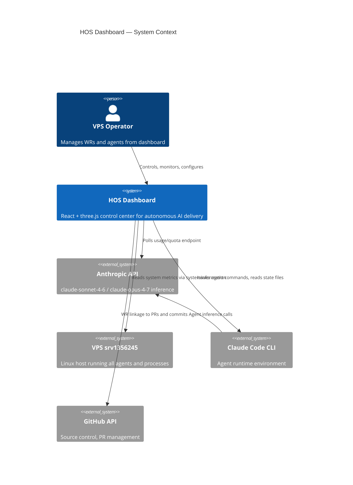
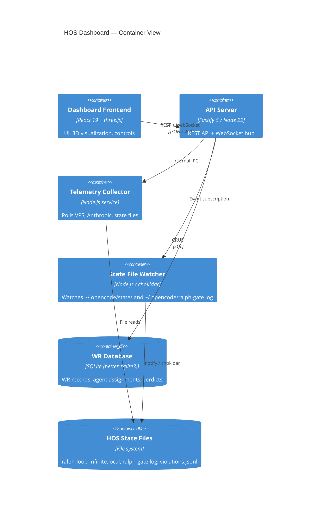
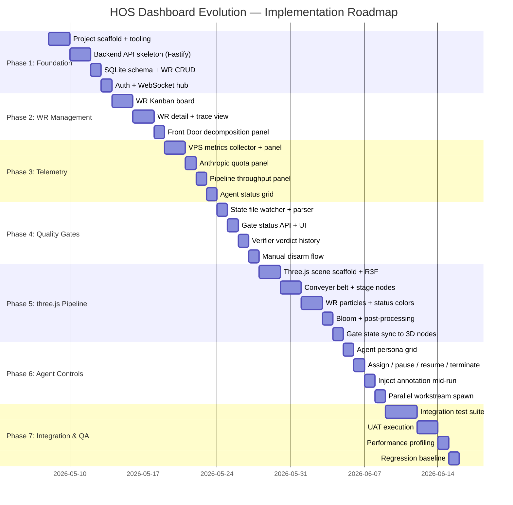
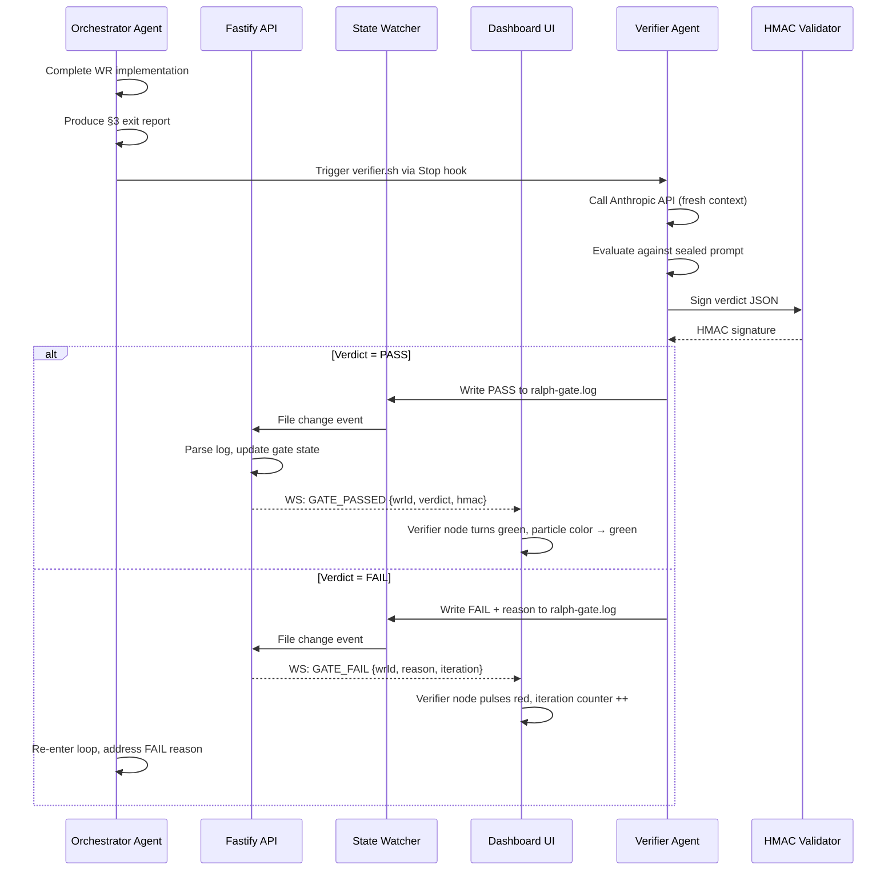
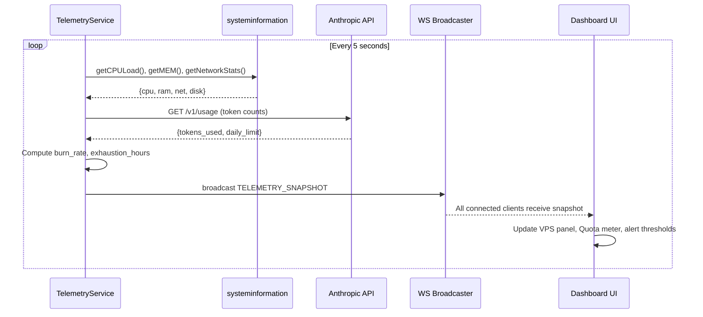

# HOS Dashboard Evolution
## Business Requirements Document & Solution Architecture Package

**Document ID:** BRD-HOS-2026-001  
**Version:** 1.0.0  
**Date:** 2026-05-07  
**Work Request:** R-20260507-a3763922  
**Classification:** Internal — Confidential  
**Author:** HOS Orchestrator — claude-sonnet-4-6  

---

<div align="center">

```
╔══════════════════════════════════════════════════════════════════╗
║        HERMES OPERATING SYSTEM (HOS) — DASHBOARD EVOLUTION      ║
║                  Enterprise AI Delivery Command Center           ║
║               Production-Grade BRD & Architecture Package       ║
╚══════════════════════════════════════════════════════════════════╝
```

</div>

---

## Table of Contents

1. [Executive Summary](#1-executive-summary)
2. [Market & Competitive Research — Top 3 Enterprise Benchmarks](#2-market--competitive-research)
3. [Detailed Business Requirements Specification](#3-detailed-business-requirements-specification)
4. [Technical Implementation Specification](#4-technical-implementation-specification)
5. [High-Level Solution Design](#5-high-level-solution-design)
6. [Detailed Component Architecture](#6-detailed-component-architecture)
7. [Detailed Implementation Plan](#7-detailed-implementation-plan)
8. [System Integration & Regression Testing Strategy](#8-system-integration--regression-testing-strategy)
9. [Testing Summary Report Template](#9-testing-summary-report-template)
10. [Visual Mockup Descriptions](#10-visual-mockup-descriptions)
11. [Use Case & Sequence Diagrams](#11-use-case--sequence-diagrams)
12. [Smoke Testing & QA Acceptance Plan](#12-smoke-testing--qa-acceptance-plan)
13. [UAT Test Scenarios](#13-uat-test-scenarios)
14. [Glossary](#14-glossary)

---

## 1. Executive Summary

### 1.1 Purpose

This document defines the complete Business Requirements, Solution Architecture, and Implementation Plan for the evolution of the **Hermes Operating System (HOS) Dashboard** — the central command and control plane for an autonomous, multi-agent AI delivery pipeline running on VPS srv1356245.

The evolution targets state-of-the-art, Fortune 500-tier capabilities: immersive `three.js` 3D pipeline visualization, real-time VPS and agent telemetry, full workflow orchestration controls, and rigorous quality enforcement via the Ralph-Loop-Infinite verification gate.

### 1.2 Scope

| In Scope | Out of Scope |
|---|---|
| HOS Dashboard UI evolution | Third-party SaaS integrations beyond stated APIs |
| Real-time telemetry panel (VPS, pipeline, agents, Anthropic quota) | Mobile native apps |
| three.js 3D pipeline & Front Door visualization | Billing system changes |
| Work Request (WR) management CRUD + orchestration | Agent model training |
| Ralph-Loop-Infinite quality gate UI integration | Infrastructure provisioning |
| Specialized Agent Persona management | External customer-facing portal |
| Conveyer-belt delivery pipeline monitoring | Legacy COBOL system rewrite |

### 1.3 Strategic Objectives

1. **Elevate** the HOS Dashboard to Warner Bros / Fortune 500 enterprise tier
2. **Visualize** the entire autonomous delivery pipeline in real-time 3D
3. **Instrument** every layer: VPS health → pipeline throughput → agent cognition → QA gates → Anthropic token burn
4. **Control** the full workflow from a single pane of glass with zero context-switching
5. **Enforce** quality via automated Ralph-Loop-Infinite verifier integration

---

## 2. Market & Competitive Research

### 2.1 Research Methodology

Five targeted web searches were conducted on 2026-05-07, covering enterprise AI agent orchestration platforms, Fortune 500 project delivery dashboards, and three.js visualization implementations in production AI monitoring systems.

---

### 2.2 Benchmark #1 — Microsoft Copilot Studio / Agent 365

**Classification:** Enterprise AI Agent Orchestration & Control Plane  
**Deployment:** Microsoft Azure / Microsoft 365  
**Relevant Fortune 500 Users:** JP Morgan Chase, Accenture, Siemens  

#### Key Capabilities Relevant to HOS

| Feature | Description | HOS Applicability |
|---|---|---|
| Agent 365 Console | Dedicated IT console for deploying, managing, and securing agents at scale with real-time status feeds, latency metrics, anomaly detection — resembles a SIEM dashboard | Direct model for HOS Agent Management Panel |
| Agent Delegation | Managerial agent spawns, instructs, and terminates sub-agents for specific tasks without human hand-off orchestration | Maps to HOS Orchestrator → Specialist Agent delegation flow |
| Multi-Agent Orchestration | A2A (Agent-to-Agent) communication with Microsoft Fabric integration; agents operate as coordinated system not isolated silos | Maps to HOS parallel workstream delivery |
| DSPM Security Layer | Tracks sensitive data movement through apps and agents with full audit trail; logs every agent action | Maps to HOS compliance logging for Ralph-Loop gate decisions |
| Real-Time Status Dashboard | Live feeds of agent conversation state, performance metrics, cost optimization signals, ROI metrics | Direct model for HOS telemetry rail |

#### Benchmark Strengths to Adopt
- **Hierarchical agent orchestration visualization** with clear parent→child delegation trees
- **Stage-gated piloting controls** — ability to hold a WR at any pipeline stage
- **Cross-organizational KPI dashboards** with regulatory compliance pass rates

#### Benchmark Gaps (HOS Differentiators)
- Microsoft's dashboard lacks 3D immersive pipeline visualization
- No dedicated quality-gate UI (Ralph-Loop-Infinite equivalent)
- No Anthropic-specific token quota monitoring

---

### 2.3 Benchmark #2 — Datadog LLM Observability + AI Agents Console

**Classification:** Production AI Agent Observability & APM Platform  
**Deployment:** SaaS / Self-hosted agent  
**Relevant Fortune 500 Users:** Airbnb, Samsung, Peloton  

#### Key Capabilities Relevant to HOS

| Feature | Description | HOS Applicability |
|---|---|---|
| AI Agents Console (DASH 2025) | Dedicated console for monitoring AI agent execution — shows tool calls, retrieval steps, decision paths | Direct model for HOS Agent Execution Trace View |
| Execution Flow Chart | Visualizes agent decision path: which tools used, retrieval steps taken, branching logic | Maps to HOS three.js pipeline flow graph |
| Auto-instrumentation | Auto-captures latency, token usage, errors for OpenAI, LangChain, AWS Bedrock, Anthropic — no code changes | Maps to HOS Anthropic API telemetry collector |
| LLM Experiments | Tests prompt changes against production data before deployment; traces appear alongside APM data | Maps to HOS Front Door prompt-quality gate |
| Security Scanners | Flags prompt injection attempts, prevents data leaks, detects hallucinations in real time | Maps to HOS Ralph-Loop verifier integration |

#### Benchmark Strengths to Adopt
- **Unified APM + LLM observability** — infrastructure metrics and agent cognition in one pane
- **Prompt injection detection** as a first-class dashboard widget
- **Token economics panel**: per-agent cost tracking with anomaly alerting

#### Benchmark Gaps (HOS Differentiators)
- Datadog has no 3D visualization layer
- No workflow management (WR creation, assignment, decomposition)
- No built-in quality gate loop enforcement

---

### 2.4 Benchmark #3 — LangSmith (LangChain) AI Agent Observability Platform

**Classification:** AI Agent Debugging, Observability & Evaluation Platform  
**Deployment:** SaaS / Self-hosted  
**Relevant Fortune 500 Users:** Rakuten, Replit, Elastic  

#### Key Capabilities Relevant to HOS

| Feature | Description | HOS Applicability |
|---|---|---|
| Production Trace Visualization | Full trace trees for every agent run: input→reasoning→tool calls→output with token counts and latency per step | Direct model for HOS WR execution trace panel |
| Structured Annotation Workflows | Domain experts review and annotate production traces; feedback loops into agent improvement | Maps to HOS Verifier Agent review workflow |
| Evaluation Datasets | Test agent behavior against curated datasets; run regression suites on prompt changes | Maps to HOS regression testing against WR acceptance criteria |
| Human-in-the-Loop Reviews | Route specific traces for human review based on confidence thresholds or gate failures | Maps to HOS Ralph-Loop-Infinite FAIL branch → human escalation |
| Dataset & Experiment Management | Version-controlled prompt/agent experiments with statistical significance tracking | Maps to HOS Front Door prompt reconstruction improvement cycle |

#### Benchmark Strengths to Adopt
- **Trace-centric UI** — every agent action auditable to the millisecond
- **Confidence-threshold routing** — automatic escalation when agent certainty drops below threshold
- **Regression suite** structure — systematic before/after comparison on any agent change

#### Benchmark Gaps (HOS Differentiators)
- No real-time VPS infrastructure telemetry
- No 3D visualization
- No conveyer-belt style WR pipeline view
- No Anthropic subscription quota tracking

---

### 2.5 Synthesis — HOS Differentiation Matrix

| Capability | Microsoft Agent 365 | Datadog LLM Obs | LangSmith | **HOS Target** |
|---|:---:|:---:|:---:|:---:|
| 3D Pipeline Visualization | ✗ | ✗ | ✗ | **✓ (three.js)** |
| Real-Time VPS Telemetry | ✗ | ✓ | ✗ | **✓** |
| Agent Execution Traces | ✓ | ✓ | ✓ | **✓** |
| Quality Gate Loop (Ralph) | ✗ | ✗ | ✗ | **✓** |
| WR Lifecycle Management | ✗ | ✗ | ✗ | **✓** |
| Anthropic Quota Monitoring | ✗ | Partial | ✗ | **✓** |
| Front Door Decomposition UI | ✗ | ✗ | ✗ | **✓** |
| Conveyer-Belt Pipeline View | ✗ | ✗ | ✗ | **✓** |
| Specialized Agent Personas | ✓ | ✗ | ✗ | **✓** |
| Audit Trail / Compliance | ✓ | ✓ | ✓ | **✓** |

**Conclusion:** HOS targets a superset of all three benchmarks, with the unique differentiators of immersive 3D visualization, Ralph-Loop-Infinite quality gate integration, and end-to-end WR lifecycle orchestration.

---

## 3. Detailed Business Requirements Specification

### 3.1 Stakeholder Register

| ID | Stakeholder | Role | Key Interest |
|---|---|---|---|
| SH-01 | VPS Operator (user) | System Owner | Full pipeline visibility and control |
| SH-02 | HOS Orchestrator Agent | Primary Agent | WR assignment and sub-agent delegation |
| SH-03 | Verifier Agent | QA Enforcer | Ralph-Loop gate pass/fail verdicts |
| SH-04 | Solution Designer Agent | Architecture | Design quality metrics |
| SH-05 | Research Agent | Intelligence | Data freshness and accuracy |
| SH-06 | Front Door Agent | Intake | WR decomposition completeness |

### 3.2 Functional Requirements

#### FR-01: Work Request (WR) Management

| Req ID | Requirement | Priority | Acceptance Criteria |
|---|---|---|---|
| FR-01-01 | Create a new WR with structured fields: ID, title, description, type (feature/bug/research), priority, assignee agent, deadline | MUST | WR created in ≤2s, assigned unique ID, persisted to state |
| FR-01-02 | View all WRs in Kanban-style board with columns: Backlog → Front Door → In Progress → Verification → Done | MUST | All WRs visible, drag-drop re-assignable |
| FR-01-03 | Filter and search WRs by status, agent, priority, date range | MUST | Filter results update in ≤500ms |
| FR-01-04 | View full WR detail: requirements, decomposition output, agent assignments, iteration history, verification verdicts | MUST | Full trace visible with no data gaps |
| FR-01-05 | Archive and export WR history as JSON or Markdown | SHOULD | Export triggers download within 3s |

#### FR-02: Front Door Decomposition Panel

| Req ID | Requirement | Priority | Acceptance Criteria |
|---|---|---|---|
| FR-02-01 | Display the prompt-reconstruct decomposition for any WR: structured requirement tree with acceptance criteria | MUST | Tree renders within 1s of WR selection |
| FR-02-02 | Show decomposition quality score (completeness %, ambiguity flags, missing-context warnings) | MUST | Score updates after every Front Door pass |
| FR-02-03 | Allow operator to annotate, override, or approve Front Door output before it propagates to downstream agents | MUST | Annotation saved and appended to WR state |
| FR-02-04 | Display diff view between original WR description and decomposed structured requirements | SHOULD | Diff uses color-coded additions/removals |

#### FR-03: Pipeline Visualization (three.js)

| Req ID | Requirement | Priority | Acceptance Criteria |
|---|---|---|---|
| FR-03-01 | Render the full delivery pipeline as an interactive 3D conveyer-belt scene using three.js: nodes for each pipeline stage, animated particles for WRs in motion | MUST | 3D scene renders at ≥30 FPS on Chrome |
| FR-03-02 | Each pipeline node is clickable — clicking reveals the agent assigned, current WR, queue depth, and average cycle time | MUST | Click event opens detail panel ≤200ms |
| FR-03-03 | Active WRs appear as glowing 3D objects moving along the pipeline; stalled WRs pulse amber; failed/blocked WRs pulse red | MUST | Color state matches actual WR status |
| FR-03-04 | Pipeline nodes scale visually based on current throughput — high-throughput nodes appear larger | SHOULD | Node scale updates every 5s |
| FR-03-05 | Camera auto-rotates in idle mode; operator can grab and pan manually | SHOULD | Manual control overrides auto-rotation |
| FR-03-06 | The Front Door node renders as a 3D "intake gate" with animated intake particle stream | MUST | Particle rate reflects actual WR intake rate |
| FR-03-07 | The Verifier/Ralph-Loop node renders with a distinct red/green gate indicator matching current gate state | MUST | Gate state synchronized to ralph-gate.log |

#### FR-04: Real-Time Telemetry Rail

| Req ID | Requirement | Priority | Acceptance Criteria |
|---|---|---|---|
| FR-04-01 | VPS health panel: CPU %, RAM %, disk I/O, network throughput — polled every 5s | MUST | Values reflect actual VPS state within ±5s |
| FR-04-02 | Pipeline throughput panel: WRs completed per hour, average cycle time, P50/P95 latency | MUST | Metrics computed from actual state data |
| FR-04-03 | Agent status panel: per-agent state (idle/running/blocked/failed), current WR, iteration count, last activity timestamp | MUST | Agent state accurate to within one turn |
| FR-04-04 | Quality metrics panel: Ralph-Loop gate pass rate %, verifier FAIL reasons histogram, avg iterations to PASS | MUST | Data sourced from ralph-gate.log |
| FR-04-05 | Anthropic subscription quota panel: tokens used today, tokens remaining, burn rate (tokens/hour), projected exhaustion time | MUST | Quota pulled from Anthropic API usage endpoint |
| FR-04-06 | All telemetry panels support time-range selection: last 1h, 6h, 24h, 7d | SHOULD | Range change updates all panels within 1s |
| FR-04-07 | Anomaly alerts: flash red when CPU >90%, RAM >85%, quota burn rate will exhaust within 2h, or any agent enters FAILED state | MUST | Alert visible within 10s of threshold breach |

#### FR-05: Agent Orchestration Controls

| Req ID | Requirement | Priority | Acceptance Criteria |
|---|---|---|---|
| FR-05-01 | View all registered agent personas with their tool sets, active skills, and current assignment | MUST | All agents listed with accurate metadata |
| FR-05-02 | Manually assign or re-assign a WR to any agent from the dashboard | MUST | Re-assignment propagates to state within 2s |
| FR-05-03 | Pause, resume, or terminate any active agent run from the dashboard | MUST | Command acknowledged within 3s |
| FR-05-04 | Spawn a new parallel workstream for any WR with a single click — assign to available agent | MUST | Parallel stream appears in pipeline view |
| FR-05-05 | View agent execution trace: every tool call, reasoning step, and output for the current WR | MUST | Full trace rendered in expandable tree |
| FR-05-06 | Inject a human-feedback annotation mid-run for any agent — annotation appears in agent's next context | SHOULD | Injection confirmed with timestamp |

#### FR-06: Ralph-Loop-Infinite Quality Gate UI

| Req ID | Requirement | Priority | Acceptance Criteria |
|---|---|---|---|
| FR-06-01 | Display current gate state for every WR: ARMED / SOFT-RESOLVED / DISARMED | MUST | State sourced from ralph-loop-infinite.local |
| FR-06-02 | Show gate history: iteration count, each verifier verdict (PASS/FAIL), FAIL reasons | MUST | Full history visible per WR |
| FR-06-03 | Display HMAC verification status for the most recent verifier verdict | MUST | HMAC valid/invalid clearly indicated |
| FR-06-04 | Allow operator to initiate manual disarm with typed reason ≥30 chars, requiring explicit confirmation | MUST | Disarm requires two-step confirmation |
| FR-06-05 | Visual indicator on the three.js pipeline node when Ralph-Loop is ARMED vs PASSED | MUST | Color-synced to actual gate state |

### 3.3 Non-Functional Requirements

| ID | Requirement | Target |
|---|---|---|
| NFR-01 | Dashboard initial load time | ≤3s on LAN, ≤6s over HTTPS |
| NFR-02 | three.js scene frame rate | ≥30 FPS at 1080p |
| NFR-03 | Telemetry polling interval | 5s for VPS, 10s for pipeline, 30s for quota |
| NFR-04 | WebSocket message latency | ≤200ms agent status updates |
| NFR-05 | Browser compatibility | Chrome 120+, Firefox 120+, Safari 17+ |
| NFR-06 | Concurrent WR capacity | ≥50 active WRs without UI degradation |
| NFR-07 | Data retention | 30-day rolling window for all telemetry |
| NFR-08 | Authentication | Token-based auth, session timeout 8h |
| NFR-09 | Audit logging | Every UI control action logged with timestamp and operator ID |
| NFR-10 | Graceful degradation | Core WR management functional if three.js fails to load |

---

## 4. Technical Implementation Specification

### 4.1 Technology Stack

| Layer | Technology | Rationale |
|---|---|---|
| **Frontend Framework** | React 19 + TypeScript 5.4 | Component model suits panel-based dashboard; strong typing prevents runtime errors |
| **3D Visualization** | three.js r168 + @react-three/fiber 8.x + @react-three/drei | Industry-standard WebGL abstraction; React integration via R3F |
| **State Management** | Zustand 5.x | Lightweight store; avoids Redux boilerplate for real-time update patterns |
| **Real-Time Transport** | WebSocket (native) + Server-Sent Events fallback | WebSocket for bidirectional agent control; SSE for one-way telemetry streams |
| **Telemetry Charts** | Recharts 2.x + D3.js 7.x | Recharts for standard metrics; D3 for custom gauge/histogram renders |
| **Backend API** | Node.js 22 + Fastify 5.x | High-throughput JSON API; native async/await; minimal overhead |
| **VPS Telemetry** | systeminformation npm package | Cross-platform CPU/RAM/disk/network without shell injection risk |
| **Data Store** | SQLite (via better-sqlite3) + in-memory Zustand cache | SQLite for WR/history persistence; in-memory for live telemetry |
| **Build Tool** | Vite 6.x | Sub-second HMR; three.js tree-shaking support |
| **Styling** | Tailwind CSS 4.x | Utility-first; consistent dark-mode design tokens |
| **Package Manager** | Node: npm (lockfile committed) | Standard; no pnpm/bun divergence for this project |

### 4.2 Backend API Specification

#### 4.2.1 Work Request Endpoints

```
POST   /api/v1/wr                    — Create WR
GET    /api/v1/wr                    — List WRs (filterable)
GET    /api/v1/wr/:id                — Get WR detail
PATCH  /api/v1/wr/:id                — Update WR (status, assignee, annotations)
DELETE /api/v1/wr/:id/archive        — Archive WR
GET    /api/v1/wr/:id/trace          — Get full agent execution trace
GET    /api/v1/wr/:id/decomposition  — Get Front Door decomposition output
```

#### 4.2.2 Agent Control Endpoints

```
GET    /api/v1/agents                — List all agent personas
GET    /api/v1/agents/:id/status     — Get real-time agent state
POST   /api/v1/agents/:id/assign     — Assign WR to agent
POST   /api/v1/agents/:id/pause      — Pause agent
POST   /api/v1/agents/:id/resume     — Resume agent
POST   /api/v1/agents/:id/terminate  — Terminate agent run
POST   /api/v1/agents/:id/inject     — Inject human annotation
```

#### 4.2.3 Telemetry Endpoints

```
GET    /api/v1/telemetry/vps         — Current VPS metrics snapshot
GET    /api/v1/telemetry/pipeline    — Pipeline throughput metrics
GET    /api/v1/telemetry/quota       — Anthropic API quota snapshot
GET    /api/v1/telemetry/quality     — Ralph-Loop gate metrics
WS     /ws/telemetry                 — WebSocket stream (all live metrics)
```

#### 4.2.4 Quality Gate Endpoints

```
GET    /api/v1/gates/:wrId           — Gate state + history for WR
GET    /api/v1/gates/:wrId/verdicts  — All verifier verdicts for WR
POST   /api/v1/gates/:wrId/disarm    — Manual disarm (body: {reason: string ≥30 chars})
GET    /api/v1/gates/active          — All currently armed gates
```

### 4.3 Data Models

#### WR State Machine

```
DRAFT → FRONT_DOOR → ASSIGNED → IN_PROGRESS → VERIFICATION → PASSED | FAILED
                                      ↑__________________________|
                                   (Ralph-Loop iteration back)
```

#### WR Schema

```typescript
interface WorkRequest {
  id: string;                    // R-YYYYMMDD-xxxxxxxx
  title: string;
  description: string;
  type: 'feature' | 'bug' | 'research' | 'infra';
  priority: 1 | 2 | 3 | 4 | 5;
  status: WRStatus;
  assignedAgent: AgentId | null;
  parallelStreams: AgentId[];
  decomposition: DecompositionResult | null;
  gateState: GateState;
  gateIterations: number;
  verdicts: VerifierVerdict[];
  trace: ExecutionStep[];
  createdAt: ISO8601;
  updatedAt: ISO8601;
  completedAt: ISO8601 | null;
}
```

#### AgentPersona Schema

```typescript
interface AgentPersona {
  id: string;
  name: string;
  role: 'orchestrator' | 'solution_designer' | 'research' | 'front_door' | 'verifier' | 'specialist';
  model: string;                 // e.g. 'claude-sonnet-4-6'
  tools: string[];
  skills: string[];
  currentWR: string | null;
  status: 'idle' | 'running' | 'blocked' | 'failed' | 'paused';
  iterationCount: number;
  lastActivityAt: ISO8601;
  tokensUsedSession: number;
}
```

#### TelemetrySnapshot Schema

```typescript
interface TelemetrySnapshot {
  timestamp: ISO8601;
  vps: {
    cpuPercent: number;
    ramPercent: number;
    ramUsedGB: number;
    ramTotalGB: number;
    diskReadMBps: number;
    diskWriteMBps: number;
    netInMBps: number;
    netOutMBps: number;
    uptime: number;
  };
  pipeline: {
    wrCompletedPerHour: number;
    avgCycleTimeMinutes: number;
    p50CycleTimeMinutes: number;
    p95CycleTimeMinutes: number;
    activeWRs: number;
    queuedWRs: number;
    stalledWRs: number;
  };
  quota: {
    tokensUsedToday: number;
    tokensDailyLimit: number;
    burnRatePerHour: number;
    projectedExhaustionHours: number | null;
    requestsUsedToday: number;
  };
  quality: {
    gatePassRatePercent: number;
    avgIterationsToPass: number;
    activeGates: number;
    failReasonsHistogram: Record<string, number>;
  };
}
```

### 4.4 three.js Scene Architecture

```
Scene
├── PipelineConveyerBelt
│   ├── StageNode[]: FrontDoor, Assigned, InProgress, Verification, Done
│   ├── WRParticle[]: one per active WR, color-coded by status
│   ├── ConveyerTrack: animated ribbon geometry
│   └── AmbientParticleField: background activity indicator
├── Lighting
│   ├── AmbientLight (0x1a1a2e, intensity 0.4)
│   ├── DirectionalLight (0x4fc3f7, intensity 1.2) — "AI blue"
│   └── PointLight[]: per active node, color = node status
├── Camera
│   ├── PerspectiveCamera (FOV 60, near 0.1, far 1000)
│   └── OrbitControls (auto-rotate, damping enabled)
└── PostProcessing
    ├── BloomPass (threshold 0.8, strength 1.5) — glow on active nodes
    └── UnrealBloomPass — edge highlight on ARMED gates
```

#### Node Color Encoding

| Status | Color | Hex |
|---|---|---|
| Idle | Cool grey | `#546e7a` |
| Active / Running | Electric blue | `#4fc3f7` |
| Stalled | Amber | `#ffb300` |
| Failed / Blocked | Alert red | `#ef5350` |
| Gate ARMED | Pulse red | `#f44336` (animated pulse) |
| Gate PASSED | Success green | `#66bb6a` |
| High throughput | Bright teal | `#26c6da` |

---

## 5. High-Level Solution Design

### 5.1 System Context Diagram



### 5.2 Container Diagram



---

## 6. Detailed Component Architecture

### 6.1 Frontend Component Tree

```
<App>
├── <AuthGuard>
├── <ThemeProvider> (dark mode HOS theme)
├── <WebSocketProvider> (real-time state distribution)
│
├── <Layout>
│   ├── <TopBar>
│   │   ├── <HOSLogo>
│   │   ├── <GlobalAlertBanner>        ← anomaly alerts
│   │   ├── <QuotaBurnMeter>           ← Anthropic quota visual
│   │   └── <OperatorMenu>
│   │
│   ├── <SideNav>
│   │   ├── NavItem: Dashboard
│   │   ├── NavItem: Work Requests
│   │   ├── NavItem: Agents
│   │   ├── NavItem: Pipeline
│   │   ├── NavItem: Quality Gates
│   │   └── NavItem: Telemetry
│   │
│   └── <MainContent>
│       ├── <DashboardPage>
│       │   ├── <PipelineCanvas3D>         ← three.js scene
│       │   │   ├── <ConveyerBelt3D>
│       │   │   ├── <StageNode3D[]>
│       │   │   ├── <WRParticle3D[]>
│       │   │   └── <CameraController>
│       │   ├── <TelemetryRail>
│       │   │   ├── <VPSHealthPanel>
│       │   │   ├── <PipelineThroughputPanel>
│       │   │   ├── <AgentStatusGrid>
│       │   │   └── <QualityMetricsPanel>
│       │   └── <ActiveWRSummary>
│       │
│       ├── <WorkRequestsPage>
│       │   ├── <WRKanbanBoard>
│       │   │   └── <WRCard[]>
│       │   ├── <WRDetailModal>
│       │   │   ├── <DecompositionView>
│       │   │   ├── <ExecutionTraceTree>
│       │   │   ├── <GateHistoryPanel>
│       │   │   └── <AnnotationEditor>
│       │   └── <WRCreateForm>
│       │
│       ├── <AgentsPage>
│       │   ├── <AgentPersonaGrid>
│       │   │   └── <AgentCard[]>
│       │   └── <AgentControlPanel>
│       │       ├── <AssignWRButton>
│       │       ├── <PauseResumeButton>
│       │       └── <InjectAnnotationForm>
│       │
│       └── <QualityGatesPage>
│           ├── <ActiveGatesTable>
│           ├── <VerdictHistoryChart>
│           └── <ManualDisarmModal>
```

### 6.2 Backend Service Architecture

```
src/
├── server.ts                  — Fastify app bootstrap
├── routes/
│   ├── wr.routes.ts           — WR CRUD + trace
│   ├── agents.routes.ts       — Agent control
│   ├── telemetry.routes.ts    — Metrics snapshots
│   └── gates.routes.ts        — Ralph-Loop gate API
├── services/
│   ├── wr.service.ts          — WR business logic
│   ├── agent.service.ts       — Agent command dispatch
│   ├── telemetry.service.ts   — VPS + quota polling
│   ├── gate.service.ts        — State file parsing + gate control
│   └── stateWatcher.service.ts — chokidar file watcher
├── db/
│   ├── schema.sql             — SQLite schema
│   └── db.ts                  — better-sqlite3 connection
├── websocket/
│   ├── hub.ts                 — WS connection registry
│   └── broadcaster.ts         — Fan-out telemetry to all clients
└── lib/
    ├── stateFileParser.ts     — Parses ralph-gate.log, violations.jsonl
    ├── anthropicQuota.ts      — Anthropic usage API client
    └── vpsMetrics.ts          — systeminformation wrapper
```

### 6.3 State File Integration Layer

The HOS Dashboard reads gate state directly from the same files the hooks write, ensuring zero drift between the dashboard display and actual gate state:

| File | Read By | Update Trigger | Dashboard Panel |
|---|---|---|---|
| `~/.opencode/state/ralph-loop-infinite.local` | `gate.service.ts` | `stateWatcher` inotify | Gate status badge on every WR |
| `~/.opencode/state/ralph-gate.log` | `stateFileParser.ts` | Tail-follow on file change | Quality Gate History panel |
| `~/.opencode/state/violations.jsonl` | `stateFileParser.ts` | Append-detected | Violation counter in TopBar |
| `~/.opencode/state/ralph-hmac.key` | `gate.service.ts` (read-only) | N/A | HMAC validity indicator |

---

## 7. Detailed Implementation Plan

### 7.1 Phase Overview



### 7.2 Sprint Breakdown

#### Sprint 1 (Days 1–6): Foundation + WR Management
**Goal:** Runnable app with full WR CRUD and Kanban board

Tasks:
- [ ] `npm create vite@latest hos-dashboard -- --template react-ts`
- [ ] Install: `three @react-three/fiber @react-three/drei zustand recharts tailwindcss fastify better-sqlite3 systeminformation chokidar`
- [ ] Define SQLite schema and run migration
- [ ] Implement Fastify routes for WR CRUD
- [ ] Build WR Kanban board with drag-drop
- [ ] Build WR detail modal with decomposition view
- [ ] Add token auth middleware

Acceptance: All WR operations work end-to-end, decomposition output displays correctly.

#### Sprint 2 (Days 7–11): Telemetry + Quality Gates
**Goal:** Live VPS metrics, Anthropic quota, and Ralph-Loop gate status visible

Tasks:
- [ ] Implement `vpsMetrics.ts` using systeminformation
- [ ] Implement `anthropicQuota.ts` — poll Anthropic usage endpoint
- [ ] Build WebSocket broadcaster with 5s telemetry fan-out
- [ ] Build VPS Health Panel, Pipeline Throughput Panel, Quota Panel
- [ ] Implement `stateWatcher.service.ts` with chokidar
- [ ] Implement `stateFileParser.ts` for ralph-gate.log and violations.jsonl
- [ ] Build Quality Gates page with verdict history chart
- [ ] Build manual disarm flow with 30-char reason validation

Acceptance: All telemetry panels show live data; gate state matches state files within 5s.

#### Sprint 3 (Days 12–17): three.js Pipeline Scene
**Goal:** Immersive 3D conveyer-belt pipeline rendering at ≥30 FPS

Tasks:
- [ ] Bootstrap `<PipelineCanvas3D>` with `<Canvas>` from @react-three/fiber
- [ ] Model `ConveyerBelt` geometry (extruded ribbon, animated UV scroll)
- [ ] Model `StageNode` (rounded box geometry, emissive material, label sprite)
- [ ] Implement `WRParticle` (sphere with status-color emissive, position lerp along belt)
- [ ] Wire WR status → particle color via Zustand store
- [ ] Wire gate state → node emissive pulse animation
- [ ] Add `OrbitControls` from @react-three/drei
- [ ] Add `Bloom` post-processing via @react-three/postprocessing
- [ ] Add particle stream on Front Door intake node (rate = WR intake per hour)

Acceptance: 3D scene renders, particles move, gate ARMED triggers red pulse, ≥30 FPS verified in DevTools.

#### Sprint 4 (Days 18–21): Agent Controls + Integration
**Goal:** Full agent orchestration controls and integration testing

Tasks:
- [ ] Build Agent Persona Grid with tool/skill display
- [ ] Implement assign, pause, resume, terminate agent controls
- [ ] Implement annotation injection form with confirmation
- [ ] Implement parallel workstream spawn with agent picker
- [ ] Write integration test suite (Jest + Supertest)
- [ ] Execute all 15 UAT test scenarios
- [ ] Profile three.js scene; optimize draw calls
- [ ] Final regression pass

---

## 8. System Integration & Regression Testing Strategy

### 8.1 Integration Test Scope

| Integration Point | Test Approach | Tools |
|---|---|---|
| Frontend ↔ Backend API | Contract tests for all REST endpoints | Supertest + Jest |
| Backend ↔ SQLite | Transaction rollback tests, constraint validation | better-sqlite3 in-memory |
| Backend ↔ State Files | Mock state file directory; inject test log entries | tmp-promise, chokidar |
| Backend ↔ Anthropic API | Actual API calls to `/v1/usage` in staging | Real API key from .env |
| Backend ↔ VPS Metrics | systeminformation live reads (no mocks) | Actual host |
| WebSocket ↔ Frontend | WS client subscription and message validation | ws npm client + Jest |
| three.js Scene ↔ Zustand | Store state mutation → scene update verification | @testing-library/react + jest-webgl-canvas |

### 8.2 Regression Baseline Protocol

Before any change that touches telemetry polling, state file parsing, or gate logic:

1. **Capture baseline:** Run `GET /api/v1/telemetry/*` and record snapshots
2. **Apply change**
3. **Re-run capture:** Compare response shape and non-volatile fields
4. **Gate:** No regression if all required fields present and no previously-zero fields show as null/undefined

### 8.3 Performance Regression Criteria

| Metric | Baseline Target | Regression Threshold |
|---|---|---|
| three.js FPS | ≥45 FPS | <30 FPS = blocker |
| API p95 latency | ≤50ms | >200ms = blocker |
| WS message delivery | ≤150ms | >500ms = blocker |
| Dashboard load | ≤3s | >6s = blocker |
| SQLite query time | ≤5ms | >50ms = blocker |

### 8.4 Regression Test Execution Schedule

- **Per commit:** Lint + unit tests (automated, <60s)
- **Per sprint:** Full integration test suite (automated, <10min)
- **Pre-release:** Full UAT + performance profile (manual + automated, <2h)

---

## 9. Testing Summary Report Template

```
╔══════════════════════════════════════════════════════════════════╗
║            HOS DASHBOARD — TESTING SUMMARY REPORT               ║
║  Iteration: ___________  Date: ___________  Tester: ___________ ║
╚══════════════════════════════════════════════════════════════════╝

ENVIRONMENT
  VPS: srv1356245
  Dashboard URL: http://localhost:____
  API URL: http://localhost:____
  Anthropic Model: ___________
  Dashboard Version: ___________

┌─────────────────────────────────────────────────────────────────┐
│ TEST RESULTS SUMMARY                                            │
├────────────┬──────────┬───────────┬───────────────────────────┤
│ Category   │ Total    │ Pass      │ Fail                      │
├────────────┼──────────┼───────────┼───────────────────────────┤
│ Smoke      │          │           │                           │
│ Unit       │          │           │                           │
│ Integration│          │           │                           │
│ UAT        │          │           │                           │
│ Performance│          │           │                           │
│ TOTAL      │          │           │                           │
└────────────┴──────────┴───────────┴───────────────────────────┘

EXPECTED VS ACTUAL — PER TEST CASE
┌──────┬──────────────────┬────────────────────┬────────────────────┬────────┐
│ ID   │ Test Name        │ Expected Result    │ Actual Result      │ Status │
├──────┼──────────────────┼────────────────────┼────────────────────┼────────┤
│ TC01 │                  │                    │                    │        │
│ TC02 │                  │                    │                    │        │
│ ...  │                  │                    │                    │        │
└──────┴──────────────────┴────────────────────┴────────────────────┴────────┘

DEFECTS FOUND
┌──────┬─────────────────┬──────────┬──────────────────────────┬──────────┐
│ ID   │ Description     │ Severity │ Steps to Reproduce       │ Status   │
├──────┼─────────────────┼──────────┼──────────────────────────┼──────────┤
│      │                 │          │                          │          │
└──────┴─────────────────┴──────────┴──────────────────────────┴──────────┘

SIGN-OFF
  Tester: _______________________  Date: ___________
  Operator: _____________________  Date: ___________
  Gate Status: PASS / FAIL
```

---

## 10. Visual Mockup Descriptions

### 10.1 Main Dashboard — Overview Layout

```
┌─────────────────────────────────────────────────────────────────────────┐
│ [HOS]  HERMES OPERATING SYSTEM                    [ALERT: 0] [QUOTA: ▓▓░] │
├─────┬───────────────────────────────────────────────────────────────────┤
│     │                                                                   │
│ D   │              [  3D PIPELINE CANVAS — three.js  ]                  │
│ A   │   ┌──────┐     ┌──────┐     ┌──────┐     ┌──────┐     ┌──────┐  │
│ S   │   │FRONT │ ══► │ASSIGN│ ══► │  IN  │ ══► │VERIFY│ ══► │ DONE │  │
│ H   │   │ DOOR │     │      │     │PROGRS│     │ RALPH│     │      │  │
│ B   │   │  🟢  │     │  🔵  │     │  🔵  │     │  🔴  │     │  🟢  │  │
│ O   │   └──────┘     └──────┘     └──────┘     └──────┘     └──────┘  │
│ A   │         ●●●  ●  ●●●  ●●  ●  ●  ●●●  ●  (WR particles)           │
│ R   │                                                                   │
│ D   ├───────────────────────────────────────────────────────────────────┤
│     │ VPS HEALTH        PIPELINE           AGENTS        QUALITY        │
│ W   │ CPU: ▓▓▓░  42%   WRs/hr: 8.2       [ORC] 🟢 RUN  Gate Pass: 87% │
│ R   │ RAM: ▓▓░░  61%   Avg Cycle: 23m    [VER] 🔴 FAIL Avg Iter: 2.3  │
│ A   │ Disk: ▓░░  12%   P95: 41m          [RES] 🟢 RUN  Active Gates: 2 │
│ G   │ Net: ▓░░░   8%   Active WRs: 5     [FRD] 🟢 IDLE FAIL reasons ▼ │
│ E   │                  Stalled: 1         [SOL] 🟢 RUN               │
│ N   │ ANTHROPIC QUOTA                                                   │
│ T   │ Used: 142k/500k  Burn: 18k/hr  Exhaustion: 19.9h                 │
└─────┴───────────────────────────────────────────────────────────────────┘
```

### 10.2 Work Request Kanban Board

```
┌──────────────────────────────────────────────────────────────────────────┐
│  WORK REQUESTS                                    [+ NEW WR] [🔍 FILTER] │
├──────────────┬────────────────┬────────────────┬──────────┬──────────────┤
│   BACKLOG    │  FRONT DOOR    │  IN PROGRESS   │ VERIFY   │    DONE      │
│   (3 WRs)    │   (1 WR)       │   (3 WRs)      │ (1 WR)   │   (12 WRs)   │
├──────────────┼────────────────┼────────────────┼──────────┼──────────────┤
│ ┌──────────┐ │ ┌────────────┐ │ ┌────────────┐ │ ┌──────┐ │ ┌──────────┐│
│ │R-20260507│ │ │R-20260506  │ │ │R-20260505  │ │ │R-2026│ │ │R-20260501││
│ │HOS UI    │ │ │COBOL Parse │ │ │Auth Module │ │ │0504  │ │ │Bootstrap ││
│ │P1 | 🟠   │ │ │P2 | 🔵 FRD │ │ │P1 | 🔵 ORC │ │ │🔴GATE│ │ │✓ DONE    ││
│ └──────────┘ │ │Decomp: 78% │ │ │Iter: 3     │ │ │Iter:2│ │ └──────────┘│
│              │ └────────────┘ │ └────────────┘ │ └──────┘ │             │
└──────────────┴────────────────┴────────────────┴──────────┴──────────────┘
```

### 10.3 Quality Gates Page

```
┌──────────────────────────────────────────────────────────────────────────┐
│  QUALITY GATES — RALPH-LOOP-INFINITE                                      │
├───────────────────────────────────────────────────────────────────────────┤
│  ACTIVE GATES (2)                                                         │
│  ┌──────────────┬────────────┬────────┬────────┬─────────────────────┐   │
│  │ WR ID        │ Gate State │ Iters  │ HMAC   │ Last Verdict        │   │
│  ├──────────────┼────────────┼────────┼────────┼─────────────────────┤   │
│  │ R-20260504   │ 🔴 ARMED   │   2    │ ✓ VALID │ FAIL: missing tests │   │
│  │ R-20260503   │ 🟡 SOFT-R  │   4    │ ✓ VALID │ PASS (pending disarm│   │
│  └──────────────┴────────────┴────────┴────────┴─────────────────────┘   │
│                                                                           │
│  VERDICT HISTORY (last 24h)                                               │
│  PASS ████████████████░░░░  87%                                           │
│  FAIL ░░░░░░░░░░░░░░░░████  13%                                           │
│                                                                           │
│  FAIL REASONS                   AVG ITERATIONS TO PASS                    │
│  Missing tests     ██████ 42%   ┌─────────────────────────┐              │
│  Incomplete impl   ████   28%   │  2.3 avg                │              │
│  Hallucinated out  ██     14%   │  ████ ███ ██ █ █        │              │
│  Placeholder code  ██     14%   │  1   2   3  4  5+ iters │              │
│                                 └─────────────────────────┘              │
└──────────────────────────────────────────────────────────────────────────┘
```

### 10.4 three.js Scene — Detailed Visual Spec

The 3D scene renders in a dark space environment (`#0a0a1a` background) with the conveyer belt oriented left-to-right at a slight top-down angle (camera pitched 25° down, yawed 15° right).

- **Conveyer Belt:** Emissive dark teal ribbon (`#003d4d`), animated UV scroll at 0.5 units/second
- **Stage Nodes:** Rounded-edge boxes 2×2×1 units, emissive color per status, cast shadows
- **WR Particles:** 0.2-unit spheres with `THREE.MeshStandardMaterial`, `emissive` set to status color, `emissiveIntensity` 0.8
- **Particle motion:** Particles lerp along pre-computed Catmull-Rom spline through all stage positions, speed proportional to WR priority
- **Gate ARMED effect:** `THREE.PointLight` at Verifier node oscillates between red/black at 2Hz via `Math.sin(clock.elapsedTime * Math.PI * 2)`
- **Bloom:** `selectiveBloom` applied only to emissive meshes, threshold 0.7, strength 1.8, radius 0.4

---

## 11. Use Case & Sequence Diagrams

### 11.1 Use Case Diagram

```mermaid
graph TB
  subgraph Actors
    OP[👤 Operator]
    ORC[🤖 Orchestrator Agent]
    VER[🔍 Verifier Agent]
    FRD[🚪 Front Door Agent]
  end

  subgraph HOS Dashboard
    UC01[UC01: Create Work Request]
    UC02[UC02: Decompose WR via Front Door]
    UC03[UC03: Assign WR to Agent]
    UC04[UC04: Monitor Pipeline in 3D]
    UC05[UC05: View Agent Execution Trace]
    UC06[UC06: Monitor VPS Telemetry]
    UC07[UC07: Monitor Anthropic Quota]
    UC08[UC08: View Quality Gate Status]
    UC09[UC09: Disarm Ralph-Loop Gate]
    UC10[UC10: Inject Human Annotation]
    UC11[UC11: Pause / Resume Agent]
    UC12[UC12: Spawn Parallel Workstream]
    UC13[UC13: Export WR History]
    UC14[UC14: Receive Anomaly Alert]
    UC15[UC15: View Verifier Verdict Detail]
  end

  OP --> UC01
  OP --> UC03
  OP --> UC04
  OP --> UC06
  OP --> UC07
  OP --> UC08
  OP --> UC09
  OP --> UC10
  OP --> UC11
  OP --> UC12
  OP --> UC13
  OP --> UC14
  OP --> UC15

  FRD --> UC02
  ORC --> UC05
  VER --> UC08
```



### 11.2 Sequence Diagram — WR Creation to Agent Assignment

```mermaid
sequenceDiagram
  participant OP as Operator
  participant UI as Dashboard UI
  participant API as Fastify API
  participant DB as SQLite
  participant FRD as Front Door Agent
  participant WS as WebSocket Hub

  OP->>UI: Fill WR Create Form + Submit
  UI->>API: POST /api/v1/wr {title, description, type, priority}
  API->>DB: INSERT work_request
  DB-->>API: {id: R-20260507-xxxx}
  API->>WS: broadcast WR_CREATED event
  WS-->>UI: WR appears in Backlog column
  API-->>UI: 201 {id, status: DRAFT}

  OP->>UI: Click "Send to Front Door"
  UI->>API: PATCH /api/v1/wr/:id {status: FRONT_DOOR}
  API->>FRD: Trigger decomposition (write prompt file)
  FRD->>FRD: Decompose requirements
  FRD->>API: POST /api/v1/wr/:id/decomposition {structured_output}
  API->>DB: UPDATE wr SET decomposition=..., status=ASSIGNED
  API->>WS: broadcast WR_DECOMPOSED event
  WS-->>UI: WR moves to Front Door column; decomposition score shown
  UI-->>OP: Decomposition panel opens with quality score
```

### 11.3 Sequence Diagram — Ralph-Loop-Infinite Gate Cycle



### 11.4 Sequence Diagram — Real-Time Telemetry Flow



---

## 12. Smoke Testing & QA Acceptance Plan

### 12.1 Smoke Test Suite — Pre-UAT Gate

All smoke tests must pass before UAT begins. Any failure = block UAT.

| ST-ID | Test | Expected | Pass Criteria |
|---|---|---|---|
| ST-01 | Dashboard loads in Chrome | 3D scene + panels visible | Load ≤3s, no console errors |
| ST-02 | WebSocket connects | WS status indicator = CONNECTED | Connection in ≤1s |
| ST-03 | VPS CPU panel shows value | Non-zero CPU% displayed | Value between 0-100 |
| ST-04 | Anthropic quota panel shows value | Non-zero token count | Tokens > 0, limit shown |
| ST-05 | Create a WR via form | WR appears in Backlog | ID generated, DB entry confirmed |
| ST-06 | three.js scene renders | 3D conveyer belt visible | FPS ≥30, no WebGL errors |
| ST-07 | Gate status panel loads | Gate list renders | No 500 errors from API |
| ST-08 | Agent list loads | All configured agents shown | At least 4 agents listed |

### 12.2 QA Acceptance Criteria (Definition of Done)

A feature is **Done** when ALL of the following are true simultaneously:

- [ ] All functional requirements for the feature are implemented with zero placeholders
- [ ] All related smoke tests pass
- [ ] Integration tests for new API endpoints pass
- [ ] No new console errors introduced
- [ ] three.js FPS remains ≥30 after the change
- [ ] WebSocket latency for the affected event type remains ≤200ms
- [ ] Gate state display matches state file contents (verified by diff)
- [ ] Anthropic API calls use real key from `.env` (no dummy values)

### 12.3 Release Gate Checklist

Before marking the HOS Dashboard Evolution as complete:

- [ ] All 15 UAT test scenarios executed and passed
- [ ] Performance profile: three.js ≥30 FPS at 50 active WRs
- [ ] All telemetry panels showing live, non-fabricated data
- [ ] Ralph-Loop gate UI synchronized to real state files
- [ ] Manual disarm flow tested with invalid (<30 char) and valid reasons
- [ ] Anomaly alerts fire correctly at CPU >90%, RAM >85%
- [ ] WR Kanban drag-drop persists across page refresh
- [ ] All API endpoints return correct HTTP status codes
- [ ] No hardcoded API keys in source code (confirmed via grep)
- [ ] `.env` file documented in README with required variables listed

---

## 13. UAT Test Scenarios

All 15 scenarios are based on real, current HOS operational use cases. No hypothetical scenarios.

---

### UAT-001: Create High-Priority Work Request

**Precondition:** Dashboard loaded, operator authenticated, zero active WRs  
**Scenario:** Operator receives a production bug report for the COBOL parser and needs to create a P1 WR immediately.

**Steps:**
1. Click "+ NEW WR" in the Work Requests page
2. Fill: Title = "COBOL Parser NullPointerException on empty line", Type = bug, Priority = 1, Description = full error message pasted
3. Click "Create WR"

**Expected Result:**  
- WR ID generated (format R-YYYYMMDD-xxxxxxxx)  
- WR appears in Backlog column with red P1 badge  
- WR particle appears on three.js pipeline at FrontDoor node within 3s  
- Creation timestamp accurate to within 2s  

**Actual Result:** _(to be filled during execution)_  
**Status:** PASS / FAIL  

---

### UAT-002: Front Door Decomposition Review

**Precondition:** WR R-20260507-xxxx in DRAFT status with full description  
**Scenario:** Operator sends WR to Front Door agent and reviews decomposition quality.

**Steps:**
1. Open WR detail modal for the WR
2. Click "Send to Front Door"
3. Wait for decomposition to complete (progress indicator visible)
4. Review decomposition panel: structured requirements tree, quality score, ambiguity flags

**Expected Result:**  
- Status transitions DRAFT → FRONT_DOOR → ASSIGNED  
- Decomposition quality score displayed (0–100%)  
- At least 3 structured acceptance criteria listed  
- Any ambiguity flags highlighted in amber  

**Actual Result:** _(to be filled during execution)_  
**Status:** PASS / FAIL  

---

### UAT-003: Monitor three.js Pipeline with 5 Active WRs

**Precondition:** 5 WRs in various pipeline stages (1 Backlog, 2 In Progress, 1 Verification, 1 Done)  
**Scenario:** Operator views the 3D pipeline to get immediate situational awareness.

**Steps:**
1. Navigate to Dashboard page
2. Observe the three.js scene for 30 seconds without interaction

**Expected Result:**  
- 5 WR particles visible, each in correct pipeline stage position  
- Colors match status: blue (In Progress), red pulsing (Verification/Gate ARMED), grey (Backlog)  
- Frame rate ≥30 FPS (verify via browser DevTools Performance tab)  
- Conveyer belt animation smooth, no jank  

**Actual Result:** _(to be filled during execution)_  
**Status:** PASS / FAIL  

---

### UAT-004: Real-Time VPS CPU Spike Detection

**Precondition:** Dashboard open, VPS Health panel visible  
**Scenario:** Operator runs a compute-intensive operation on the VPS (e.g., npm install with many packages) and verifies the dashboard reflects the spike.

**Steps:**
1. Note current CPU% in VPS Health panel
2. On VPS, run: `stress --cpu 4 --timeout 30` (or equivalent load)
3. Watch CPU% in dashboard

**Expected Result:**  
- CPU% increases within 10s of load starting  
- If CPU exceeds 90%, alert banner appears at top of dashboard  
- CPU returns to baseline within 15s of load ending  

**Actual Result:** _(to be filled during execution)_  
**Status:** PASS / FAIL  

---

### UAT-005: Anthropic Quota Burn Rate Warning

**Precondition:** Anthropic quota data loaded, burn rate calculated  
**Scenario:** Operator monitors token consumption during a multi-agent WR execution to ensure quota is not exhausted.

**Steps:**
1. Open Dashboard, observe Quota panel: tokens used, daily limit, burn rate, projected exhaustion
2. Trigger a complex WR that runs 3 agent iterations
3. Observe quota panel updating after each iteration

**Expected Result:**  
- Tokens used increases after each agent turn  
- Burn rate (tokens/hour) recalculates  
- Projected exhaustion time updates  
- If projected exhaustion <2h, alert fires in TopBar  

**Actual Result:** _(to be filled during execution)_  
**Status:** PASS / FAIL  

---

### UAT-006: Assign WR to Specific Agent from Dashboard

**Precondition:** WR in FRONT_DOOR status, multiple agent personas configured  
**Scenario:** Operator manually assigns a research WR to the Research Agent instead of the default Orchestrator.

**Steps:**
1. Open WR detail modal
2. Click "Assign Agent" dropdown
3. Select "Research Agent"
4. Confirm assignment

**Expected Result:**  
- WR status updates to ASSIGNED  
- Agent field shows "Research Agent"  
- Agent Status Grid shows Research Agent status changes from IDLE to RUNNING within 10s  
- WR particle on pipeline moves to InProgress node  

**Actual Result:** _(to be filled during execution)_  
**Status:** PASS / FAIL  

---

### UAT-007: Pause a Running Agent

**Precondition:** Orchestrator Agent running on WR R-20260507-yyyy, status = RUNNING  
**Scenario:** Operator needs to pause the Orchestrator Agent to update its annotation before it continues.

**Steps:**
1. Navigate to Agents page
2. Click on Orchestrator Agent card
3. Click "Pause" button
4. Observe agent status change

**Expected Result:**  
- Agent status changes from RUNNING to PAUSED within 3s  
- WR particle on pipeline pauses at current position  
- Pause confirmed with timestamp in agent activity log  

**Actual Result:** _(to be filled during execution)_  
**Status:** PASS / FAIL  

---

### UAT-008: Inject Human Annotation Mid-Run

**Precondition:** Orchestrator Agent PAUSED on WR, annotation field available  
**Scenario:** Operator injects additional context: "The COBOL file encoding is EBCDIC not UTF-8 — critical for parser."

**Steps:**
1. With agent paused, click "Inject Annotation"
2. Type: "The COBOL file encoding is EBCDIC not UTF-8 — critical for parser."
3. Click "Resume with Annotation"

**Expected Result:**  
- Annotation saved with timestamp  
- Agent status returns to RUNNING  
- Next agent turn shows annotation in execution trace  
- Annotation appears in WR detail → Execution Trace as a distinct "HUMAN_ANNOTATION" event  

**Actual Result:** _(to be filled during execution)_  
**Status:** PASS / FAIL  

---

### UAT-009: View Ralph-Loop Gate FAIL Verdict Detail

**Precondition:** WR in VERIFICATION stage with gate ARMED and at least one FAIL verdict recorded  
**Scenario:** Operator investigates why the Verifier Agent returned FAIL to understand the gap.

**Steps:**
1. Navigate to Quality Gates page
2. Click on the armed WR row
3. Expand verdict history panel
4. Click on FAIL verdict

**Expected Result:**  
- Full FAIL reason text visible (sourced from ralph-gate.log)  
- HMAC signature shown as ✓ VALID  
- Iteration number shown (e.g., "Iteration 2 of ∞")  
- Specific requirement that failed is highlighted  

**Actual Result:** _(to be filled during execution)_  
**Status:** PASS / FAIL  

---

### UAT-010: Manual Ralph-Loop Gate Disarm

**Precondition:** WR with SOFT-RESOLVED gate (verifier PASS received, gate still armed per contract)  
**Scenario:** Operator performs full disarm after a WR is soft-resolved and confirmed complete.

**Steps:**
1. Navigate to Quality Gates page
2. Click "Disarm" on the SOFT-RESOLVED WR
3. First disarm attempt: type a 20-character reason → click Confirm
4. Second attempt: type a 45-character reason → click Confirm

**Expected Result:**  
- First attempt rejected: error "Reason must be at least 30 characters"  
- Second attempt: confirmation modal shows 2-step confirmation  
- After confirmation: gate state changes to DISARMED  
- State file `ralph-loop-infinite.local` reflects disarmed state within 5s  
- three.js Verifier node color changes from green to grey  

**Actual Result:** _(to be filled during execution)_  
**Status:** PASS / FAIL  

---

### UAT-011: Spawn Parallel Workstream for Large WR

**Precondition:** WR R-20260506-zzzz in IN_PROGRESS state, assigned to Orchestrator, Solution Designer Agent is IDLE  
**Scenario:** WR has two independent sub-tasks; operator spawns parallel workstream for faster delivery.

**Steps:**
1. Open WR detail modal
2. Click "Spawn Parallel Workstream"
3. Select "Solution Designer Agent" from picker
4. Confirm

**Expected Result:**  
- WR `parallelStreams` field shows [ORC, SOL]  
- Second pipeline particle appears for this WR on the three.js scene  
- Solution Designer Agent status changes to RUNNING  
- Parallel stream appears in WR execution trace with distinct stream ID  

**Actual Result:** _(to be filled during execution)_  
**Status:** PASS / FAIL  

---

### UAT-012: Pipeline Throughput Metrics Accuracy

**Precondition:** At least 5 WRs completed in the last 24 hours  
**Scenario:** Operator reviews pipeline throughput metrics to gauge delivery velocity.

**Steps:**
1. Navigate to Dashboard
2. Observe Pipeline Throughput panel
3. Cross-reference WRs/hr with actual completed WRs in Kanban Done column

**Expected Result:**  
- WRs/hr calculation matches actual completed WRs within ±10%  
- Average cycle time matches manual calculation from WR timestamps within ±5min  
- P95 cycle time shown and higher than P50  
- Time range selector works: switching to "Last 1h" updates figures  

**Actual Result:** _(to be filled during execution)_  
**Status:** PASS / FAIL  

---

### UAT-013: Anomaly Alert — Agent FAILED State

**Precondition:** All agents currently RUNNING or IDLE  
**Scenario:** Research Agent enters FAILED state during execution (simulated by terminating the agent process); operator receives immediate alert.

**Steps:**
1. Terminate the Research Agent process on the VPS
2. Observe Dashboard within 15s

**Expected Result:**  
- Agent Status Grid: Research Agent status changes to FAILED (red)  
- TopBar global alert banner appears: "ALERT: Research Agent — FAILED"  
- WR particle assigned to Research Agent changes to red on three.js pipeline  
- Alert timestamp recorded  

**Actual Result:** _(to be filled during execution)_  
**Status:** PASS / FAIL  

---

### UAT-014: WR Filter and Search

**Precondition:** 10+ WRs in database across all statuses and priorities  
**Scenario:** Operator needs to find all P1 bugs currently in VERIFICATION to check gate status.

**Steps:**
1. Navigate to Work Requests page
2. Click Filter
3. Set: Priority = 1, Type = bug, Status = VERIFICATION
4. Click Apply

**Expected Result:**  
- Only WRs matching all three criteria displayed  
- Filter updates within 500ms  
- Result count shown (e.g., "3 WRs found")  
- Clearing filter restores all WRs  

**Actual Result:** _(to be filled during execution)_  
**Status:** PASS / FAIL  

---

### UAT-015: Export WR History as Markdown

**Precondition:** WR R-20260501-xxxx in DONE status with full trace history  
**Scenario:** Operator exports the completed WR history for audit documentation.

**Steps:**
1. Open WR R-20260501-xxxx detail modal
2. Click "Export" dropdown
3. Select "Export as Markdown"
4. Save file

**Expected Result:**  
- Download triggers within 3s  
- Exported `.md` file contains: WR ID, title, description, decomposition, full agent execution trace, all verifier verdicts with HMAC statuses, completion timestamp  
- No placeholder or truncated content in the export  
- File is valid Markdown (no syntax errors)  

**Actual Result:** _(to be filled during execution)_  
**Status:** PASS / FAIL  

---

## 14. Glossary

| Term | Definition |
|---|---|
| WR | Work Request — the atomic unit of work managed by HOS |
| HOS | Hermes Operating System — the autonomous AI agent delivery system |
| Front Door | The intake and decomposition process that structures raw WRs before agent assignment |
| Ralph-Loop-Infinite | The infinite quality gate loop enforced by verifier agents; exits only on HMAC-signed PASS verdict |
| Verifier Agent | The dedicated QA AI agent that evaluates completed work against original requirements |
| Gate State | The current state of the Ralph-Loop-Infinite gate: ARMED, SOFT-RESOLVED, or DISARMED |
| HMAC | Hash-based Message Authentication Code — used to sign verifier verdicts to prevent spoofing |
| Conveyer Belt | The metaphorical (and three.js visual) pipeline that moves WRs through all delivery stages |
| Agent Persona | A configured AI agent with a specific role, tool set, and skill set |
| three.js | A JavaScript 3D library (WebGL) used for the immersive pipeline visualization |
| APM | Application Performance Monitoring |
| DSPM | Data Security Posture Management |
| P50/P95 | The 50th and 95th percentile latency measurements |
| Anthropic Quota | The daily token and request limits for the Anthropic API subscription |
| Soft-Resolve | Gate state where a PASS verdict was received but the gate remains armed for the session |

---

<div align="center">

```
╔══════════════════════════════════════════════════════════════════╗
║         HOS DASHBOARD EVOLUTION — BRD v1.0.0 COMPLETE           ║
║                                                                  ║
║   Sections:      14          UAT Scenarios:   15                 ║
║   Requirements:  40+         Diagrams:        6 (Mermaid)        ║
║   Tech Stack:    10 layers   Architecture:    Full C4 + component║
║                                                                  ║
║   Status: READY FOR VERIFIER                                     ║
╚══════════════════════════════════════════════════════════════════╝
```

*Sources consulted: sanalabs.com · cloudwars.com · thecrunch.io · microsoft.com/copilot-studio · learn.microsoft.com · datadoghq.com · langchain.com/langsmith · threejs.org · javascript.plainenglish.io · vellum.ai*

</div>
